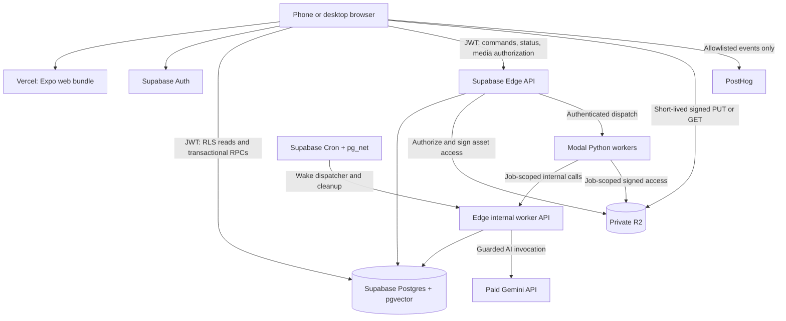
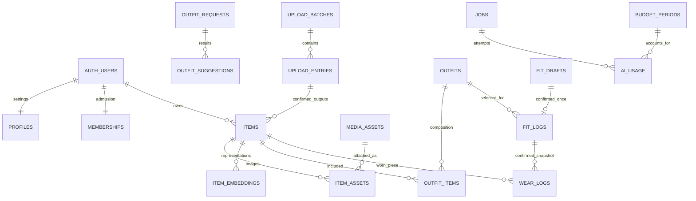

# bowr: system architecture and technical design

**Status:** Proposed implementation baseline; no application or infrastructure is implemented by this document.  
**Updated:** 25 September 2026.  
**Scope:** Detailed design for phases 0–2 (MVP), with extension contracts for phases 3–9.  
**Inputs:** [Product context](PRODUCT.md), [UI, UX and information architecture](DESIGN.md), and [PRD](<bowr — PRD.md>).

The PRD defines product scope and the infrastructure direction. DESIGN.md defines interaction, privacy, history, and measurement semantics. This document turns those decisions into an implementable technical contract. Additional engineering decisions are explicitly called out; performance and cost figures are targets or estimates until measured. Provider documentation was checked on the date above, but account configuration and deployed behavior still need verification.

## Contents

1. [Architecture decisions](#1-architecture-decisions)
2. [System boundaries and deployment](#2-system-boundaries-and-deployment)
3. [Technology stack and repository](#3-technology-stack-and-repository)
4. [Frontend architecture](#4-frontend-architecture)
5. [Identity, membership and authorization](#5-identity-membership-and-authorization)
6. [Data models and invariants](#6-data-models-and-invariants)
7. [API contracts](#7-api-contracts)
8. [Media pipeline](#8-media-pipeline)
9. [Durable jobs and recovery](#9-durable-jobs-and-recovery)
10. [AI, matching and budget control](#10-ai-matching-and-budget-control)
11. [Outfits, fit logs and statistics](#11-outfits-fit-logs-and-statistics)
12. [Privacy and deletion](#12-privacy-and-deletion)
13. [Later-phase extensions](#13-later-phase-extensions)
14. [Operations, delivery and recovery](#14-operations-delivery-and-recovery)
15. [Capacity, performance and cost](#15-capacity-performance-and-cost)
16. [Verification and implementation sequence](#16-verification-and-implementation-sequence)
17. [Decisions resolved and release dependencies](#17-decisions-resolved-and-release-dependencies)
18. [Research references](#18-research-references)

## 1. Architecture decisions

Build a **modular application backed by managed Postgres, with one Python processing service**. Keep the small friend group on one deployment; each user's wardrobe is a separate authorization boundary. Do not create a service per feature.

| Decision | Baseline | Reason / consequence |
| --- | --- | --- |
| Client | Expo + React Native + Expo Router, web first | Preserve the PRD's path to native apps in phase 8 |
| Web delivery | Static files containing a client-rendered SPA on Vercel | Private, dynamic routes do not need build-time rendering of wardrobe records |
| Source of truth | Supabase Postgres | Relationships, transactions, RLS, durable jobs, and vectors in one database |
| Authentication | Supabase Auth: Google and email magic link | Auth identity is separate from permission to enter bowr |
| Reads | Supabase Data API through RLS; selected query RPCs | The client never opens a direct database connection |
| Writes | Narrow transactional database RPCs; Edge APIs for orchestration | Prevent partial logs, client-controlled authority fields, and duplicate side effects |
| Server API | Supabase Edge Functions in TypeScript | Hold secrets, authorize assets, enforce budgets, dispatch jobs |
| Media | Private Cloudflare R2 buckets | Signed access; asset ownership is checked in bowr, independently of database RLS |
| Processing | Python on Modal | Decode images, remove backgrounds, compute colors/embeddings, and orchestrate durable processing stages |
| LLM | Paid Gemini, configured by task | Preserve the PRD's photo-processing choice; every billable call passes one budget gate |
| Jobs | Postgres job records + Modal execution + scheduled reconciliation | A durable record survives a tab closing, dispatch failure, or worker crash |
| Matching | FashionCLIP baseline + pgvector exact search within one wardrobe | Small collections do not justify a separate vector database or approximate index |
| Offline behavior | Online-first; server drafts after upload | No guarantee of offline mutations or background browser uploads |
| History | Mutable outfit library; independent wear snapshots | Editing an outfit does not rewrite the past |
| AI budget | Shared US$10 ceiling; US$8 lighter mode; US$9.50 operational stop | Atomic reservations account for concurrent and uncertain requests |
| Social | No sharing in the MVP | Later sharing uses explicit recipient grants and selected payloads |

MVP includes Gather, auto-tagging, Arrange, manual outfits, Strut, calendar/list history, private account settings, and owner administration. Wishlist, insights, inspiration, optional fit profiles, native distribution, and Flock remain later phases.

### 1.1 Invariants

1. A valid login without active membership cannot access wardrobe data or private media.
2. A member can access only their own domain records. Being an administrator does not grant wardrobe access.
3. Model output is untrusted input. It cannot authorize access, create a wear, or introduce an unowned item into an owned outfit.
4. User edits override inference, including results that arrive after the edit.
5. Saving, rating, loving, and logging an outfit are distinct operations.
6. A confirmed fit and all of its wear records commit together, once per request identity.
7. Permanent deletion removes private assets and reusable item details from snapshots and derived results.
8. AI unavailability leaves manual wardrobe, outfit, and logging workflows usable.
9. Database commits and object-storage changes are not one transaction; every cross-service workflow must reconcile partial completion.

## 2. System boundaries and deployment



The public Edge API and internal worker API share modules, but have different authentication paths. Use three deployment entry points: `api`, `internal`, and `maintenance`. Feature modules remain ordinary code, not individually deployed services.

| Boundary | Responsibilities | Must not do |
| --- | --- | --- |
| Expo client | Rendering, selection, local previews, form validation, upload transport | Store provider secrets, decide ownership, mark AI spend, or directly insert wear rows |
| Database | Ownership, relational integrity, transactions, revisions, idempotency, leases, budget ledger | Fetch untrusted URLs or perform image inference |
| Public Edge API | Verify session/membership, issue media access, create jobs, validate command envelopes | Trust a body-supplied `user_id`, arbitrary object key, or client price estimate |
| Internal Edge API | Validate worker scope and lease, invoke Gemini, apply results, settle usage | Accept ordinary member tokens as worker authority |
| Modal worker | Bounded media and ML computation using declared job inputs | Possess a general Supabase service-role key or bypass the Gemini budget gate |
| R2 | Store private immutable media objects | Act as the source of authorization policy |

**Refinement to the PRD:** the Python worker uses the internal API and job-scoped signed R2 operations instead of receiving broad database/storage credentials. This reduces the blast radius of an image-processing failure. Only the Edge service and cleanup path hold bucket-level storage credentials.

Use a Supabase region near the initial Philippine users, preferably Singapore if available at provisioning. Select a nearby Modal region where supported. R2 location hints and provider routing are not a guarantee of Philippine or Singapore-only processing. Record actual provider regions and terms in deployment documentation.

Supabase currently documents 256 MB memory and a 2-second CPU allowance per Edge request; free-plan wall-clock lifetime is 150 seconds. Heavy image work therefore belongs in Modal. Edge background tasks are useful for an initial dispatch attempt, but do not replace a durable queue. See [Edge limits](https://supabase.com/docs/guides/functions/limits) and [background tasks](https://supabase.com/docs/guides/functions/background-tasks).

## 3. Technology stack and repository

### 3.1 Selected stack

| Concern | Choice | Implementation rule |
| --- | --- | --- |
| UI/runtime | Expo, React Native, react-native-web, TypeScript strict mode | Select a compatible stable Expo release when scaffolding; commit exact dependency locks |
| Routes | Expo Router | Implement the route contract in DESIGN.md; route groups do not change public URLs |
| Styling | NativeWind + shared design tokens | Generate web/native values from one token source; preserve the light-only design |
| Images | `expo-image`; picker behind a platform adapter | Use private memory caching; no persistent private-media cache in MVP |
| Server state | TanStack Query | Keys include the authenticated user ID; invalidate after acknowledged mutations |
| Form/schema validation | React Hook Form + Zod | Export shared JSON Schema contracts for the worker; database constraints remain authoritative |
| Auth/data client | `@supabase/supabase-js` | Publishable client key only; use user JWTs for reads and member RPCs |
| Edge runtime | Supabase's Deno-compatible TypeScript runtime | Shared validation, authorization, signing, error and AI modules |
| Database | Postgres + `pgvector`; `pg_cron` and `pg_net` for maintenance | Versioned SQL migrations, constraints, RLS, and narrow RPC grants |
| Object access | R2 S3 API with AWS SDK signer | Private bucket; exact object, method, expiry and content type |
| Worker | Python 3.12, Modal, Pydantic, Pillow, NumPy, ONNX Runtime | Pin Python dependencies and model weights; process in ephemeral scratch space |
| Cutouts | `rembg`, initially BiRefNet general | Benchmark CPU cost and quality; offer an alternate model retry; no automatic model carousel |
| Embeddings | `patrickjohncyh/fashion-clip` via Transformers/PyTorch | Pin model revision and preprocessing; 512-dimensional normalized image/text vectors |
| Colors | Masked pixel clustering in Python | Exclude transparent pixels/background; map clusters to stable color names |
| AI | Official Google Gen AI TypeScript SDK | JSON-schema outputs, bounded input/output, paid project, centralized invocation |
| Authentication email | Custom SMTP connected to Supabase Auth | Use a verified sender; test delivery to invited addresses outside the project team |
| Analytics | PostHog web adapter; native adapter in phase 8 | Autocapture and session recording off; explicit event allowlist |
| Verification | Type checks, Vitest, pgTAP, pytest, Playwright + axe | Focus on ownership, money, history, deletion, and critical journeys |
| Tooling | pnpm for TypeScript; uv for Python; Supabase CLI | Pin tool versions and commit lockfiles; no runtime downloads of model weights |

The [FashionCLIP project](https://github.com/patrickjohncyh/fashion-clip) provides fashion image/text representations; its [model configuration](https://huggingface.co/patrickjohncyh/fashion-clip/raw/main/config.json) specifies 512 projection dimensions. Treat its suitability for mirror photos as an evaluation question. The [rembg project](https://github.com/danielgatis/rembg) supports CPU execution and BiRefNet models; actual latency depends on chosen weights and allocated resources.

Do not preselect mutually incompatible package majors in prose. The initial implementation must record tested versions in lockfiles, the worker image, and `models.yaml`; production upgrades require the checks in section 16.

### 3.2 Proposed repository structure

These paths describe future implementation files, not files created by this specification.

```text
ARCHITECTURE.md
DESIGN.md
PRODUCT.md
apps/app/
  app/                       Expo route files and layouts
  src/features/              wardrobe, outfits, logs, account, admin
  src/components/            shared accessible UI primitives
  src/platform/              auth-storage, camera, images, mask-editor, analytics
  src/lib/                   API client, query keys, error mapping
packages/contracts/          Zod schemas, generated JSON Schema, API types
packages/domain/             taxonomy, outfit slots, pure shared rules
packages/design-tokens/       canonical tokens and generated outputs
supabase/
  migrations/                schema, functions, RLS, grants, scheduled jobs
  functions/api/             public HTTP router
  functions/internal/        authenticated worker API
  functions/maintenance/     dispatch, reconciliation, cleanup
  functions/_shared/         authorization, media, AI gateway, contracts
  tests/                     pgTAP and integration fixtures
services/worker/
  src/                       decoding, masks, colors, embeddings, pipeline
  tests/                     synthetic/licensed image fixtures
  pyproject.toml
  uv.lock
config/                      models.yaml, task limits, versioned price catalog
tests/e2e/                   browser journeys and accessibility checks
docs/runbooks/               restore, deletion, budget, deployment
```

Keep dependency direction one-way: clients and Edge code depend on contracts/domain rules; shared packages do not import app screens or provider clients. Python consumes versioned JSON contracts, not TypeScript source. Generated database types are checked for drift in CI.

## 4. Frontend architecture

### 4.1 Routing and session gates

Public routes are `/`, `/auth`, `/auth/check-email`, `/auth/callback`, and `/privacy`. Authenticated but unredeemed users can access `/invite` and their own pending-account deletion flow. Active members enter `/wardrobe`; owner-only navigation adds `/admin`.

Use separate public, pending, member, and owner layouts. On startup, resolve Auth, then `GET /v1/bootstrap`, before rendering private content. Bootstrap returns membership state, safe profile fields, feature flags, supported upload limits, and public budget mode/reset time. It does not return secrets or other members' data.

Configure `web.output: "single"`, export the web bundle, and rewrite application deep links to `index.html` while preserving static assets. This serves private dynamic routes such as `/logs/:id` without enumerating their IDs during build. Expo documents SPA and other output modes in [Publish websites](https://docs.expo.dev/guides/publishing-websites/). Verify reloads and OAuth callbacks on the deployed host.

### 4.2 State ownership

| State | Owner | Persistence |
| --- | --- | --- |
| Session | Supabase Auth adapter | Browser session storage in MVP; secure native adapter in phase 8 |
| Wardrobe, outfits, confirmed logs | Postgres | Cached in TanStack Query memory, scoped to user |
| Search/filter/sort | Route parameters | Non-sensitive filter values only; never photos, tokens or entered private notes |
| Unsent file selection, mask undo, open sheets | Component/reducer | Memory; warn that an unsent file may need reselection |
| Uploaded batch and processing status | Server batch/jobs | Survives reload and browser closure |
| Fit draft | Server after explicit draft save | Stores selected IDs/date and temporary asset references |
| Optimistic field edits | Client pending mutation | Display pending/error state; resolve by revision, not silent last-write wins |
| AI result | Server request/result record | Opening an existing result never regenerates it |

**New security default:** use tab-scoped `sessionStorage` on web rather than long-lived wardrobe/session persistence. Document that a closed tab may require sign-in again. A future “remember me” behavior is a separate decision. OAuth magic-link completion in a different browser must show a recoverable authentication error.

On logout, expiry requiring a new login, or account change: cancel in-flight queries, unmount private screens, clear query/image memory caches, revoke local object URLs, reset drafts and PostHog identity, and clear account-scoped storage. Discard responses whose captured user ID no longer matches the current session.

### 4.3 Rendering and interaction

Implement feature modules around domain objects rather than bird names: wardrobe, outfits, fit logs, settings. Build the manual outfit composer first and reuse it for AI results, swaps, confirmation, and paused-AI behavior.

Use windowed/paginated lists, fixed image aspect ratios, 256 px thumbnails, and 50-record pages. Preserve focus and scroll when opening detail and returning. Implement semantic roles, keyboard alternatives, live processing announcements, reduced motion, and the visual tokens specified in DESIGN.md.

The web mask editor may use canvas internally behind a `.web.tsx` adapter; normal screens use React Native primitives. Provide Restore/Erase, zoom, brush size, undo and reset. Native implementation is a phase-8 adapter and requires its own device testing.

Do not cache private API/media responses in a service worker. A web manifest is permitted for home-screen installation; it does not imply offline support. Poll active jobs at 2, then 5, then 10 seconds, stopping on terminal states and while hidden; refetch on focus. Realtime is an optional later optimization, not a correctness dependency.

## 5. Identity, membership and authorization

### 5.1 Identity is not membership

Supabase Auth owns identity, verified email and sessions. A minimal Auth-user creation trigger creates default profile and pending membership rows; it never grants admission from user-supplied metadata. `private.memberships` owns admission and role: `pending`, `active`, `suspended`, or `deleting`, with role `owner` or `member`. `profiles` contains editable settings only. Do not put `is_admin`, `joined_at`, or `invited_by` into a client-editable profile row.

Bootstrap the first owner through a one-time operator command against an explicitly supplied Auth user ID. There is no public “become first admin” endpoint. Record the action and disable bootstrap after the owner exists.

### 5.2 Invite redemption

1. Owner creates a cryptographically random invite with at least 128 bits of entropy, seven-day default expiry and one use. Return the plaintext once; store an HMAC digest using a server secret. Notes are owner-only.
2. A signed-in pending user submits the code in an HTTPS request body. Never place it in analytics or ordinary request logs.
3. Atomically enforce five attempts per hour per account, plus an IP-abuse throttle. Return a generic invalid/expired/unavailable message.
4. Lock the invite and membership rows; check expiry, revocation and remaining uses; insert a unique redemption; activate membership with `invited_by` and `joined_at` in the same transaction.
5. Repeated successful submissions by that same member return existing membership without consuming another use.
6. An hourly cleanup claims pending Auth accounts older than 24 hours by locking and rechecking membership, then marking them deleting before calling the Auth deletion API. Redemption checks that state under the same lock, so a concurrent successful redemption cannot be deleted. Failed Auth deletion remains a retryable cleanup task.

Revoking an unused invite does not suspend an existing member. Suspending a member is a separate owner command, audits its consequence, and immediately blocks new RLS/API/media authorization; already issued media links may last until their short expiry or object deletion.

Google OAuth and magic links use an exact redirect allowlist per environment and PKCE. Do not derive redirects from untrusted return URLs. Production magic links require [custom SMTP](https://supabase.com/docs/guides/auth/auth-smtp): Supabase's default mail service is intended for testing and restricts recipients. Configure sender verification and test a real invited address before launch.

### 5.3 Database and API enforcement

Every exposed domain table enables RLS. Anonymous roles have no domain grants. Authenticated members receive owner-filtered `SELECT`; writes use specific RPCs. Keep membership, invites, object keys, worker payloads, idempotency records and spend tables in an unexposed `private` schema.

Illustrative ownership policy:

```sql
alter table public.items enable row level security;

create policy items_read_own on public.items
for select to authenticated
using (
  user_id = (select auth.uid())
  and (select private.is_active_member(auth.uid()))
);
```

`private.is_active_member` is a narrow, hardened helper that reads membership without recursive RLS. Revoke default public execution. Client-invoked mutation RPCs may use `SECURITY DEFINER` because direct table writes are revoked; each must derive `auth.uid()`, check active membership and ownership explicitly, use a fixed empty `search_path` and fully qualified objects, reject unexpected fields, and receive only its intended execute grants. Never accept a caller-supplied owner as authority.

Same-owner composite foreign keys prevent cross-user links even inside privileged code. Views exposed to clients use `security_invoker = true` with underlying RLS/grants; aggregation RPCs apply the same member filter. Supabase explains [RLS](https://supabase.com/docs/guides/database/postgres/row-level-security) and [view security](https://supabase.com/docs/guides/database/views).

Edge validates the JWT using supported Supabase verification and checks current membership for every private action. Owner authorization reads server-controlled membership, not user-editable Auth metadata or a hidden navigation flag. Owner dashboards expose aggregate closet counts and operational spend, never friends' item records or photos.

Internal worker requests require a short-lived signed capability containing job ID, owner ID, allowed stage/assets, expiry and lease generation. Check the current lease on every callback or AI call. The Modal dispatch endpoint also requires [Modal proxy authentication](https://modal.com/docs/guide/webhook-proxy-auth). Scheduled maintenance has a separate rotating machine secret stored in Vault; no public maintenance route is permitted.

## 6. Data models and invariants

### 6.1 Conventions

- Primary IDs are UUIDs; every member-owned row carries `user_id`. Use `timestamptz` for instants, `date` for `worn_on` and purchase dates, and IANA timezone names for user/date context.
- Mutable aggregates have `revision bigint`, `created_at`, and `updated_at`. A mutation supplies its expected revision; conflicting edits return `409` and the current revision.
- Add `UNIQUE (user_id, id)` on referenced aggregates and composite foreign keys `(user_id, parent_id)`. For joins such as `outfit_items`, both item and outfit must belong to the row's owner.
- Money is `price_minor bigint` plus ISO currency code, with the correct currency exponent at display time. Unknown price is `NULL`; zero is an explicitly entered zero. Never mix currencies in totals.
- JSONB is for bounded, versioned structures such as colors, crop boxes and provider suggestions. Ownership, relationships, spend, statuses and query-critical attributes remain ordinary columns.
- Every JSON contract declares `schema_version`, maximum lengths/counts and allowed fields. Reject unknown enums at the server; do not silently convert them into valid categories.
- Store asset IDs in domain records. Object keys live only in `private.media_objects`; signed URLs are generated responses, never persisted as identifiers.

### 6.2 MVP relationship map



The diagram omits secondary foreign keys and operational rows for readability. `MEMBERSHIPS`, `JOBS`, `AI_USAGE`, and `BUDGET_PERIODS` are private-schema tables. All relationship tables still enforce same-owner references.

### 6.3 Account, upload and media records

| Table | Essential fields | Constraints / purpose |
| --- | --- | --- |
| `profiles` | `id` = Auth user ID, display name, optional city, timezone, locale, temperature/measurement units, onboarding completion, revision | No authority fields; fit-photo retention remains off per new log |
| `private.memberships` | user ID PK, state, role, invited by, joined at, suspended/deleting at | Exactly one active owner for MVP; user cannot edit directly |
| `private.invite_codes` | ID, code digest unique, creator, private note, max uses, uses, expires/revoked at | Checks prevent negative/over-limit use counts; plaintext is never stored |
| `private.invite_redemptions` | invite ID, user ID, redeemed at | Unique user admission and unique invite/user pair |
| `upload_batches` | ID, owner, source (`gather`, `fit`, later `inspiration`), state, revision | Gather batch limit is 20 source photos including labels |
| `upload_entries` | ID, batch ID, client file ID, purpose, target item/parent entry, asset ID, split decision, state, failure code | Unique `(user_id, batch_id, client_file_id)`; label requires a target and never creates an item |
| `media_assets` | ID, owner, purpose, state, source asset ID, width/height, MIME, byte size, SHA-256, retention class, expiry, deletion state | Metadata only; typed ownership attachments control signing; byte validation precedes `ready` |
| `private.media_objects` | asset ID, bucket, object key unique, object generation, checksum, deleted at | Supports distinct temporary and final keys; client cannot read/write keys |
| `item_assets` | owner, item ID, asset ID, role (`original`, `cutout`, `thumbnail`, `label`, `mask`), media revision | Partial unique constraint for current original/cutout/thumbnail/mask; labels may be multiple |

Asset states: `awaiting_upload → uploaded → validating → ready`; failures become `rejected`. Any state may become `deletion_pending → deleted`. Retention is separately `temporary` or `retained`; an HTTP upload success does not mean a valid retained asset.

The MVP stores one asset per item-specific crop/derivative. If a grouped source yields several pieces, each confirmed item receives its own normalized original crop. The shared source stays temporary, avoiding indefinite shared ownership and deletion ambiguity.

### 6.4 Wardrobe records

| Field group on `items` | Fields and types |
| --- | --- |
| Identity | `id uuid`, `user_id uuid`, `source text`, nullable `source_entry_id uuid`, nullable `source_part_id uuid` |
| Lifecycle | `lifecycle text` (`active`, `archived`, `deleted`), `category_review_required bool`, `reviewed_at timestamptz?`, `revision bigint`, `media_revision bigint` |
| Core tags | `name text`, `category text?`, `subcategory text?`, `pattern text?`, `material text?`, `formality smallint? CHECK 1..5` |
| Multi-value tags | `colors jsonb` = at most 5 `{hex,name,proportion}` entries, `seasons text[]`, `style_tags text[]`, bounded accessory attributes JSONB |
| Optional details | `brand text?`, `size_label text?`, `price_minor bigint?`, `currency text?`, `purchased_on date?` |
| Provenance | `field_meta jsonb`, latest suggestion reference, created/updated/archived/deleted at |

`category` uses the DESIGN.md taxonomy: tops, bottoms, outerwear, dresses, shoes, eyewear, headwear, bags, belts, watches, jewelry. Taxonomy and category/subcategory validation are versioned shared data. Accessory attributes include shoe/sole type, frame shape/color, lens tint and hat style/logo, as applicable.

Do not overload one item status with lifecycle, processing and review. Derive the display state from the item, asset and stage jobs: processing, ready, needs attention, or archived. Manual composition may select any active, user-confirmed item with enough identifying metadata. Automatic outfit selection requires a resolved category and usable canonical metadata; visual recognition additionally requires a current embedding. Embedding failure must not disable manual use or tag-based Arrange.

Additional tables:

| Table | Essential fields | Invariant |
| --- | --- | --- |
| `item_embeddings` | owner, item ID, model ID, model revision, preprocessing version, media revision, `embedding vector(512)`, created at | Unique item/model/preprocess/media version; never compare different vector spaces |
| `item_suggestions` | ID, owner, item ID, job ID, input media revision, base field versions, schema version, suggested fields, evidence source | Keep inference separate from canonical values; bounded suggestions, no raw photo or prompt |

`field_meta` tracks each editable field's version, source (`user`, `vision`, `label`, `computed`) and update time. An inference can fill a field only if its captured field version still matches and the field is not user-locked. A user intentionally clearing a field is also a locked edit. Explicit “Use suggestion” changes the canonical value through the normal edit RPC.

Photo/crop/mask replacements advance `media_revision`. Late results from a previous media revision cannot overwrite current assets, colors or embeddings. Tag jobs may remain inspectable as stale suggestions but cannot apply them.

### 6.5 Outfit and wear records

| Table | Essential fields | Invariant |
| --- | --- | --- |
| `outfit_requests` | ID, owner, mode (`arrange`, later `mimic`/`forage`), anchor, include/avoid IDs, conditions, closet revision/hash, job ID, status, model/prompt version | Input and results restore without another AI call; owner-scoped cache key |
| `outfit_suggestions` | ID, owner, request ID, rank, versioned piece/slot list, missing slots, explanation, rating `-1/0/1`, optional controlled rejection reason | Validated owned IDs only; ratings can be reversed; not a saved outfit or wear |
| `outfits` | ID, owner, name, source (`manual`,`pair`,`inspo`,`generated`,`log`), nullable suggestion ID, occasion, explanation, explanation revision, loved, composition hash, revision, deleted at | Composition hash is indexed, not unique: users may intentionally name identical outfits differently |
| `outfit_items` | owner, outfit ID, item ID, slot, ordinal | Unique outfit/item; slot/ordinal constraints; same-owner item and outfit |
| `fit_drafts` | ID, owner, selected date/timezone, nullable source outfit ID/revision, selected IDs/slots, temporary photo ID, detections JSONB, keep-photo false, state, revision, activity/expiry times | No wear records; explicit unknown-crop confirmation creates an item independently |
| `fit_logs` | ID, owner, nullable source draft ID, outfit ID, outfit revision at confirmation, `worn_on date`, timezone, nullable retained photo ID, revision, confirmed at | Unique non-null source draft; no uniqueness on owner/date; confirmed rows only |
| `wear_logs` | ID, owner, fit log ID, item ID, worn date, slot/ordinal, snapshot name/category/colors, snapshot schema version | Unique `(fit_log_id, item_id)`; one confirmed item's contribution per event |

The `wear_logs` snapshot is the historical display contract; no additional copy of image bytes or reusable signed URLs is stored there. Historical images resolve to currently authorized item assets. A later item photo change can change the illustration, but cannot change which item was worn; a retained fit photo is the event-specific visual record.

Slot values are `top`, `bottom`, `one_piece`, `outerwear`, `shoes`, `eyewear`, `headwear`, `bag`, `accessory`. Single core slots have at most one item; accessory entries use ordinal positions. A complete combination has either top + bottom or one_piece, normally with shoes. Store incomplete combinations explicitly and permit manual confirmation of what was actually worn. MVP does not model arbitrary clothing layers; unusual layering remains a labeled manual combination.

A permanently deleted piece becomes a minimal tombstone (`id`, owner, lifecycle/deletion timestamp), with reusable fields and embeddings erased. Its historical wear rows remain as “Deleted piece” placeholders with snapshots scrubbed. Active catalog counts and item statistics exclude tombstones. Account deletion removes those tombstones too.

### 6.6 Operational records

All tables below live in the unexposed `private` schema. Access comes through narrow server functions.

| Table | Essential fields |
| --- | --- |
| `jobs` | ID, owner, kind/stage, target ID/revision, parent/dependency IDs, state, dedupe key, input/output schema versions, attempt count, next-run time, lease generation/token hash, lease expiry, heartbeat, safe failure code, timestamps |
| `job_payloads` | job ID, bounded typed input/output, payload expiry; no embedded photo bytes or persisted signed URLs |
| `mutation_requests` | owner, operation, idempotency key, canonical body hash, state, resulting object IDs, timestamps; unique owner/operation/key |
| `budget_periods` | period start/end, timezone, ceiling/stop/lighter thresholds in USD micros, settled/reserved totals, mode, revision |
| `ai_usage` | ID, owner, job/stage/attempt, period ID, model/prompt/price version, input/output/thinking usage, tool counts, reserved/settled USD micros, provider request ID, state, dispatch/settlement times |
| `budget_holds` | usage ID, period ID, amount in USD micros, reason, released at; unique usage/period; conservative cross-period holds, separate from actual spend |
| `deletion_tasks` | ID, owner, object/asset ID, reason, state, attempts, next-run time, deadline, completed at |
| `rate_limit_buckets` | hashed subject, scope, window, count, expiry; atomic counters |
| `audit_events` | actor ID, action, target ID/type, allowlisted operational changes, timestamp; no wardrobe contents |

`ai_usage` is both the per-attempt reservation and usage ledger. States are `reserved`, `dispatching`, `settled`, `released`, and `unknown`. Unknown means the request may have been billed; it continues consuming the reserved allowance. One logical job can have several attempts, but each attempted provider call needs its own unique reservation.

### 6.7 Indexes, queries and schema evolution

Start with indexes on `(user_id, lifecycle, created_at DESC, id)`, `(user_id, category)`, each foreign key, `(user_id, worn_on DESC, id)`, `(user_id, item_id, worn_on)`, and pending jobs/deletions by state and due time. Add a partial queue index for runnable jobs and a unique job dedupe index.

Use a server-computed search document over name, taxonomy synonyms, brand, colors, material and tags. At 100–300 items per wardrobe, indexed owner filtering plus escaped substring/text matching is sufficient. Search is not a paid model request. Within a filter facet combine values with OR; across facets use AND. Add trigram/GIN indexes only after measured need.

Use exact cosine-distance search over the authenticated owner's eligible item embeddings. [pgvector supports exact search by default](https://github.com/pgvector/pgvector); approximate indexing is unnecessary at this scale. Any future vector RPC must filter ownership before candidate selection and avoid caller-supplied tenant authority.

Migrations follow expand → backfill → validate → switch → contract. Add new embedding versions alongside old ones; dual-compute during backfill, evaluate, then switch reads. A different vector dimension needs a new typed storage column/table and a new retrieval contract, not truncation or mixing.

## 7. API contracts

### 7.1 Surfaces and conventions

Public Edge base: `https://<project>.supabase.co/functions/v1/api/v1`. Internal base uses the `internal` deployment; it is inaccessible with ordinary app credentials. Native clients later reuse the same contracts.

Supabase Auth handles sign-in, magic-link exchange and session refresh. Domain reads use its generated Data API (`/rest/v1/...`) with RLS and explicit projections. Domain RPCs are called through `supabase.rpc(...)`. Do not implement a second HTTP CRUD layer for every read.

All authenticated commands derive the user from the verified token. Edge mutations require `Idempotency-Key: <UUID>`; RPCs take `p_request_id`. The client creates the key once per user action and reuses it after a timeout. A changed body with the same key returns `409 IDEMPOTENCY_CONFLICT`. Same key and body returns/reconstructs the existing result without repeating side effects.

Successful synchronous Edge commands return `200` or `201`; accepted jobs return `202` with a job/result ID and poll URL. Responses carry `request_id`. Use `Cache-Control: no-store` on private API responses. Validate JSON sizes, UUIDs, enum values, maximum array counts and string lengths before any provider call.

```json
{
  "data": {
    "job_id": "5e7659b9-0889-4ea4-b851-40b3e9c82b7a",
    "status": "queued",
    "poll_after_ms": 2000
  },
  "request_id": "91354998-8a42-4588-b16e-0fef7bce2483"
}
```

List reads use a stable secondary ID sort and opaque cursor, default 50/max 100. Sort-specific cursors carry the last sort value, not just an offset; malformed/mismatched cursors are rejected. Job polling may return a validated resource summary but not internal payloads or stack traces.

### 7.2 Public Edge endpoints

| Method and path | Input / result | Authorization / side effect |
| --- | --- | --- |
| `GET /bootstrap` | Safe profile, membership, flags, limits, budget status | Signed-in; pending users receive only gate-safe fields |
| `POST /invites/redeem` | `{code}` → membership | Pending identity; atomic redemption and throttling |
| `POST /upload-batches` | Up to 20 file descriptors/purposes → batch, entry and provisional asset IDs, signed PUTs | Member; reserves unique temporary keys; no model work yet |
| `POST /upload-entries/:id/renew` | Same file identity → replacement signed PUT | Owner; only while awaiting upload; cannot select an object key |
| `POST /upload-entries/:id/complete` | Upload completion claim → validation job | Owner; server HEAD/checksum/decode validation still required |
| `GET /upload-batches/:id` | Entry/stage status, ready item IDs, failed files | Owner; refresh does not dispatch duplicate jobs |
| `POST /upload-entries/:id/confirm-parts` | Keep-one or selected normalized crop boxes → item IDs/jobs | Owner; explicit split confirmation; unique entry/part mapping |
| `POST /items/:id/process` | Stage (`cutout`, `tags`, `embedding`), current media revision, optional alternate cutout model | Owner; deduped stage retry; AI budget applies to tags |
| `POST /items/:id/media` | Replace photo or submit mask asset ID, expected media revision | Owner; validates asset purpose; revisions fence stale work |
| `POST /media/access` | Up to 50 `{asset_id,variant}` requests → signed GETs with expiry | Member + attachment ownership; temporary session must still be live |
| `DELETE /media/:id` | Photo/label removal → deletion task | Owner; command detaches immediately and reconciles storage deletion |
| `GET /jobs/:id` | State, stage, safe failure, result IDs | Owner; no raw prompt/provider error |
| `POST /jobs/:id/cancel` | Cancellation intent → current state | Owner; cannot undo already incurred AI charges |
| `POST /outfit-requests` | Arrange mode, anchor, include/avoid, occasion → request/job | Owner; every referenced item checked before acceptance |
| `GET /outfit-requests/:id` | Persisted validated suggestions | Owner; no automatic regeneration |
| `POST /fit-drafts/:id/recognize` | Uploaded photo ID, expected draft revision → recognition job | Owner; candidates only, no wears |
| `POST /fit-drafts/:id/items` | Detection/crop ID and category → confirmed wardrobe item | Owner; retains an independent crop only after explicit Add |
| `GET /budget-status` | Mode, effective stop, reset timestamp, whether work can resume | Member; no other users' usage details |
| `POST /account/reauth-challenges` | Start fresh OAuth/magic-link verification → challenge | Signed-in; bound to user, action and short expiry |
| `DELETE /account` | Fresh single-use verification proof → deletion status ID | Own account; owner-transfer dependency enforced |
| `GET /account/deletion-status` | Limited deletion progress | Short-lived status capability after sessions are revoked |
| `GET /admin/overview` | Spend actual/reserved, safe member counts and invites | Owner; operational aggregates only |
| `POST /admin/invites` | Optional note/expiry → plaintext code once | Owner; no automatic message sending |
| `POST /admin/invites/:id/revoke` | → revoked status | Owner; only unused capacity revoked |
| `POST /admin/members/:id/suspend` | Explicit suspension → status | Owner; cannot suspend sole owner |
| `PATCH /admin/budget` | Expected revision, thresholds → configuration | Owner; enforce `lighter <= stop <= ceiling <= $10` |
| `POST /admin/ownership-transfer` | Active recipient + fresh reauthentication → new owner | Current owner; transactional role swap and audit |

Expose deletion status separately from task success: a saved fit may succeed while photo deletion is still processing. Return both outcomes so the UI can use truthful copy.

### 7.3 Transactional database RPCs

| RPC | Important arguments | Transaction behavior |
| --- | --- | --- |
| `update_profile` | Request ID, expected revision, allowlisted settings | Cannot change membership/role |
| `update_item` | Request ID, item ID, expected revision, patch | Locks edited field provenance; validates taxonomy/currency |
| `bulk_update_items` | Request ID, up to 100 IDs, expected revisions, archive/category operation | All owned; return a conflict without silently skipping a stale row |
| `set_item_lifecycle` | Request ID, item ID, expected revision, active/archived | Invalidate generation eligibility; never records a wear |
| `delete_item` | Request ID, item ID, expected revision | Tombstone and scrub references; enqueue media deletion atomically |
| `save_outfit` | Request ID, optional ID/revision, name, source suggestion, complete slot list | Validate owned active items for new selections; replace composition atomically |
| `set_outfit_loved` / `rate_suggestion` | Request ID, target ID/revision, value | Independent reversible feedback; no logging |
| `delete_outfit` | Request ID, outfit ID/revision | Remove from library; preserve minimal referenced shell for existing logs |
| `save_fit_draft` | Request ID, ID/revision, date/timezone, selections, retention choice | Saves draft only; `keep_photo` defaults false on each new draft |
| `cancel_fit_draft` | Request ID, draft ID/revision | Cancel/fence jobs and enqueue temporary-photo/crop deletion |
| `confirm_fit_draft` | Request ID, draft ID/revision, optional duplicate override | Atomic outfit reuse/create, log, wear snapshots, photo promotion/deletion intent |
| `update_fit_log` | Request ID, log ID/revision, date/timezone/confirmed selections | Replace wear rows and snapshots together; do not edit a shared saved outfit implicitly |
| `delete_fit_log` | Request ID, log ID/revision | Remove wear contributions; retain independent pieces/outfit; enqueue log photo deletion |
| `search_items` / `get_wardrobe_stats` | Filter/sort/cursor or date range | Owner-scoped read, allowlisted queries; stats UI comes in phase 3 |

An Edge endpoint may invoke these same functions under the caller JWT; it must not recreate their transaction in several HTTP writes. Worker-only application/claim/reserve/settle functions have separate service grants and are never client-executable.

### 7.4 Fit confirmation example

Example RPC arguments; UUIDs are illustrative:

```json
{
  "p_request_id": "f8478c5a-f6cd-4514-b7f5-f85426111c98",
  "p_draft_id": "53df71e6-08a1-4fb7-b67c-25445ec399eb",
  "p_expected_revision": 7,
  "p_allow_possible_duplicate": false
}
```

The selected IDs/date/retention decision come from draft revision 7, already reviewed by the user. Confirmation refuses if that revision changed; it never silently confirms newly arrived detections.

```json
{
  "fit_log_id": "0c3ba038-0f3a-44c7-9b0e-b1e94557babe",
  "outfit_id": "3b988c0d-a29c-4768-9eaa-78e88acb4342",
  "worn_on": "2026-09-25",
  "timezone": "Asia/Manila",
  "logged_piece_count": 4,
  "photo": { "retained": false, "deletion_status": "pending" },
  "revision": 1
}
```

### 7.5 Errors and retry semantics

Use `{error:{code,message,retryable,details},request_id}` for Edge errors and map database error codes to the same client shape. Never expose SQL, stack traces, provider payloads, private object keys or tokens.

| HTTP / code | Client behavior |
| --- | --- |
| `401 AUTH_REQUIRED` | Refresh once if applicable; sign in and resume safe server draft |
| `403 INVITE_REQUIRED` / `MEMBERSHIP_INACTIVE` | Show admission/account state; clear private views |
| `404 NOT_FOUND` | Same response for absent and unauthorized objects |
| `409 REVISION_CONFLICT` | Reload current revision and let the user reconcile edits |
| `409 POSSIBLE_DUPLICATE` | Show existing same-date/piece-set log; explicit override permits a real second event |
| `409 IDEMPOTENCY_CONFLICT` | Reject changed request under an old key |
| `413 FILE_TOO_LARGE` / `415 UNSUPPORTED_MEDIA` | Preserve other batch entries; replace this file |
| `422 INVALID_COMPOSITION` / `ITEM_UNAVAILABLE` | Keep draft; show invalid slot or unavailable owned item |
| `429 RATE_LIMITED` | Honor `Retry-After`; no rapid automatic retries |
| `429 AI_BUDGET_PAUSED` | Return reset time/mode; offer manual flow |
| `502 PROVIDER_UNAVAILABLE` / `503 SERVICE_UNAVAILABLE` | Preserve input; retry only under the operation's safe retry policy |

Ambiguous network outcomes require fetching the existing request/job before resubmission. Keep mutation request identities for at least 30 days and retain resource-linked creation identities for their lifetime. Beyond that window, clients must not replay old mutations blindly. A durable unique source draft/entry constraint is the final defense against duplicate logs/items.

## 8. Media pipeline

### 8.1 Upload and asset contracts

**New configurable MVP limits:** JPEG, PNG, WebP and HEIC/HEIF input; 20 MiB per source; 40 megapixels decoded; up to 20 source photos per Gather batch; three concurrent browser uploads. The deployed decoder must pass HEIC fixtures before advertising that format. Add a pinned `pillow-heif` decoder in the worker; reject animations, SVG, video and unexpected multi-frame content.

The server provides these limits through bootstrap so UI copy cannot drift. Check declared sizes before signing, actual byte count through R2 metadata, and decoded dimensions/content in the worker. Content type and extension alone are insufficient. Reject decompression bombs and corrupt data before expensive inference.

```mermaid
sequenceDiagram
    participant C as Client
    participant E as Edge API
    participant D as Postgres
    participant R as R2
    participant W as Modal worker
    C->>E: Create batch (stable request/file IDs)
    E->>D: Reserve entries and temporary asset IDs
    E-->>C: Signed PUTs for exact temporary keys
    C->>R: Upload each file independently
    C->>E: Complete entry
    E->>D: Mark uploaded and create validation job
    E-->>C: 202 + durable status IDs
    E->>W: Authenticated wake-up
    W->>E: Claim stage and obtain scoped asset access
    W->>R: Read temporary source; write validated derivatives
    W->>E: Complete with checksums and lease generation
    E->>D: Publish assets/results if source revision is current
    C->>E: Poll batch/job
    E-->>C: Cutout, tagging and review states
```

Use separate key spaces:

```text
uploads/{user_id}/{upload_entry_id}/{random_nonce}
users/{user_id}/assets/{asset_id}/{media_revision}/{variant}.webp
```

The client cannot choose either key. Upload URLs expire after 10 minutes and download URLs after 5 minutes by default. Worker URLs expire with the stage and cannot outlive a temporary asset session. Presigned URLs are bearer capabilities; never log their query strings or send them to analytics. R2 supports signed operations and browser CORS as described in [presigned URLs](https://developers.cloudflare.com/r2/api/s3/presigned-urls/) and [CORS configuration](https://developers.cloudflare.com/r2/buckets/cors/).

Signed PUT alone is not a reliable maximum-size enforcement boundary. Issue a bounded number of upload slots, validate after upload, delete violations, and monitor abusive storage consumption. Allow only exact web origins, methods and necessary headers in bucket CORS. CORS is not authentication.

**Prevent upload replay:** never publish the user-writable temporary key as a canonical original. Decode and write a validated image under a new server-controlled key, then attach that object. A replayed PUT can only modify the temporary object until its URL expires. Cleanup revisits temporary keys after upload URL expiry, including keys recreated after cancellation.

### 8.2 Image outputs and processing order

1. Apply EXIF orientation and the user's rotation; convert to sRGB; strip EXIF/GPS and embedded metadata.
2. Write a normalized pre-cutout original, max 1024 px longest edge. “Original” in the app means this privacy-sanitized version, not a byte-identical camera file.
3. Care labels may retain a 2048 px sanitized original for readable text; this is a deliberate exception to the PRD's general 1024 px rule. Delete raw upload bytes after validation, with orphan cleanup as a backstop.
4. For an ordinary single-piece photo, create one visible item after upload validation. For an explicitly grouped photo, propose crops and wait for Keep as one set / Split confirmation before creating item records.
5. Remove the background; preserve an editable mask, normalize the crop on a square canvas, and generate transparent 1024 px cutout plus 256 px thumbnail. The UI provides its neutral background.
6. Compute dominant colors from foreground pixels and an embedding using pinned preprocessing. Run structured tagging and optional label reading as independent dependent stages, so one failure does not discard other results.
7. Merge only eligible suggestions under field/media revision rules. Set review flags for unresolved categories; otherwise the piece is usable without a compulsory approval form.

Keep the original available if cutout processing fails. “Use original” selects a valid fallback rendition and permits manual use. Brush correction uploads a mask associated with the same original/media revision; validate dimensions, compose the result server-side, and recompute affected colors/embedding. The client never uploads arbitrary bytes directly as a trusted cutout.

Grouped crops use normalized coordinates after orientation. Validate bounds and minimum crop size. Offer manual crop rectangles and Keep as one set when AI splitting is unavailable. The default maximum is 20 resulting parts per source photo; more parts require another selection step. Labels remain attached to their intended garment. A reshoot updates the existing item ID, preserving history.

### 8.3 Duplicate detection and access

Use exact sanitized-image hashes to flag probable reuploads and category-filtered vector similarity for near-duplicates. Present comparisons only within the same user's wardrobe. Do not make a media hash globally unique or silently merge identical garments. “Use existing” resolves the upload draft without creating another piece; “Add another” creates a distinct item with its own retained assets.

`POST /media/access` looks up asset metadata, owning attachment, active membership, deletion state, session expiry and requested variant before signing. A key prefix alone is insufficient. Return `expires_at`; refresh authorization once on expiry, then show an image error if still denied. Set private media to `Cache-Control: private, no-store` and use memory-only client image caching. Already downloaded pixels cannot be recalled from someone who has seen them.

## 9. Durable jobs and recovery

### 9.1 Execution model

Use Postgres as the durable job registry and queue. Job creation commits in the same transaction as the state it processes. An Edge post-response dispatch is a latency optimization; a scheduled dispatcher retries committed work that was never delivered.

Supabase Cron invokes the authenticated maintenance function every minute through `pg_net`, with credentials in Vault. The dispatcher wakes bounded Modal execution only when due jobs exist. Modal's endpoint spawns a function and returns promptly; the worker claims actual work through the internal API. See [Supabase scheduling](https://supabase.com/docs/guides/functions/schedule-functions) and [Modal job processing](https://modal.com/docs/guide/job-queue).

```text
queued -> running -> succeeded
            |       
            +-> retry_wait -> queued
            +-> blocked_budget
            +-> awaiting_review
            +-> failed
            +-> canceled
```

`blocked_budget` is not a retry loop. A monthly reset can make eligible retained-item tagging jobs runnable again, subject to a new budget check. Expired fit photos/drafts are never resurrected. User-requested outfit generation is not automatically rerun next month.

### 9.2 Claim, lease and completion

1. Dispatch includes a single-use, short-lived signed claim capability for the selected job, with a stored nonce; it permits claiming only that job, not reading user data. The claim function locks eligible rows with `FOR UPDATE SKIP LOCKED`, checks dependencies and membership, consumes that nonce, increments a lease generation, and returns a short-lived execution capability. Stale dispatches cannot claim unrelated or already-running work.
2. Start with at most two concurrent processing jobs globally and one per member, plus at most two concurrent billable model calls. These are fairness/resource limits, not per-user monetary budgets.
3. A stage heartbeats every 15 seconds, holds a 120-second renewable lease and has a five-minute hard stage deadline. Initial end-to-end job deadline is ten minutes; tune against measured model startup/processing time.
4. Result callbacks contain job ID, lease generation, target/media revision, schema version and typed result. The database applies the callback only if all still match and the target is not canceled/deleting.
5. Outputs use immutable stage/attempt keys and checksums. Duplicate completion is a no-op that returns existing state. Losing/stale attempts are recorded for object cleanup rather than attached to the item.

Execution is **at least once**. Database effects are idempotent; provider calls cannot be assumed exactly once. A worker lease retry must look up the AI attempt state before asking for another paid call.

### 9.3 Retry policy

| Failure | Policy |
| --- | --- |
| Transient R2 read/write or deterministic worker failure | Up to three total attempts with backoff/jitter; reuse completed stage outputs |
| Corrupt/unsupported photo | Terminal per-entry failure; ask for replacement |
| Bad cutout quality | User chooses alternate model, original or mask correction; no blind automatic retries |
| Gemini rejects before dispatch/known unbilled failure | Release reservation; a bounded retry must reserve again |
| Provider timeout or connection loss after possible dispatch | Mark usage `unknown`, keep reserved cost, stop automatic paid retries |
| Invalid AI JSON/unknown item IDs | Persist safe failure; at most one separately budgeted repair if configured, otherwise manual correction |
| Budget refusal | `blocked_budget`; retain canonical piece/draft metadata; no provider call |
| Target edited/replaced/deleted | Discard stale output; never recreate target data |
| Cancellation during execution | Fence callbacks immediately; finish settlement/cleanup even if compute cannot be stopped |

User-requested retries of an uncertain paid call use a new attempt and reservation while the old uncertain amount remains held. Show that the earlier attempt could not be confirmed; do not silently charge again on reopening a screen.

### 9.4 Reconciliation

The maintenance path detects unclaimed queued jobs, expired leases, due retries, unfinished deletions, expired temporary sessions, unpublished worker objects and unused uploads. Each job has a stable dedupe key such as `item_id:media_revision:stage:model_revision:prompt_version`.

Cleanup never infers an AI request was free because its lease expired. Reconcile provider usage separately; if precise attribution is unavailable, retain the conservative maximum and require operator review. Operations receive a safe alert when jobs are stuck beyond ten minutes or privacy deletion deadlines are approaching.

## 10. AI, matching and budget control

### 10.1 Model policy

Keep logical task aliases in versioned configuration, with exact model IDs, prompt/schema versions, token limits and effective-dated prices. Do not accept model names, system prompts or cost estimates from a client.

| Task | Initial candidate | Constraints |
| --- | --- | --- |
| Garment tags, label reading, fit detections | `gemini-3.1-flash-lite` | Structured extraction; compare `gemini-3.5-flash-lite` in the PRD's blind evaluation |
| Arrange and later style/insight text | `gemini-3.8-flash` | Bounded context; supported low/minimal thinking configuration verified for that exact model |
| Lighter mode | Evaluated Flash-Lite candidate for every task | Fewer suggestions; no new web grounding |
| Cutout, colors, embeddings, numeric stats | Python/SQL | No generative model call |

Google currently lists these IDs in its [model catalog](https://ai.google.dev/gemini-api/docs/models). The checked standard paid rates per million input/output tokens are $0.25/$1.50 for 3.1 Flash-Lite, $0.30/$2.50 for 3.5 Flash-Lite, and $0.75/$3.75 for 3.8 Flash through 31 December 2026, changing to $1.50/$7.50 on 1 January 2027. Output billing includes thinking. Encode effective dates and recheck before deploying. [Pricing source](https://ai.google.dev/gemini-api/docs/pricing).

No fallback to an unpaid project or a different photo provider is allowed. If the configured paid model is unavailable, fail to a manual workflow or an explicitly configured, evaluated paid alternative.

### 10.2 AI gateway and validation

Every AI call is made by the internal Edge gateway after verifying the job and reserving spend. Modal can request a task by job/stage ID, but cannot submit arbitrary prompts or call Gemini directly. The gateway assembles task-specific context from authorized records.

- Tagging gets a normalized garment photo, taxonomy and bounded output schema. Label reading gets only the label photo.
- Arrange gets a small candidate catalog of real IDs/tags, anchor and explicit constraints. Prefer metadata; add images only if evaluation shows a necessary quality gain.
- Fit recognition gets the temporary fit photo; candidate verification sees only that user's crops and candidate items. Detections/crops are temporary and require user confirmation.
- Later insights get computed statistics and coverage, not a dump of private logs or photos.

Use [Gemini structured outputs](https://ai.google.dev/gemini-api/docs/structured-output), then validate again with application schemas. Structured JSON does not prove factual correctness. Treat text inside photos, product pages, care labels and user notes as data, never as authority to change tools, policies or recipient lists.

Initial task caps: 20,000 counted input tokens and 2,048 maximum billed output tokens for extraction; 30,000 and 4,096 for Arrange. Count images with the provider's model-specific token accounting before dispatch. Limit candidate catalogs to 60 items with bounded tags; cap all text/arrays before counting. Thinking must fit a verified billed-output bound; otherwise disable that model/task configuration. Standard MVP calls have no tools, paid caching or background agent sessions.

### 10.3 Candidate selection and result checks

For Arrange, filter active owned items, apply include/avoid and season/formality constraints, enforce slot compatibility, and rank candidates with explicit rules. Ask the model for 3–5 combinations normally, fewer in lighter mode. The anchor remains present unless the user explicitly unlocks it.

For fit recognition, validate detected bounding boxes; embed each crop with the same model/preprocessor as wardrobe items; retrieve category-compatible nearest neighbors; optionally verify uncertain candidates through the gateway. Return up to three owned candidates and an uncertain/no-match state. Build embeddings in phase 1 because phase-2 Strut depends on them, even though phase-5 Mimic reuses the same infrastructure.

Before storing a suggestion and again before saving/logging it, validate:

1. Every ID belongs to the requester, exists and is eligible for this action.
2. Required included IDs and the anchor are preserved; avoided IDs are absent.
3. IDs are not duplicated and slots/categories are compatible.
4. Completeness is computed by server rules. Missing clothing remains a separately labeled gap.
5. Any explanation is plain text with length limits. It cannot introduce links, HTML or commands into the app.

Use cosine similarity as a model-specific comparison, not identity probability. Calibrate any qualitative thresholds on real wardrobe examples; the PRD's sample `0.92` threshold is not a validated constant. Never select an item from a different member because it is visually closer.

Cache only within one owner and an exact hash of task, canonical inputs, wardrobe/item revisions, model, schema and prompt version. Revalidate availability on reads. A repeated request key restores its result; a new explicit Generate action may spend again. Do not cache raw fit photos or expired detection crops as AI context.

### 10.4 Atomic budget reservation

**New accounting convention:** bowr's monthly allowance resets at 00:00 UTC on the first, displayed in the member's local timezone (08:00 in Manila). This is an application convention, not an assertion about Google's billing timezone. Configure the provider cap separately and reconcile its actual billing periods.

Store costs as integer USD micros: $1 = 1,000,000. Defaults are 8,000,000 for lighter mode, 9,500,000 for the operational stop, and 10,000,000 as the outer ceiling. Admin changes cannot raise the outer ceiling above the PRD's $10 requirement.

For each provider attempt:

```text
R = conservative maximum charge for admitted input
    + configured maximum billed output
    + any bounded tool charges
    + rounding/token-accounting safety margin

BEGIN
  lock the active budget_period row
  return existing attempt if its job/stage/attempt identity already exists
  select permitted task/model under current spend mode
  compute R from the server's effective price catalog
  reject if settled_cost + held_reservations + R > operational_stop
  insert ai_usage(state = reserved, reserved_cost = R)
  increment budget_period.reserved_cost by R
COMMIT

mark attempt dispatching atomically; invoke provider once

BEGIN
  lock that usage attempt and its budget period
  if already settled: return existing settlement
  replace its reservation with observed billed cost
  record provider usage and request ID; mark settled
COMMIT
```

Routing mode uses settled plus held cost, including active cross-period `budget_holds`, so concurrent requests cannot each spend the same remaining balance. Lock period rows in chronological order when an operation affects several periods. If a request would cross the $8 threshold, recompute its lighter-mode envelope before admission. Recheck effective prices immediately before dispatch; a reservation cannot authorize an expired cheaper tariff.

Reserve worst-case admitted usage rather than average historical tokens. Report input, visible output and thinking separately where available, but calculate billed totals according to the provider adapter without double counting. A provider charge above the reserved maximum immediately pauses new AI calls and raises an accounting alert.

Unknown dispatched attempts retain their full reservation. Never release on a timeout or cron expiry alone. At month rollover, carry any amount that might be billed in the new month as an additional hold until attribution is known; implement `private.budget_holds(usage_id, period_id, amount_micros)` with unique usage/period pairs. These safety holds are not actual spend and must not double-count in financial reports. Avoid launching a call within its maximum execution window of rollover, and test this boundary explicitly.

Use a dedicated Gemini project/key only for bowr. Evaluation calls, repairs, administrative tests and future grounding all consume the same guarded allowance if they use that project. An accounting outage, unknown price version, or missing billable bound means **no AI dispatch**.

Google documents that project caps can lag by roughly ten minutes and permit overages; prepaid controls depend on the billing account. Set the project cap to $10 and use prepaid with automatic top-up disabled where available, but keep the application guard as the primary control. This is a bounded application design, not a guarantee against provider billing errors or out-of-band key use. [Billing documentation](https://ai.google.dev/gemini-api/docs/billing).

Later search grounding must meter actual search queries, not just prompts. Google's pricing notes that one prompt can issue multiple billable queries. Do not enable it under the hard budget until the adapter can bound and reserve those charges; if it cannot, use an explicitly bounded search integration or leave new search disabled. [Grounding pricing](https://ai.google.dev/gemini-api/docs/pricing).

## 11. Outfits, fit logs and statistics

### 11.1 Confirming a fit

`confirm_fit_draft` is the only ordinary path that creates a confirmed fit. It runs one database transaction:

1. Check idempotency, active membership, draft ownership/state and expected revision. Lock the draft and selected items in a consistent order.
2. Validate the user-reviewed local date, timezone, unique piece set, crop additions and retention choice. Require at least one confirmed owned piece; a partial outfit can still be a truthful log.
3. New logs reject archived/deleted pieces and show restore/swap actions. Historical corrections can retain an already logged archived piece; deleted placeholders can be kept or removed but cannot become newly selected wardrobe items.
4. Compare a stable sorted piece-set hash and date against existing logs. If a different request already logged that combination/date, return a possible-duplicate result. An explicit override permits another real event. Serialize this check per owner/date, so two concurrent confirmations cannot both bypass it.
5. Reuse the selected saved outfit only if its confirmed composition is unchanged. Otherwise reuse a matching generated log outfit if suitable, or create one with source `log`. Lock the owner/composition identity during this lookup/create to prevent duplicate library entries from concurrent logging.
6. Insert the fit log and one `wear_logs` snapshot per unique selected item. Tie the result uniquely to its source draft and request identity.
7. If keeping the fit photo, promote the ready temporary asset's retention atomically with the log attachment, after locking the asset and checking expiry/deletion state. No copy is needed if its canonical validated key is already private.
8. If discarding, keep the log photo reference null and enqueue deletion of the full photo and unused crops. Independently confirmed new-piece crops remain attached to their items.
9. Mark the draft confirmed, fence its recognition jobs, record the successful result identity, and commit. Emit `fit_logged` only after commit, using the fit ID as an event dedupe identifier.

Recognition results cannot mutate a confirmed draft. If AI finishes while the confirmation screen is open, offer refreshed suggestions without replacing selections that the user has reviewed.

### 11.2 Editing and deleting history

An outfit edit changes `outfits`/`outfit_items`; a past log reads its `wear_logs` snapshot. A fit-log correction updates the date, linked combination and wear snapshots in one transaction and increments the log revision. It must not silently change an outfit used by other logs.

Deleting a log removes its wear rows and queues any log-specific photo deletion; it does not delete a saved outfit or garment. Deleting an outfit removes it from the library but retains a neutral referenced shell until dependent logs are removed. Encore creates a new draft using historical piece IDs, today's local date, no inherited photo, and `keep_photo=false`; it never inserts a wear.

### 11.3 Derived measures

Compute statistics from source records, without a mutable `items.wear_count` counter:

```sql
select
  item_id,
  count(distinct worn_on) as logged_wear_days,
  max(worn_on) as last_logged_on
from public.wear_logs
where user_id = auth.uid()
group by item_id;
```

The illustrative query is exposed only through the authorized RLS/read path. Restrict to relevant item lifecycle and date range for each report.

- Same item in two fits on one local date = two events but one logged wear day.
- Per-logged-wear-day cost = purchase price / distinct logged wear days; zero days returns unavailable. Currency is preserved.
- Historical dates stay fixed when the user changes timezone. Timezone converts timestamps and defaults, not stored `worn_on` values.
- Closet size excludes archived/deleted pieces; processing and automatic-selection eligibility are separate counts.
- “Not logged in 90 days” requires sufficient observation history; recently added pieces show “not logged since added.”
- Saved/loved/rated outfits are preference signals, not evidence of wearing.

At this scale, calculate on demand and invalidate cached results after item/log mutations. Introduce rollups only after query measurements justify the additional repair logic.

## 12. Privacy and deletion

### 12.1 Retention policy

The following are **proposed operational targets**, not currently measured guarantees. Test them before publishing concrete deletion promises. Temporary media is excluded from backups and reusable AI caches.

| Data | Normal lifecycle | Proposed cleanup target |
| --- | --- | --- |
| Raw uploaded bytes | Quarantine until normalized validation completes | Delete immediately after success/failure; sweep unfinished slots after signed PUT expiry, within 1 hour of abandonment |
| Item originals/cutouts/masks/thumbnails | Retained while active or archived | User deletion detaches access immediately; physical deletion target within 24 hours |
| Care-label attachment | Retained independently | Removal deletes label-derived assets; user-approved canonical tags may remain |
| Fit photo with Save photo off | Temporary processing/session asset | Delete on confirm/cancel; abandoned assets expire after 45 minutes of inactivity and target deletion within 1 hour of inactivity |
| Active fit-photo session | User activity can renew the inactivity deadline | Absolute session maximum 4 hours; longer work requires reselection; no indefinite worker renewal |
| Fit photo with Save photo on | Private log attachment | Remove photo without deleting the fit; same 24-hour retained-asset deletion target |
| Unused detection crops | Temporary under the source session | Delete with source; only explicitly confirmed item crops are retained independently |
| Later selfie/drape assets | Temporary session only | End-session deletion; expire at 15 minutes inactivity or 1 hour absolute, sweep every 5 minutes |
| Completed job payloads | Keep bounded metadata while useful | Remove temporary detections immediately with their media; other payloads after 7 days, safe status metadata after 30 days |
| Structured operational logs | Redacted metadata | 14-day target in application-controlled storage; provider log retention configured/documented separately |
| AI ledger and audit | Costs, task IDs, actions, safe operational facts | 12 months; detach deleted user identity, retain non-identifying aggregate accounting |
| Application database backups | Encrypted, access restricted | Seven-day rolling retention; temporary media excluded; deleted records may persist until backup expiry |

Run temporary-media cleanup every five minutes and full orphan reconciliation daily. Check session expiry at read/sign/worker-completion time, not only during cleanup. Already issued URLs can survive until expiry; the signer clips their lifetime to the asset/session deadline.

If a storage/provider outage prevents physical deletion, retain the deletion task, deny further app access, retry, alert and show deletion pending. Do not say “deleted” merely because a row was hidden. Provider processing retention is distinct: Google's paid-service terms say inputs/outputs are not used to improve products, but permit limited abuse-prevention logging and transient storage. Do not claim zero provider retention. [Gemini paid-service terms](https://ai.google.dev/gemini-api/terms).

### 12.2 Deletion as a recoverable workflow

1. Lock and mark the target deleted/deleting; prevent new jobs, attachment changes and media signing.
2. In the same transaction, scrub canonical reusable attributes and all materialized copies: wear snapshots, suggestion payloads, item suggestions, cached candidate lists, autogenerated outfit names/reasons and later share payloads. Retain only neutral IDs/placeholders required for historical structure. User-entered independent notes are not silently rewritten; show affected logs/photos for review where relevant.
3. Enqueue every associated asset key and derivative for deletion. Keep the minimal manifest until storage deletion is confirmed.
4. Delete objects idempotently, confirm absence, then mark assets/tasks complete. A late worker may not attach new media to the deleted target; its output is added to orphan cleanup.
5. Purge temporary caches/job payloads and remove applicable analytics identity data. Recheck inventory after all outstanding signed upload capabilities expire.

Permanent item deletion does not automatically remove a separately retained full fit photo that depicts that piece. Show those photos and offer their independent removal, as DESIGN.md requires. Archiving retains item data and media; it is not deletion.

### 12.3 Account deletion and owner resolution

Require fresh authentication, not merely a refreshed access token. Start a server challenge bound to the current account, deletion/transfer action and a ten-minute expiry; complete a fresh provider or email-link verification. Bind the successful callback to that challenge and consume the resulting proof once. Existing long-lived sessions cannot self-assert that they reauthenticated.

The sole owner with other active members must first transfer ownership to an active member using the explicit owner-transfer action. The transfer transaction demotes the old owner, promotes the selected member, and audits the change; it does not expose either wardrobe. With no other active members, allow owner deletion and leave the installation locked for explicit operator bootstrap. Do not silently delete friends' accounts.

Account deletion marks membership deleting, blocks data access, revokes sessions, fences jobs, and creates an asset manifest before deleting domain rows. Complete object cleanup, remove profile/membership/Auth identity, clear pending invite references, and null or pseudonymize unavoidable accounting references. Inviter/creator references use an explicit nullable-on-delete policy so they cannot strand another member's account.

A restricted deletion-status capability can show progress after session revocation. It contains no wardrobe or identity data, expires, and is never a general access credential. Keep only the minimal deletion manifest until completion and backup-expiry checks are done.

### 12.4 Security and analytics controls

Use HTTPS, a restrictive content security policy compatible with the tested Expo build, narrow CORS, and `Referrer-Policy: no-referrer` for private screens. Render notes/model prose as text; never execute injected HTML. No credentials or secret values belong in `EXPO_PUBLIC_*`, source maps, query strings or client logs.

PostHog receives only explicitly allowed events and bounded categorical/numeric fields from DESIGN.md. Disable autocapture, session recording and automatic URL capture; emit route templates such as `/wardrobe/items/:id`, never query strings. Send no photos, image links, entered text, email, invite code/note, exact body measurements, product URL or precise location. Browser errors are scrubbed before reporting.

Operational logs contain request/job IDs, stage, duration, retry count and safe failure code. Admin dashboards may link pseudonymous IDs to account display names for support, but cannot reveal wardrobe contents. Keep break-glass production access exceptional, audited and outside the ordinary admin UI.

## 13. Later-phase extensions

Do not create empty screens or implement all future tables in the foundation migration. Add each domain when its phase starts, preserving the same owner, asset, job, budget and deletion contracts.

| Phase / domain | Data additions | API / processing extension |
| --- | --- | --- |
| 3: Birdseye | Optional cached `insight_reports` with stats/input hash, coverage, narrative and model version | SQL computes facts; on-demand guarded commentary; charts work without AI |
| 4: Shinies | `wishlist_items`: title, source URL/store, variant, price/currency, asset, status, verdict factors/reasons, nullable resulting item ID | Extract preview or accept screenshot/manual entry; purchase RPC creates/links one item and marks bought atomically |
| 5: Mimic | `inspos`: owned reference asset or URL, detected parts, matches, nullable resulting outfit | Reuse detection/embeddings; retain visual similarity scale; gaps remain outside owned items |
| 5: Forage / Themes | `style_presets` and versioned style briefs/references on outfit requests | Review brief first; bounded grounding; explicit include/avoid constraints; results restore without another call |
| 6: Fit profile | `fit_profiles`, temporary `color_sessions`, `drape_votes`, `taste_ratings` | Independent optional body/color/taste sections; local numeric computation; selfie session cleanup |
| 8: Native apps | `device_installations`, push tokens, reminder preferences/timezone | Secure session storage, share-intent adapter, camera guidance, explicit notification opt-in |
| 9: Flock | `shares`, `share_recipients`, `share_assets`, `polls`, `poll_responses` | Separate authorized payload snapshots; recipient-specific reads; explicit revoke; no wardrobe access inheritance |

### 13.1 Wishlist and public URL fetching

Run URL retrieval in a bounded worker stage: HTTPS only, no userinfo, block loopback/private/link-local/metadata destinations, validate DNS and every redirect, restrict ports, cap redirects/bytes/time, and never forward user cookies. Reject unexpected MIME types. Product pages are untrusted text; preview extraction never executes their JavaScript in the app.

Start with the PRD's Uniqlo link and Shein screenshot cases; blocked pages use screenshot/manual fallback. Normalize tracking parameters where safe, retain attribution and respect supported site access. A bought item gets an independent asset or explicit ownership transfer before its wishlist source can be deleted. Its transition has a durable unique `wishlist_item_id → item_id` mapping.

Compute outfit unlocks as distinct complete combinations including the candidate; if search is bounded, label “combinations found.” Estimated future cost-per-wear exposes assumptions and is never confused with historical logged cost-per-wear.

### 13.2 Profiles, inspiration and weather

Fit-profile measurements are optional, typed, unit-normalized and isolated from general profile/settings. `drape_votes.winner` supports A, B and no preference; skips do not become negative taste ratings. Taste vectors carry the same model/version identity as their source embeddings.

Selfie work runs in temporary sessions with no retained face embedding or identity recognition. Save only approved numerical color/profile outputs and explicit preferences. Numerical color readings are lighting-sensitive inputs, not diagnostic facts. User preferences override model-derived recommendations.

Select a weather provider when phase 5 begins; expose a provider-neutral city/date/conditions adapter now. Use an optional saved city or manually entered conditions. Cache coarse city results, apply a request limit, and proceed without weather on failure. Precise GPS is unnecessary.

Named-person references store source links and allowed remote previews, not copied celebrity photo collections. Search uses public style terms; fit-inspired search uses opt-in coarse traits rather than exact measurements or selfies. New grounded search is gated by the bounded-cost requirement in section 10.

### 13.3 Sharing and revocation

Replace the PRD's recipient-ID array with `share_recipients(share_id, recipient_user_id, granted_at, revoked_at)`, unique per share/recipient. The owner grants only an allowlisted payload snapshot of the chosen object. Members never gain direct SELECT access to a friend's `items`, `fit_profiles` or original private media merely because an outfit was shared.

Copy explicitly included media into share-specific assets. Authorize them through the share and recipient grant; revocation/deletion removes those copies and prevents further signing. Short URL expiry bounds remaining links; downloaded screenshots cannot be revoked. Price, private notes, body data, selfies and retained fit photos are excluded unless the relevant share contract explicitly allows and confirms the field.

Poll responses are unique per poll/member, recipient-authorized and writable only before `closes_at` according to server time. Changing a vote is an update, not another vote. A/B options have stable IDs/text labels and equivalent presentation. Deleting a source object scrubs/revokes derived shares; sharing never makes an object public.

## 14. Operations, delivery and recovery

### 14.1 Environments and secrets

Use local, staging and production environments with separate Supabase projects, R2 buckets, Modal environments, Auth callbacks and Gemini projects/keys. Keep synthetic or consented fixtures in staging; never clone private production photos into test environments. Preview deployments point to staging, not production.

| Location | Configuration |
| --- | --- |
| Client public build | Supabase URL/publishable key, API URL, public feature flags and analytics project key |
| Edge secrets | Supabase server key, R2 credentials/bucket, Gemini key, invite HMAC secret, worker-capability signing secret, Modal dispatch proxy credentials |
| Modal authorization | Platform-managed dispatch proxy authentication; per-job claim/execution capabilities delivered at runtime; no generic database/Gemini/R2 master key |
| Supabase Vault | Scheduled maintenance credential and endpoint configuration |
| Auth service settings | Google OAuth secret, SMTP credentials, exact callback URLs |
| Operator/CI secret store | Deployment tokens and encrypted-backup key; never exposed to runtime client code |

Version non-secret limits, taxonomy, prompts, model IDs and price effective dates. Rotate credentials independently per environment. A deployment health check refuses AI enablement without paid project verification, price configuration and a successful budget-block test.

### 14.2 Delivery pipeline

1. Validate formatting/types/contracts; run the focused tests below and build the Expo web export and worker image.
2. Apply additive SQL migrations to staging; verify RLS and grants using separate users and pending/suspended identities.
3. Deploy compatible worker/internal API code, then public Edge code, then web bundle. Run synthetic smoke flows and deep-link/Auth checks.
4. Promote compatible database changes and the same immutable artifacts to production. Keep flags off for incomplete phases.
5. Run non-billable smoke checks; use a separately identified, reserved minimal paid smoke call only if needed.

Rollback the client/Edge/worker artifact to the previous version while retaining backward-compatible schema. Do not automatically run destructive down migrations against production data. Use a forward fix or a rehearsed restore for destructive schema/data failures. Keep the previous embedding/model configuration during any migration window.

### 14.3 Monitoring and degraded operation

Track upload success/failure by format, queue age, job duration by stage, retries, invalid model outputs, match corrections, active deletions, missed cleanup deadlines, AI actual/reserved/unknown cost, and budget refusals. An operational health view shows dispatcher/cleanup heartbeat timestamps.

Use provider-native logs plus redacted application summaries initially; a new observability vendor is unnecessary. Configure an external uptime/heartbeat check so a paused Supabase project or failed scheduler does not go unnoticed. Do not claim a cleanup deadline if the only cleanup scheduler can silently pause. At deployment, test detection of missed maintenance heartbeats and document the manual recovery command.

| Unavailable component | Expected behavior |
| --- | --- |
| Gemini or AI budget | Manual Bower/outfits/Strut continue; extraction waits |
| Modal | Upload metadata/original validation may wait; existing catalog and manual edits/logs continue |
| R2 | Show piece names and image failures; preserve server drafts; do not falsely confirm new uploads |
| Supabase | Private reads/writes unavailable; show cached already-loaded view only, clearly mark unsaved work |
| PostHog | Product operations continue; analytics must not block a save |
| Weather / product preview | Manual conditions or screenshot fallback |

### 14.4 Backups and restore

MVP targets: database recovery point within 24 hours and service restoration within one day, subject to a successful rehearsal. Run encrypted daily database exports and retain seven days in a separate restricted backup location. Validate the export/restore procedure for Auth records and application schemas using Supabase's supported tooling; migrations alone are not a backup.

R2 retained media is stored durably but has no independent disaster-recovery copy in this low-cost baseline. Database backups contain asset manifests, not photos. If a retained original is lost, the user may need to reupload it; document this limitation instead of promising full media restoration. Add an independently protected, deletion-aware retained-media backup only after the storage/cost decision is approved in implementation planning.

Maintain a minimal deletion journal outside the restored database's timeline for at least the backup window. Restore into isolation, replay deletions and expired-session cleanup, reconcile R2 asset existence, disable old jobs/provider dispatch, reestablish Auth/session security, and only then serve traffic. This prevents an old backup from restoring deleted details or triggering old AI requests.

## 15. Capacity, performance and cost

### 15.1 Planning envelope

Size for one owner plus up to ten invited friends: at most 11 initial members × 300 pieces = 3,300 items. At 512 float32 dimensions, one embedding per piece is roughly 6.4 MiB before row/index overhead. Per-user exact retrieval over 300 vectors is an appropriate starting point; benchmark on the selected Supabase plan.

The PRD's 250 KB average for original plus cutout would put 3,300 pieces near 825 MB in decimal units. Real usage also includes thumbnails, masks, labels, retained fit photos, temporary objects and old revisions. Budget storage from measured percentiles and retention choices, not that single average.

### 15.2 Performance objectives

These are proposed p95 release targets on a representative Manila mobile connection, with cold and warm processing measured separately:

| Interaction | Target |
| --- | --- |
| Local selection / pending feedback | Within 100 ms; never wait for AI to acknowledge a tap |
| Authenticated first wardrobe view | Useful shell and first page within 3 seconds on a midrange phone/network test |
| Metadata search/filter or acknowledged manual save | Within 1.5 seconds end to end, excluding sign-in |
| Submit a processing command | Job identity within 1 second, excluding upload transport |
| One ordinary cutout after validated upload | Warm p95 within 15 seconds; cold p95 within 60 seconds |
| Arrange suggestions | Warm p95 within 15 seconds; slower work remains a resumable job |
| Fit-photo recognition | Warm p95 within 20 seconds; manual confirmation always available |
| Later Forage | PRD's two wearable outfits within 15 seconds is an evaluation gate, including search where used |

Limit browser upload concurrency and lazy-load offscreen images. Keep model weights in built worker images/cache and reuse model instances within a worker. Do not buy permanently warm compute before measuring whether cold starts prevent acceptable use.

### 15.3 Cost model

The $10 requirement covers AI across all accounts. Hosting, email, storage, domains and future native distribution are separate cost categories; free tiers are a target, not an architectural guarantee.

| Cost source | Control / assumption |
| --- | --- |
| Gemini | Atomic reservations, effective-dated prices, dedicated project, bounded task sizes and no invisible regeneration |
| Modal | Scale to zero; bounded concurrency, CPU/memory/time quotas; measure onboarding batches and cold starts |
| R2 | Normalize images; delete quarantine/orphans; monitor stored GB and read/write operations |
| Supabase | Small owner-filtered queries, connection limits, polling only for active jobs, prune operational payloads |
| Vercel | Static SPA under the eligible personal-use plan; re-evaluate plan when usage/business context changes |
| SMTP | Verified sender and provider plan chosen at setup; include email/domain costs in operations |
| PostHog | Explicit sparse events; recording off |
| Native | EAS plan and store-account fees evaluated at phase 8, outside the AI allowance |

At research time, Modal advertises $30/month included Starter compute and R2 advertises a 10 GB-month Standard-storage free tier with separately metered operations and free direct egress. These allowances may cover the initial group, but CPU model startup and retained photos need measurement. [Modal pricing](https://modal.com/pricing), [R2 pricing](https://developers.cloudflare.com/r2/pricing/).

Do not treat the PRD's projected monthly AI total as a quote. Calculate actual task cost from observed input, billed output/thinking and tool use; multiply by measured task volumes. Maintain a forecast for the documented 3.8 Flash tariff change. An operational infrastructure budget alert is separate from the Gemini pause.

## 16. Verification and implementation sequence

### 16.1 Tests that prove the contracts

| Area | Required evidence before MVP release |
| --- | --- |
| Tenant isolation | Anonymous, pending, user A, user B, suspended member and owner cannot access unauthorized table/view/RPC/media/job paths; guessed UUIDs do not leak existence |
| Authority fields | Clients cannot set roles, membership, invited-by, spend, job completion, asset keys or ownership; security-definer RPCs reject forged references |
| Invites | Two concurrent redemptions cannot exceed one use; fifth/next attempt behavior is correct; expiry/revocation and pending-account cleanup races are covered |
| Uploads | 20-photo batch including labels; mixed failure; corrupt/oversized/HEIC fixtures; late PUT replay; grouped split confirmation; closed-tab resume |
| User edits | A late tag/crop/embedding result cannot replace user-corrected fields or a newer media revision |
| Idempotency | Duplicate completion, lost response and reconnect produce one item/log; same key with different input is rejected |
| History | Outfit edits preserve logs; log corrections/deletion repair distinct-date counts; multiple fits/day and timezone travel remain correct |
| AI ownership | Foreign, unknown, archived, duplicated and avoided IDs are rejected; missing slots are labeled partial; manual fallback succeeds |
| Budget concurrency | Parallel reservations near $8/$9.50/$10 never over-admit; unknown calls keep holds; pricing changes, rollover, repairs and cancellation settle correctly |
| Privacy | Discarded photo and unused crops disappear; confirmed crop survives; late workers cannot resurrect assets; snapshot scrubbing and backup restore replay deletion |
| Accounts | Fresh reauthentication enforced; sole-owner transfer requirement works; deleting account cannot leave live jobs or signed access beyond bounded expiry |
| Accessibility | Keyboard/screen reader, reduced motion, 320 px reflow, 200% text, real phone touch, labeled image/status alternatives |
| Analytics | Inspect captured event payloads for prohibited fields and private URLs; identity reset works on shared devices |
| Operations | Worker death and dispatcher loss recover; stale jobs/deletions alert; database restore rehearsal completes within the stated target |

Use pgTAP for RLS/constraints/RPC concurrency support, integration harnesses for races and cross-service failures, pytest for image/embedding contracts, and Playwright for the critical web journeys. Test external services through deterministic adapters in CI; reserve paid evaluation for identified runs using consented/owned fixtures.

The model evaluation follows the PRD: compare extraction accuracy and blind outfit preference on the same examples, choose the cheapest candidate within the agreed quality tolerance, and record results. Include shoes, eyewear, jewelry, dresses, busy backgrounds and mirror photos. Proposed recognition acceptance is the PRD's 8/10 correct matches on the pilot set, with sample size and correction rate reported rather than presented as a universal accuracy claim.

### 16.2 Build order and stop conditions

| Milestone | Deliverable | Exit condition |
| --- | --- | --- |
| 0A: Local foundation | Expo shell, contracts, local Supabase, schema/RLS, synthetic fixtures | Two members cannot cross-read/write; pending login cannot enter |
| 0B: Identity and media | Google + SMTP magic link, invites/admin, R2 slots/access, asset validation | Friend can redeem once and privately upload; unauthorized signed access fails |
| 0C: Reliable processing | Job claims/leases, Modal pipeline skeleton, cleanup, budget ledger/gateway | Crash resumes safely; AI set to $0 never dispatches; temporary cleanup is observed |
| 1A: Usable Bower | Upload batches, originals/cutouts, manual metadata, search/archive, labels and split controls | 50 real pieces are usable; mixed batch failure and manual correction work |
| 1B: Inference | Tags, colors, embeddings, provenance, retries, model evaluation | Late inference never overwrites edits; current vectors support pilot recognition |
| 2A: Outfits | Shared manual composer, Arrange, validated suggestions, save/rate/love | Owned complete/partial combinations behave correctly in normal/paused modes |
| 2B: Strut | Draft photo/manual flow, confirm, snapshots, calendar/list, correction, Encore | Five-day pilot loop works; retries and corrections preserve accurate wear days |
| MVP release | Deletion/ownership resolution, accessibility, ops/restore and budget evidence | Every applicable DESIGN.md and technical acceptance check is demonstrated |

Do not expand into phase-3 insights or phase-4 wishlist to compensate for an incomplete core loop. The MVP stops when an invited person can privately gather, arrange, confirm what they wore, and return to that history, including while AI is paused.

## 17. Decisions resolved and release dependencies

### 17.1 Resolutions introduced here

| Gap in earlier documents | Technical resolution |
| --- | --- |
| “Direct Postgres” access | Browser uses authenticated Supabase Data API, never a database connection string |
| Safe client writes | Owner-filtered reads; narrow revisioned/idempotent mutation RPCs |
| Editable admin flags | Membership/role separated into private server-controlled records |
| Static web export versus private dynamic routes | SPA export and deep-link rewrites; no build-time wardrobe rendering |
| Jobs table without delivery guarantees | Durable claims, leases, fencing, dispatch sweep and reconciliation |
| Worker credentials | Job-scoped internal API and signed objects; no broad worker database/provider key |
| “Original kept” versus EXIF/storage limits | Sanitized 1024 px pre-cutout original; 2048 px label exception; raw upload discarded |
| One image versus one item | Batch entries, explicit split confirmations and item-specific crop assets |
| Item processing status | Lifecycle separated from job, asset and review states |
| Embeddings introduced only at Mimic phase | Compute in phase 1 so phase-2 Strut can match pieces |
| 512 dimensions assumed for every future model | Pin FashionCLIP 512; new vector spaces require versioned migration |
| History when outfits/items change | Independent wear snapshots, stable IDs and scrubbed deletion placeholders |
| Concurrent/uncertain AI spending | Locked worst-case reservations, unknown holds and rollover accounting |
| Reset time | Explicit UTC application month; server timestamp displayed locally |
| Magic links for friends | Custom production SMTP is a launch dependency |
| Owner deletion | Reauthenticated ownership transfer before deleting an owner with active members |
| Later recipient arrays | Normalized recipient grants and share-specific media |

### 17.2 Implementation gates, not unanswered product choices

The architecture can be implemented without a new product-design round. Before release, implementation must establish evidence for these external or empirical dependencies:

- Pin a compatible Expo/NativeWind/runtime set and verify browser/deep-link/Auth behavior on the real deployment.
- Configure production SMTP, OAuth redirects, paid Gemini billing and current model availability in the actual accounts.
- Benchmark cutout/embedding resources, verify model licenses and weight integrity, and complete the blind model test.
- Confirm format decoder support, image/token limits, worker deadlines and cleanup retention targets against real devices and fixtures.
- Verify provider-cap billing periods and price schedules; prove application reservation behavior before enabling paid calls.
- Prove owner transfer, item/account deletion, missed-maintenance alerts and deletion-aware restore.

No checklist is satisfied by the existence of this file. These are release gates for future code and deployed configuration.

## 18. Research references

Primary sources consulted on 25 September 2026. Linked facts inform the design; custom limits, schema choices and operational targets above are bowr decisions, not provider guarantees.

| Source | Used for |
| --- | --- |
| [Expo: publish websites](https://docs.expo.dev/guides/publishing-websites/) | SPA export, hosting and route delivery |
| [Supabase: RLS](https://supabase.com/docs/guides/database/postgres/row-level-security) and [views](https://supabase.com/docs/guides/database/views) | Data isolation and safe view execution |
| [Supabase: Edge limits](https://supabase.com/docs/guides/functions/limits) and [background tasks](https://supabase.com/docs/guides/functions/background-tasks) | Runtime boundaries and durable-job rationale |
| [Supabase: scheduled functions](https://supabase.com/docs/guides/functions/schedule-functions) | Cron, pg_net and Vault maintenance pattern |
| [Supabase: custom SMTP](https://supabase.com/docs/guides/auth/auth-smtp) | Production magic-link delivery dependency |
| [Supabase: pricing](https://supabase.com/pricing) | Deployment-plan review; no guaranteed zero-cost claim |
| [Cloudflare: presigned URLs](https://developers.cloudflare.com/r2/api/s3/presigned-urls/), [CORS](https://developers.cloudflare.com/r2/buckets/cors/), [pricing](https://developers.cloudflare.com/r2/pricing/) | Private object access and storage cost assumptions |
| [Modal: job processing](https://modal.com/docs/guide/job-queue), [proxy authentication](https://modal.com/docs/guide/webhook-proxy-auth), [pricing](https://modal.com/pricing) | Async processing, endpoint protection and compute allowance |
| [Gemini: models](https://ai.google.dev/gemini-api/docs/models), [pricing](https://ai.google.dev/gemini-api/docs/pricing), [billing](https://ai.google.dev/gemini-api/docs/billing) | Current task candidates, effective tariffs and cap limitations |
| [Gemini: structured outputs](https://ai.google.dev/gemini-api/docs/structured-output) and [terms](https://ai.google.dev/gemini-api/terms) | Output contracts and paid-service data handling |
| [rembg](https://github.com/danielgatis/rembg) | CPU cutout implementation and supported models |
| [FashionCLIP](https://github.com/patrickjohncyh/fashion-clip) and [model configuration](https://huggingface.co/patrickjohncyh/fashion-clip/raw/main/config.json) | Image/text embedding baseline and dimension |
| [pgvector](https://github.com/pgvector/pgvector) | Exact per-wardrobe similarity search |
