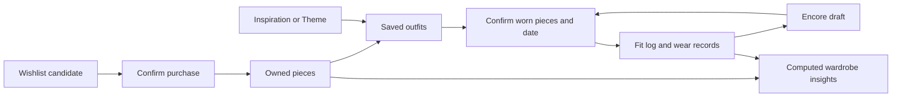
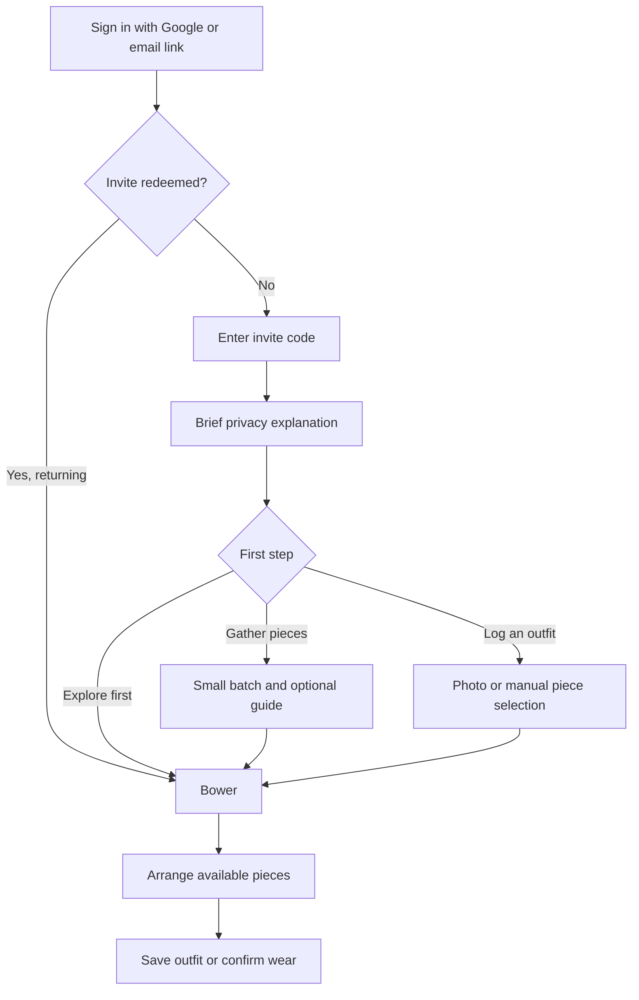
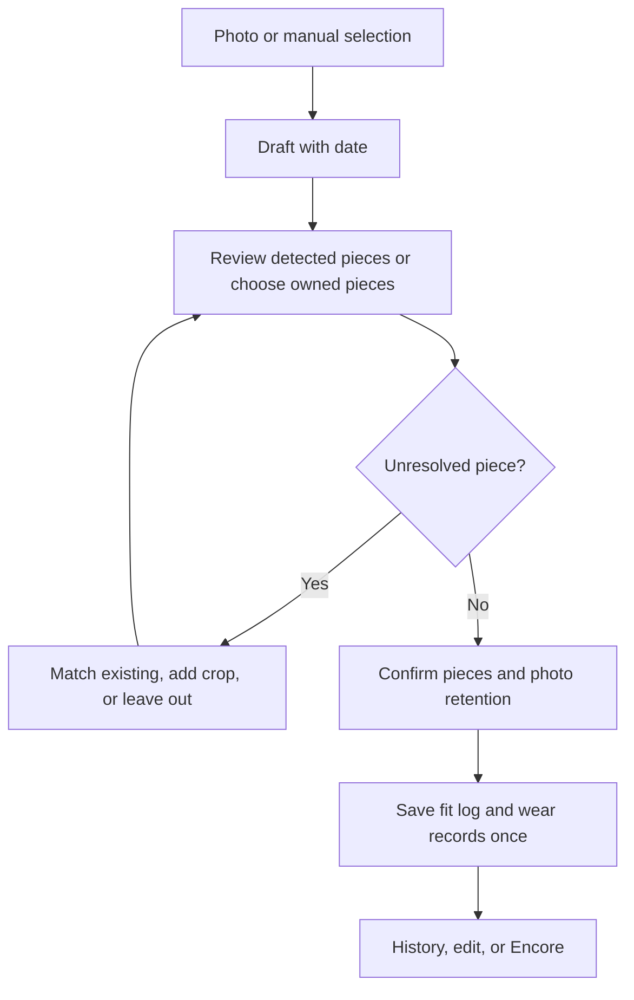

# bowr: UI, UX and information architecture

**Version:** 1.0, 25 September 2026  
**Status:** Recommended product design specification, ready for wireframing and implementation planning.  
**Scope:** The complete product architecture, with implementation detail concentrated on the MVP.  
**Inputs:** [Product requirements](<bowr — PRD.md>), [product context](PRODUCT.md), inspected Mobbin references, and the research linked throughout this document.

This document translates the PRD into interface decisions. It does not represent an implemented or usability-tested product. New decisions and proposed validation targets are identified explicitly. The PRD remains the source for feature scope and infrastructure; this document resolves presentation and interaction questions. AI model availability, prices, and provider terms in the PRD were not audited as part of this design work.

## Contents

1. [Design direction and decisions](#1-design-direction-and-decisions)
2. [Bowerbird behavior as product inspiration](#2-bowerbird-behavior-as-product-inspiration)
3. [Interface research](#3-interface-research)
4. [Information architecture](#4-information-architecture)
5. [Navigation and responsive structure](#5-navigation-and-responsive-structure)
6. [MVP journeys and screen specifications](#6-mvp-journeys-and-screen-specifications)
7. [Later feature specifications](#7-later-feature-specifications)
8. [Visual identity and design tokens](#8-visual-identity-and-design-tokens)
9. [Interaction and component system](#9-interaction-and-component-system)
10. [Accessibility and inclusive design](#10-accessibility-and-inclusive-design)
11. [AI, processing and recovery states](#11-ai-processing-and-recovery-states)
12. [Privacy, settings and administration](#12-privacy-settings-and-administration)
13. [Content and measurement contracts](#13-content-and-measurement-contracts)
14. [Delivery and validation](#14-delivery-and-validation)
15. [Resolved PRD ambiguities](#15-resolved-prd-ambiguities)

## 1. Design direction and decisions

**bowr should feel like a carefully arranged personal wardrobe: pale surfaces, clear garment silhouettes, useful memory, and quiet confidence.** The recurring experience is to gather a few pieces, arrange something wearable, log it, and return to it later.

Physical scene: someone stands beside their wardrobe in morning daylight, holding a phone in one hand and deciding what to wear before leaving. A light interface, readable controls, and large photographs support that moment. Longer sessions on a laptop support sorting and batch review. Light mode is an explicit product requirement; there is no dark mode or automatic system-theme switch.

### 1.1 Decisions to build around

| Decision | Recommendation | Product reason |
| --- | --- | --- |
| Starting screen | Open into **Bower**, the owned-piece collection | The wardrobe is the product's source of truth and the most concrete starting point |
| Main navigation | Four mobile destinations: **Bower, Outfits, Strut, More** | Organizes frequent jobs without turning ten named features into ten tabs |
| Primary loop | Gather → Arrange → Strut → Encore | Connects setup to immediate usefulness and repeated wear |
| First-run effort | Suggest one small outfit's worth of pieces; allow skipping | A useful first session should not require photographing 200 items |
| Brand | One Satin-led identity with supporting Flame and Gold | Keeps recognition consistent while allowing warmth and variety |
| Appearance personalization | No appearance selector in the MVP | Avoids early QA cost and a naming collision with saved style Themes |
| Recommendation presentation | Visible pieces, one-line explanation, clear swap controls | Makes AI advice inspectable and correctable |
| Manual operation | Create outfits and log wears without AI or a photo | Keeps the app useful when recognition fails or the shared budget pauses |
| Fit photos | Default to keeping the pieces only; saving the photo is opt-in | Resolves an unanswered retention choice conservatively without blocking the log |
| Reminders | Off by default; offer native push only in phase 8 | Prevents onboarding permission friction and respects the web-first roadmap |
| Social | Hidden until phase 9; explicit recipients per share | Invite-only membership does not make anyone's wardrobe shared |
| Bird metaphor | Feature names and a few meaningful interaction ideas | Ordinary tasks should remain understandable without knowing bird biology |

### 1.2 The theme recommendation

Different selectable accents do not inherently damage a brand. Inconsistency arises when they change the wordmark, hierarchy, component shapes, semantics, and content presentation together. bowr can preserve its identity across accents, but there is little launch value in implementing three complete themes.

**Ship Satin as the primary action color, Flame as a restrained expressive accent, and Gold for selected moments of value or rediscovery.** Garment imagery remains on the same pale neutral stage throughout. Do not color-code Arrange, Mimic, Forage, and Strut as separate mini-brands.

If users later ask for personalization, add **Settings → Appearance → Accent: Satin / Flame / Gold** as a separate follow-on, outside the committed roadmap. Change only approved accent tokens; keep neutral surfaces, typography, imagery, status colors, layout, and the wordmark fixed. Every variant must pass contrast and state tests. “Themes” continues to mean a saved style brief from Forage. “Plumage” continues to mean the user's color profile. Neither names interface appearance.

## 2. Bowerbird behavior as product inspiration

The table separates observed animal behavior from design interpretation. These are creative analogies, not evidence that a particular interface will work for people. Species differ; a trait observed in a great bowerbird must not be attributed to every bowerbird.

| Documented behavior | Product interpretation | Concrete use in bowr |
| --- | --- | --- |
| Male satin bowerbirds collect blue decorations and maintain an arranged display. [Australian Museum](https://australian.museum/learn/animals/birds/satin-bowerbird/) | Personal selection is more distinctive than an endless stream of new objects | Gather emphasizes owned pieces; Bower supports named-color filters and an optional color sort |
| A bower is a courtship display structure, distinct from a nest. [San Diego Zoo](https://animals.sandiegozoo.org/animals/bowerbird) | A collection becomes useful when it can be arranged and viewed | Separate the piece library from saved outfits; avoid “nest,” eggs, and hatchling account terminology |
| Great bowerbirds arrange objects in a size-distance gradient relative to the female's viewing position. [Endler et al., 2010](https://pubmed.ncbi.nlm.nih.gov/20832314/) | Design around the person's actual viewing situation | Make outfit compositions readable at phone size; compare an inspiration photo and owned substitutes from a consistent visual frame |
| Experimental changes to great bowerbird court geometry were followed by restoration of individual arrangements. [Kelley and Endler, 2012](https://pmc.ncbi.nlm.nih.gov/articles/PMC3529017/) | An arrangement should be easy to refine and recover | Lock an anchor piece, swap one slot, undo an edit, and preserve saved outfits when generating alternatives |
| Satin bowerbird displays include strutting, bowing, and vocal mimicry. [Australian Museum](https://australian.museum/learn/animals/birds/satin-bowerbird/) | A completed arrangement has a moment of use, then can be revisited | Strut records real wear; Encore copies a past fit into a new confirmation step. Mimic is an analogy from vocal mimicry, not a claim that birds copy outfits |
| Male satin bowerbirds adjust display intensity in response to female signals. [Patricelli et al., 2002](https://www.nature.com/articles/415279a) | Respond to explicit preference and tolerance | Thumbs up/down, dismissible guidance, optional reminders, and reduced motion. Never interpret silence as consent |
| Golden bowerbirds build maypole structures decorated with flowers and lichen. [Wet Tropics Management Authority](https://www.wettropics.gov.au/site/user-assets/docs/birdsofthewettropics.pdf) | The brand can accommodate distinct arrangements within a common vocabulary | Use a coherent system with flexible outfit compositions; a restrained two-upright motif may inform future identity work |
| Bower construction varies with species, individual birds, and available materials. [San Diego Zoo](https://animals.sandiegozoo.org/animals/bowerbird) | Work creatively with the collection that actually exists | Recommendations must resolve to owned IDs; sparse wardrobes produce fewer honest options rather than invented pieces |

### 2.1 What this changes in the interface

- **Gathering is gradual.** A person can add today's clothes and gain value now, then expand the wardrobe over time.
- **Arranging is reversible.** The user can change one piece without discarding the rest of an outfit.
- **Memory is useful.** “Last logged 12 days ago” and Encore are more useful than a badge for collecting more clothes.
- **Preference belongs to the person.** A favorite color or cut can override inferred advice. No wardrobe or body receives an attractiveness grade.
- **The bird appears in details.** A small abstract bower mark in an empty state, one orderly settling motion after save, and the feature vocabulary are enough. No bird calls, animated mascot, plumage wallpaper, or mandatory collection game.

Do not translate competitive courtship, decoration theft, or rivalry into social comparison, purchase pressure, leaderboards, or public outfit scores. This product's interpretation of the bowerbird is about resourcefulness and personal expression.

## 3. Interface research

Mobbin references were inspected on 25 September 2026. Observations below concern the returned screens and preview frames only; they are not usability findings or an exhaustive review of these products. Links point to canonical Mobbin records, not expiring image URLs. No reference screenshots are embedded or redistributed.

| Inspected reference | Observed pattern | Application to bowr |
| --- | --- | --- |
| [Alta: closet grid](https://mobbin.com/screens/5d68a0b4-57fd-4013-9fa4-06e6e7f901e1) | Cutouts on pale square fields, short identifying text, search above the collection | Keep cutouts consistent and searchable; use user-readable piece names rather than brand names as the main label |
| [Whering: item selection](https://mobbin.com/screens/e376c7b0-6ea1-4142-9323-c0e6c4de9468) | Category filters, visible selection checkmarks, and a bottom action with a selected count | Reuse this interaction logic for choosing outfit pieces and correcting Strut matches |
| [Whering: uploading items](https://mobbin.com/flows/af4ef40b-1307-45e3-9a42-d2c3d46a363c) | Preview frames show an upload entry point, completion feedback, and a populated wardrobe | Make progress persist outside the upload screen and return people to actual pieces. Do not copy the frames' many competing bright action colors |
| [Depop: outfit canvas](https://mobbin.com/screens/452bfc07-ad8d-4a1d-9303-e1939686b972) | Several isolated pieces share a single composition, with Save and undo/redo above | Treat an outfit as a composition. For the MVP use automatic slots and tap-to-swap, avoiding dependence on a freeform drag editor |
| [Alta: outfit calendar](https://mobbin.com/screens/c313869c-75f9-4ffd-ad68-956656460d6a) | Small outfit compositions identify logged dates in a month grid | Provide a calendar overview plus a readable selected-day list; tiny calendar images cannot carry the full interaction |
| [Air: desktop asset library](https://mobbin.com/screens/beaf7e86-2f16-4663-9ad2-9dce7a018f70) | Persistent sidebar, search, and a visual asset grid | Desktop Bower gets stable navigation and more visible pieces while retaining the mobile information hierarchy |

The result should have bowr's own restrained palette, clear outfit anatomy, and private wardrobe focus. Shopping calls to action, public engagement mechanics, and unrelated reference features do not enter the scope.

## 4. Information architecture

### 4.1 Organize by the user's question

| User question | Destination | Typical action |
| --- | --- | --- |
| What do I own? | Bower | Search, filter, inspect, Gather |
| What can I wear with this? | Piece → Arrange; also Outfits | Generate, swap, save |
| What outfits have I saved? | Outfits | Browse, edit, wear |
| What did I wear? | Strut | Log, correct, revisit, Encore |
| What would improve my wardrobe? | Birdseye | Inspect evidence and underused pieces |
| Should I buy this? | Shinies | Save a candidate, inspect its verdict |
| Can I recreate this look? | Outfits → Mimic | Map references to owned pieces |
| Can you build something for this occasion? | Outfits → Forage | Review a brief, then generate |
| What fits my preferences and proportions? | More → Fit profile | Manage Plumage, Perspective, and taste |
| What do my friends think? | Flock, phase 9 | Share a selected object or poll |

### 4.2 Object model visible to users

| Object | Meaning and ownership | Important distinction |
| --- | --- | --- |
| Piece | One owned wardrobe item, including an accessory | A photo is an input to a piece, not the piece itself; one piece may have an original, cutout, and care-label image |
| Outfit | A saved combination of pieces | Saving does not record a wear |
| Fit log | A confirmed occasion of wearing an outfit on a local date | Logging does not require a photo; several fits may occur on the same date |
| Wear record | A piece's participation in a confirmed fit log | Created only after confirmation; corrected or removed with that fit log |
| Inspiration | An input photo or linked reference with a derived brief or matches | Not automatically a wardrobe piece |
| Theme | A saved, reusable style brief | Not an outfit and not an interface color scheme |
| Shiny | A prospective purchase | Remains outside owned-piece results until “I bought it” is confirmed |
| Fit profile | Private, optional measurements, coloring, and preferences | Never a requirement for an outfit or an included social payload |
| Share / poll | A selected object made visible to named recipients | Does not expose the source wardrobe or grant browsing rights |

Outfit editing must not rewrite past wear history. At logging, preserve a snapshot of the worn piece IDs and display metadata. The existing `wear_logs` identify worn pieces; a version or snapshot contract is additionally needed for historical display. If the saved outfit changes later, the old log remains accurate. Section 15 records this implementation clarification.



### 4.3 Navigation tree and route contract

These are proposed stable routes. Feature names can change independently of plain internal names. Each detail has a shareable internal URL, but a URL never grants access. Opening a protected route requires authentication, a redeemed invite, and ownership or an explicit social permission.

```text
Unauthenticated
  /                         Welcome and sign in
  /auth                     Google or email magic link
  /auth/check-email         Sent, resend, change email
  /auth/callback            Return from authentication
  /privacy                  Photo processing and data use

Authenticated, invite not redeemed
  /invite                   Enter invite code; sign out or delete pending account

Invited member
  /onboarding               Brief privacy explanation and first-step choices
  /wardrobe                 Bower (default)
    /wardrobe/gather         Camera/gallery, batch preparation
    /wardrobe/uploads/:id    Upload batch progress and review
    /wardrobe/items/:id      Piece detail, edit, archive
    /wardrobe/insights       Birdseye (phase 3)
  /outfits                  Saved outfits and creation entry points
    /outfits/new            Manual outfit composer
    /outfits/arrange         Choose an anchor and complete a look
    /outfits/:id             Saved outfit detail and edit
    /outfits/mimic           Inspiration matching (phase 5)
    /outfits/forage          Brief-led generation (phase 5)
    /outfits/themes          Saved style briefs (phase 5)
    /outfits/themes/:id      Reuse or edit a style brief (phase 5)
    /outfits/requests/:id    Saved brief, references, and results (phase 5)
  /logs                     Strut: calendar and history
    /logs/new               Photo or manual fit log
    /logs/:id               Worn pieces, photo choice, correction, Encore
  /more                     Secondary destinations and account settings
  /wishlist                 Shinies (phase 4)
    /wishlist/new           Product link, photo, or manual details
    /wishlist/:id           Verdict, ownership transition
  /profile/fit              Fit profile (phase 6)
    /profile/fit/color       Plumage and temporary draping session
    /profile/fit/proportions Perspective and measurements
    /profile/fit/taste       Preferences and image ratings
  /settings                 Account, privacy, location, units, reminders
  /help/photos              Photo guides by category
  /friends                  Flock (phase 9)
    /friends/shares/:id      Shared object or poll

Owner only
  /admin                    Spend overview, members, invites
```

Every path above is complete; indentation shows hierarchy. Static routes such as `/outfits/new` take precedence over dynamic IDs. An authenticated, invited member opening `/` goes to Bower; an unredeemed account goes to the invite gate.

### 4.4 Labels and vocabulary

| PRD name | Visible label or contextual action | Placement |
| --- | --- | --- |
| Bower | “Bower” with “Your wardrobe” below the page title | Main navigation |
| Gather | “Gather” button; destination title “Gather · add pieces” | Bower |
| Arrange | “Arrange around this”; entry subtitle “Pair your pieces” | Piece detail and Outfits |
| Mimic | “Mimic · recreate a look” | Outfits, phase 5 |
| Forage | “Forage · build an outfit” | Outfits, phase 5 |
| Themes | “Themes · saved style briefs” | Outfits, phase 5 |
| Birdseye | “Birdseye · wardrobe insights” | Bower link and More, phase 3 |
| Plumage | “Plumage · your colors” | Fit profile |
| Perspective | “Perspective · fit and proportions” | Fit profile |
| Shinies | “Shinies · wishlist” | More, phase 4 |
| Strut | “Strut” with “Your fit log” below the page title | Main navigation |
| Encore | “Encore · wear again” | Past fit detail |
| Flock | “Flock · shared with friends” | More, phase 9 |
| Ask the Flock | “Ask the Flock” followed by the actual question | Share composer |

Keep explanatory subtitles in feature entry points and headings; do not make recognition depend on an onboarding tutorial. Compact tab labels stay short. Buttons name their result: “Save outfit,” “Log this fit,” “Replace shoes,” and “Review 3 matches.” Avoid “Go,” “Submit,” or “Magic.”

### 4.5 Piece taxonomy and search

Retain the PRD's first-class categories: tops, bottoms, outerwear, dresses, shoes, eyewear, headwear, bags, belts, watches, and jewelry. Do not bury these last six categories under an exclusive “Accessories” bucket. An Accessories shortcut may group them, but the filter reveals every constituent category.

| Facet | Representation | Interaction rule |
| --- | --- | --- |
| Category / subcategory | Plain labels such as Shoes → Loafers | Multiple categories can be selected |
| Color | Named swatches plus stored hex values | A color name is always available; selection has a checkmark |
| Pattern | Plain chips, such as Solid or Striped | Show common options first |
| Material | Editable value with “Suggested” when inferred | Never present an image-based fabric guess as verified |
| Formality | Relaxed, Casual, Smart casual, Dressy, Formal | Map to the PRD's 1–5 values; disclose that it is editable |
| Season / conditions | Editable PRD season tags | Weather is context, not a region-specific preset |
| Style tags | Searchable suggestions and editable tags | Do not let free-text tags replace core categories |
| Wear history | Last logged, wear days, never logged | Distinguish incomplete logging from actual non-use |
| State | Ready, processing, needs attention, archived | Archived is excluded by default |

Search matches piece name, category synonyms, brand, color, material, and tags. “Shades” finds eyewear; “pants” finds bottoms. MVP search is explicit text-and-tag matching, not a hidden paid AI call. Within a facet use OR; across facets use AND. Preserve sort and filters when opening a piece and returning.

Default sort is Recently added. Alternatives: Category, Color, Most logged, Least recently logged, and Name. Treat pieces with no logs as a separate group when sorting by wear history. Show active filter chips, result count, and Clear all. An empty result says which filters are active and offers to clear them without clearing the underlying wardrobe.

Outfit slots support either **top + bottom** or **one-piece garment**, with shoes, optional outerwear, and independent accessories. Dresses must not require a redundant top or bottom. Add a `one_piece` slot to the implementation contract; do not squeeze dresses into the PRD's top slot.

## 5. Navigation and responsive structure

### 5.1 Phone web, the primary surface

- Four labeled bottom tabs stay in the same order: Bower, Outfits, Strut, More. Bower is the post-login default.
- Gather is a labeled primary action in Bower, not a fifth destination or an ambiguous global plus button.
- Each tab remembers its scroll position and local state. Back returns to the originating collection and position.
- A compact Today row near the top of Bower links to “Log today's fit” or today's latest log. It is an action row, not a separate dashboard.
- Complex work such as Gather, fit matching, and outfit editing opens a full-height route. The bottom navigation is replaced by the task's own footer; Back preserves a draft where safe.
- More is a labeled list. At MVP it contains Settings and Photo guides. Birdseye, Shinies, Fit profile, and Flock appear only when their phases ship. No disabled future-feature wall.
- Birdseye has a contextual link from Bower and a secondary link in More. Both point to the same route and state; Bower remains its active navigation owner.

### 5.2 Tablet and desktop

Use the same destinations and route ownership. From 768 CSS px, switch the bottom navigation to a 208 px rail if the remaining content can support the grid. Below that width retain the bottom tabs. From 1200 px, use a 224 px rail and a content maximum of 1280 px. Secondary destinations can appear below a divider in the rail; do not turn them into a different taxonomy.

Piece and outfit details use two columns on sufficiently wide screens: imagery and composition on the left, metadata and actions on the right. A route remains a full page even if a desktop implementation adds a detail panel; browser Back and focus behavior must remain predictable. Filters can become a persistent inline sidebar when there is enough space.

### 5.3 Layout sizes

| Available viewport | Page gutter | Bower grid | Detail behavior |
| --- | --- | --- | --- |
| 320–374 px | 12 px | 2 columns | Single column; controls wrap |
| 375–767 px | 16 px | 2 columns by default | Large image, then content; optional denser grid later |
| 768–1199 px | 24 px | Usually 3–4 columns after rail | Split detail only if both columns remain readable |
| 1200 px and above | 32 px | 4–6 columns | Composition plus a 320–400 px details column |

Choose grid columns from actual available width, with a normal tile minimum around 152 px and a 320 px viewport exception. Never let a fixed column count force horizontal page scrolling. Reflow to fewer columns at larger text sizes. A 12 px grid gap and stable image aspect ratios prevent a busy catalog from becoming visually noisy.

## 6. MVP journeys and screen specifications

### 6.1 Onboarding: reach the first useful outfit



**Welcome screen:** wordmark, a small composition of example clothing clearly labeled as a sample, one sentence (“Wear what you've gathered.”), Google sign-in, email sign-in, and the invite requirement. Do not make users believe sample pieces belong to them.

**Authentication:** email has a persistent label, a resend state, and a change-email action. Keep an intended destination across the email round trip. Expired links return to a clear resend path. Do not ask a returning member for another invite.

**Invite gate:** one paste-friendly field, “Unlock my Bower,” and a way to switch accounts. Separate invalid, expired, already used, revoked, and rate-limited messages when the server safely identifies them. The PRD allows five attempts per hour; show the next retry time after rate limiting. Explain that unredeemed accounts expire after 24 hours. Do not imply there is a waitlist or send a message to the owner automatically.

**Privacy step:** “Your wardrobe is private. Google processes photos for bowr's AI features. bowr tracks usage events, not your photos or typed text.” Link to a concise explanation of storage, processing, retention, and deletion. This is a description of the intended deployed configuration and must be verified before release.

**First action:** offer Gather pieces, Log today's fit, and Skip for now. The suggested starter set is one top and bottom, or a dress, plus shoes; adding another top creates more options. This is guidance, not an eligibility threshold. Do not collect body measurements, a selfie, favorite brands, weather location, notifications, or 20 taste ratings here.

After the first useful outfit or log, show the next relevant action inline. A subtle “5 pieces gathered” acknowledgment is enough. No fixed wardrobe-completion percentage unless the user later provides an optional estimate of their total wardrobe.

### 6.2 Bower: the collection

Information order:

1. Page title and piece count, with Gather as the primary action.
2. Today row, or compact ongoing-upload status if action is required.
3. Search, category shortcuts, filter count, and sort.
4. Piece grid with consistent images and short names.
5. Additional results and a clear end state.

At 390 px, the intended hierarchy is:

```text
bowr                                      Account
Bower                               + Gather
Your wardrobe · 42 pieces

Today                 Log today's fit     →

[ Search pieces                            ]
[All] [Tops] [Bottoms] [Shoes] [Categories ▾]
42 pieces                    Filters (2)  Sort

┌────────────────┐   ┌────────────────┐
│  shirt cutout  │   │  trouser      │
│                │   │  cutout       │
└────────────────┘   └────────────────┘
Blue Oxford shirt    Black trousers

Bower          Outfits          Strut          More
```

“Account” links to Settings; it does not create another profile destination. The category shortcut row may scroll horizontally with a visible continuation cue, but Categories must expose the full list without requiring swiping.

**Tile content:** garment image, editable display name, and a status only when needed. Generate a name such as “Navy linen shirt” from known tags; fall back to “Untitled top.” Keep brand, price, formality, wear count, and every tag off the default tile. A processing tile stays in its position as the cutout arrives. Missing images retain the label and an image-error state.

**Selection:** tapping opens detail. A visible Select action enters bulk mode; long press may be a shortcut. Bulk operations in the MVP are archive and category correction, not a spreadsheet of every attribute. Show the selected count and a clear exit.

**Empty Bower:** “Your Bower is empty. Gather your first piece.” Primary Gather; secondary Log today's fit. The guide should promise a manageable start, not a complete cataloging project.

**Partial Bower:** display everything the user has added. Offer relevant suggestions, such as adding shoes, only when they help complete a look. Do not hide Arrange behind a numerical minimum; explain the missing categories when it cannot produce a complete combination.

### 6.3 Gather: from photos to pieces

Entry offers **Take photo** and **Choose photos**, with batch selection up to 20 source photos. A browser without camera capture still exposes the file picker. Desktop adds a drop zone as an alternative, not the only input mechanism.

1. Select photos; show a thumbnail queue with Remove, Rotate, and Add more.
2. Offer the brief first-upload guide, dismissible and permanently accessible. Category-specific guidance appears when a category is selected.
3. Treat care-label photos as attachments to a garment, never as new wardrobe pieces. “Add care label” is optional on each queue item or detail screen. Explain that the 20-photo limit includes label photos.
4. Start upload with a selected count. Files upload independently; one failure does not reset the batch.
5. Show preview → upload → cutout → tags as actual server-derived stages. After upload, processing continues in the background.
6. As pieces become available, return them to Bower. Offer “Review pieces” and a smaller “Needs attention” count; do not require a form submission for every successful inference.

The guide uses the PRD's instructions: one garment in frame, plain contrasting background, indirect daylight, and a straight camera angle. Shoes use a side view of the pair; eyewear needs glare control; bags stand upright; caps keep their shape; belts show the buckle. Jewelry guidance may allow grouped photography, but each intended piece must be split and confirmed before creating item records.

**Grouped photos:** show proposed crops with “Keep as one set” or “Split into pieces.” Earrings sold and worn as a pair can remain one piece. A watch and bracelet become separate pieces when the user confirms them. The limit applies to source photos, so explain if splitting creates more than 20 resulting pieces. Do not silently create several wardrobe items from one photo.

**Per-photo recovery:** Retry upload, Retry cutout, Use original, Replace photo, or Remove. Manual edge correction offers Restore / Erase, brush size, zoom, undo, and reset; retain the original so correction is reversible. A care-label failure leaves the garment intact and allows manual brand, size, and material entry.

**Tag review:** category, name, and colors appear first; other fields expand under Details. Mark uncertain values as “Suggested.” The user's changes override later job results. A tag job may fill an untouched field, but may never replace an edited value or reset a crop.

An uploaded piece is visible in Bower immediately. It becomes eligible for automatic matching and outfit generation when its category and required processing data are available. A low-confidence or missing category shows “Check category” and excludes that piece from automatic selection until resolved; it can still be found and added manually. Successful ordinary tags do not require a separate approval step.

**Duplicates:** flag a likely existing item before final creation when feasible, with both images visible. Actions are Use existing, Add another, or Decide later. Identical garments can be real separate pieces, so never merge automatically.

**Interrupted work:** show “Keep this tab open until uploads finish.” Completed uploads survive closing the browser; files not uploaded may need reselection. Do not promise background upload in a suspended phone browser. Retrying uses the same job identity to avoid duplicate items or double charging.

### 6.4 Piece detail

Information order is cutout, name and category, **Arrange around this**, then metadata and history. The image viewer can switch between Cutout and Original; a care-label image sits in a separate attachment row.

Details include colors with names, material and pattern, formality, seasons, style tags, then optional brand, size, price paid, currency, and purchase date. Keep optional purchase fields collapsed. Price is never required to use the app.

Actions: Edit details, Replace or fix photo, Log wear, Archive. Put permanent deletion in the overflow menu with a description of its effect on outfit and log history. Archive means the piece is no longer available to new recommendations; old logs remain readable. Restore is available in the archived filter. Permanent deletion removes that piece's originals, cutouts, labels, and reusable attributes; historical references become a neutral “Deleted piece” placeholder. It must not leave a recoverable copy in an outfit snapshot. Other pieces and the fact that a fit was logged remain until the user deletes that log. A separately retained fit photo may still depict the garment; disclose that distinction and link to those photos for removal.

History uses “Logged on 3 days” and “Last logged 12 Sep” rather than claiming complete knowledge of wear. Before any confirmed logs, show “No wears logged yet.” Similar pieces can appear as a compact row when data is available, not as an automatic duplicate accusation.

### 6.5 Outfits and Arrange

Outfits opens to saved combinations. The header offers **Create outfit**; a prominent but compact entry offers **Arrange · pair your pieces**. Before phase 5 these are the only creation modes. Empty copy: “Save a combination you want to wear again.” Actions: Arrange a look or Choose pieces myself.

**Arrange flow:** choose an anchor if one was not passed from a piece → optionally set occasion or include/avoid pieces → Generate → inspect 3–5 complete outfits in normal budget mode → swap, save, rate, or log.

The anchor remains visibly locked. Results are vertically stacked on phones, with a small “1 of 3” orientation label. Desktop can show two results side by side. Avoid a swipe-only carousel that hides the available choices.

Each result contains:

- An orderly composition of actual cutouts, with a text piece list directly below.
- A one-line explanation grounded in those pieces and the request.
- **Save outfit** as the primary action, plus **Wear today**, **Swap a piece**, and compact thumbs up/down controls.
- A details disclosure for assumptions, unavailable pieces, or a cached result's creation time.

Arrange should produce complete wearable combinations when the wardrobe permits it: top + bottom or one-piece, normally shoes, and optional layers or accessories. Accessories never count as a substitute for missing clothing. When completion is impossible, show the partial combination labeled “Needs shoes” or “Needs a bottom,” offer a manual change, and allow saving it as a partial outfit. Never call a partial suggestion complete.

**Swap:** tap a piece or its named row, see owned alternatives for that slot, select one, and return to the composition. Manual swaps do not require another AI call. The original anchor can only change through an explicit Unlock action. Recomputing an explanation, if requested, is a separate AI action; otherwise label the existing explanation as applying to the original suggestion.

**Manual composer:** the same slot structure and picker work without AI. It is a functional fallback and the main editing surface, not a separate drawing tool. Freeform positioning, sticker text, export canvases, and elaborate moodboards are outside the MVP.

**Save:** an optional name is suggested, such as “Blue shirt + black trousers.” Saving does not log wear. **Wear today** opens a compact date and piece confirmation before creating the log. It can also save the outfit if it is not already saved.

**Feedback:** thumbs up/down rate a suggestion; a heart means “Love this outfit.” Neither records wear. A downvote may reveal optional reasons such as Not my style, Too warm, or Pieces do not work together. Preserve the ability to reverse a rating; never block progress on an explanation.

### 6.6 Strut: confirm what was worn

Strut opens to the current month's calendar with a selected-day list underneath. Offer a List view with equivalent information for easier scanning and accessibility. Logged days have an outfit thumbnail and a text or icon marker; selection uses an outline as well as color.

**Primary action:** Log a fit. Two equal input methods: Take or choose photo, and Choose pieces. Today's date is the default, clearly editable. Multiple fits per day are supported, but an identical piece-set/date submission triggers a possible-duplicate check.



**Photo review:** show the fit photo, then one row per detected piece. Each row contains the crop, the proposed owned match, its name, a textual certainty label, and Change / Remove. Low-confidence matches rise to the top and remain marked until reviewed. A matching score is assistance, not a claim that the garment is certainly identical.

**Unknown item:** offer Find in my Bower, Add as a new piece, or Leave out. Adding from a crop shows the crop and basic category, creates a piece only on confirmation, and marks its image as “From a fit photo” with a reshoot action. A later reshoot updates the same piece ID. If a visible item is intentionally left out, the confirmation states that its wear will not be counted.

**Confirmation:** “Log 4 pieces for today” with date, piece thumbnails/names, and a **Save this photo** switch, off by default. Explain: “The piece list is saved either way.” An unconfirmed detection never creates wear records.

After save: “Strut saved. 4 pieces logged.” Show View fit and optional Love this outfit. If the photo was not retained, use an outfit composition in history. Keep the photo choice visible on every new log; do not silently change the default after one opt-in.

Every confirmed log links to a saved outfit, as required by F9. Reuse an unchanged selected outfit; otherwise save the confirmed combination with source `log`. Repeated logs of the same saved combination do not need duplicate outfit-library entries. Store the wear snapshot separately so later outfit edits cannot rewrite the log.

If the user explicitly added a new wardrobe piece from a crop, that confirmed piece image is retained as its own asset even when the full fit photo is discarded. Explain this beside Add as a new piece. Delete the full photo and all unused detection crops; do not delete the newly confirmed wardrobe item's image.

**Correcting history:** changing a piece or date updates corresponding wear records together. Deleting a log removes its contribution to statistics but does not delete the wardrobe pieces or a separately saved outfit. A failed save remains a draft and cannot display a success message.

**Encore:** create a new draft from the historical worn pieces. Set today's date, show unavailable or archived pieces, and ask for confirmation. Do not copy the old photo as evidence of today's wear, and never add a wear merely because Encore was tapped.

On a past fit, use precise nudges such as “Last logged Tue, 15 Sep.” Avoid guilt, streak loss, or pressure to appear different every day. Repeating an outfit is a useful outcome.

## 7. Later feature specifications

These sections establish stable entry points and interaction contracts. They do not expand the MVP.

### 7.1 Birdseye, phase 3

Enter from Bower or More. Organize the page as **Overview, Wear history, and Opportunities**, with date range, data coverage, and last-calculated time near the top.

Use labeled horizontal bars for category and formality distributions, a named-color breakdown with counts, ranked rows for most/least logged pieces, and a readable table equivalent. Do not make a multi-ring dashboard or a single unexplained wardrobe-health score. All counts are computed before the AI writes commentary.

Each insight pairs **observation → interpretation → action**. Example: “8 of 21 tops are black” → “Your tops currently favor dark neutrals” → View these tops. A separate suggestion can offer a different color; the data does not establish that owning black clothes is a problem.

“Not logged in 90+ days” only appears when sufficient observation history exists. For recently added pieces use “Not logged since added.” Cost-per-wear shows the paid price, currency, and counted wear days; missing prices produce “Add price to calculate.” Never show zero cost or infinity as a meaningful estimate.

Near-duplicates open a side-by-side comparison. Palette balance, category ratios, and versatility expose their definitions and sample sizes. Describe them as characteristics, not ideals everyone must meet. Suggested gaps explain which existing combinations they would complete, with a View combinations action and a later Save to Shinies link.

AI commentary is generated on request or after a meaningful data change, not on every page visit. Computed charts remain usable when AI is paused. Fit-profile advice, when available, stays optional and can be hidden.

### 7.2 Shinies, phase 4

More → Shinies opens a visual list with Wanted, Bought, and Dropped filters. Add accepts a product URL, screenshot/photo, or manually entered title. Start with the PRD's Uniqlo link and Shein screenshot acceptance cases; keep the generic fallback available for every store.

After extraction, let the user correct title, image, price, currency, and variant before asking for a verdict. If a store blocks previews, preserve the link and offer a screenshot immediately. Do not present an endless retry spinner.

A verdict starts with **Buy / Think about it / Skip**, two concise reasons, and an “Based on your current Bower” timestamp. Follow with duplicate comparisons, complete-outfit unlocks, taste distance, optional palette/fit guidance, and a clearly labeled cost-per-wear scenario. Recommendations are editable judgments, not purchase commands. Missing closet or price data yields “Not enough information” for the affected factor.

An outfit unlock counts a distinct complete combination containing the candidate, not every pairwise match. The user can inspect the counted combinations. Show “3 combinations found” when the search is incomplete; do not imply an exhaustive count. A cost-per-wear estimate exposes its assumed wear frequency, unlike historical Birdseye cost-per-wear.

**I bought it:** confirm the variant and price, then create one wardrobe piece with the product image and source link. Check for an existing piece first. Mark the wishlist record Bought only after the wardrobe save succeeds. Offer “Take my own photo” later. No checkout, affiliate placement, or automatic wear log.

### 7.3 Mimic, phase 5

Outfits → Mimic accepts an uploaded image or a supported pasted image/URL, with file upload as the fallback when clipboard or URL access fails. Explain the difference at entry: “Find your closest pieces to a reference outfit.”

Show the reference first, then detected garment rows. Each row contains the reference crop, a plain description, up to three owned candidates, and an explicit choice. On desktop, place reference and recreation side by side; on mobile, stack them with a persistent reference thumbnail that can expand.

Similarity is labeled as **visual similarity**, not a probability of a perfect match. Preserve the PRD's score requirement in expanded details using the model's documented scale; use qualitative labels as the scanning aid. Do not convert arbitrary embedding distance into an uncalibrated confidence percentage.

Distinguish Exact piece confirmed by user, Close substitute, and Gap. A gap says “No close match in your Bower,” with Pick another piece or Save gap to Shinies. It never inserts a store item into the owned composition. Save the recreated outfit once required choices are resolved; unresolved gaps produce a clearly labeled partial outfit.

### 7.4 Forage and Themes, phase 5

Outfits → Forage accepts a short prompt plus optional photos, occasion, weather, and include/avoid pieces. Keep the initial screen small: input, a few examples, and expandable constraints. Examples from the PRD include “Old money,” “Cubao Expo fit,” and “BGC brunch.” They are suggestions, not permanent location-specific weather presets.

The flow is **Input → Review style brief and references → Build outfits → Refine or save**. Keyword searches return 3–5 references where available. Users can remove a reference before generation, edit the brief, or proceed with fewer. A brief describes palette, silhouettes, fabrics, footwear, and the desired mood in plain language.

For a named person, use public-style references. Store source links rather than copies of their photos. Use licensed/allowed remote thumbnails where available, with link-title cards when preview rights or access are unavailable. The UI must remain complete without cached celebrity imagery.

Generate 2–3 owned outfits in normal mode, with missing pieces in a separate section. Keep include/avoid constraints visible on results; do not silently relax them to fill a slot. Weather can come from an optional saved city or a user edit. No location permission is required to make an outfit; unavailable weather leaves a manual conditions control.

Save a useful brief through **Save as Theme**, with an editable name and summary. Themes live under Outfits and generate new combinations when used. Editing a Theme changes the brief, not previously saved outfits. When web search is disabled by the budget mode, explain that new references cannot be fetched and offer a saved Theme, existing references, photos, or direct instructions.

Mimic and Forage each expose Recent requests. Opening one restores its existing references, brief, and results without generating again; Refresh or Build again is explicit. Users can delete a saved request independently of an outfit already created from it.

### 7.5 Fit profile: Plumage, Perspective and taste, phase 6

More → Fit profile shows three independent sections and what each can help with. Each can be skipped, edited, reset, or deleted. Do not show a completion score suggesting that weight or a selfie is required.

**Perspective:** optional height and measurements, units toggle, usual brand sizes, relaxed-to-tailored preference, comfort constraints, and optional areas to emphasize. Provide measurement diagrams and manual input; do not infer a person's body measurements from a casual outfit photo. Weight remains optional and never becomes a target, badge, or recommendation objective.

**Plumage:** choose self-reported coloring or a temporary selfie session. Explain the lighting limitations before capture. Follow the PRD's daylight and white-paper guide and three-shot consistency check. Show low-quality or inconsistent input as something to retake or skip, not a confident palette.

During optional draping, show the same face crop against two color candidates with **Left, Right, No preference**, and Undo controls. Swipes are optional shortcuts. Keep a persistent End session and delete photos action. Color results distinguish near-face suggestions from colors to try anywhere; the user's ratings override initial suggestions. Do not give a diagnostic body type or a mandatory color season.

**Taste:** 15–20 short outfit-image ratings, resumable and skippable, with explicit Like / Not for me / Skip controls and source attribution. Favorite brands, icons, budget, comfort, and lifestyle are optional. Store useful preferences, not an obligation to complete every field.

Web fit inspiration is opt-in and describes matching criteria. Search using coarse traits and stated preferences rather than sending a selfie or exact measurements into public search. Never promise an exact “body twin.” Include a visible Edit preferences link on results.

Selfie deletion covers originals, crops, temporary previews, and draping assets. Leaving or ending the session initiates deletion; crash and abandoned-session cleanup must be enforced server-side. A proposed safety limit is 15 minutes of inactivity and a maximum session of one hour. Store only the approved numerical color profile, palette, and votes. Do not claim deletion is complete until the server confirms it.

### 7.6 Flock, phase 9

More → Flock has Shared with me and My shares. It is a finite friends-only list, with explicit unread states if needed. Invitations to use bowr and permission to view a shared object are separate concepts.

Share begins from an outfit, fit log, or Shiny. Show the exact payload preview, select named recipients, choose a simple share or a poll, then confirm. Nobody is preselected. Fit photos require explicit inclusion even when already retained privately. Exclude measurements, selfies, price paid, private notes, and the rest of the wardrobe from the default payload.

Poll types are Rate my fit, A or B, and Ask before buying, with comments and an explicit closing time. A/B choices need text labels and equivalent image size. Votes can be changed while open; closed polls show results and closing time. No public profile, share-to-public default, popularity ranking, or follower counts.

Unshare revokes in-app access and invalidates future image access. Explain that recipients may already have seen or captured the content; deletion cannot retract screenshots. Deleted or inaccessible shares show a neutral unavailable state without exposing the source object's title or thumbnail.

## 8. Visual identity and design tokens

### 8.1 Color strategy

Use a **restrained** product palette. Saturated interface color should occupy roughly 10% or less of a normal collection screen, excluding the clothing photographs. Neutral surfaces supply the stage; blue-violet identifies action and selection.

The male satin bowerbird's blue-black plumage and violet-blue iris inform Satin. [Australian Museum](https://australian.museum/learn/animals/birds/satin-bowerbird/) Flame translates the flame bowerbird's orange and yellow plumage into a restrained warm accent. [BirdForum species account](https://www.birdforum.net/opus/Flame_Bowerbird) Gold takes its cue from the golden bowerbird's golden underside and brown-gold wings. [Wet Tropics Management Authority](https://www.wettropics.gov.au/site/user-assets/docs/birdsofthewettropics.pdf)

“Gold” in this specification refers to the **golden bowerbird**, not the similarly striking regent bowerbird. The token values are designed interpretations for accessible interfaces, not sampled or biologically exact feather colors.

### 8.2 Core palette

Author tokens in OKLCH, with the listed sRGB hex fallbacks for tooling and native rendering. The values below are paired conversions rounded for documentation. Keep a single canonical token source and generate platform values from it.

| Token | OKLCH | sRGB fallback | Role |
| --- | --- | --- | --- |
| `canvas` | `oklch(97.65% 0.0054 274.97)` | `#F6F7FB` | Main page background |
| `surface` | `oklch(99.09% 0.0029 264.54)` | `#FBFCFE` | Image fields and raised working surfaces |
| `surface-subtle` | `oklch(95.56% 0.0096 273.36)` | `#EEF0F7` | Sidebar, grouped controls, subdued panels |
| `text` | `oklch(28.19% 0.0355 274.75)` | `#24283B` | Primary text and icons |
| `text-secondary` | `oklch(49.96% 0.0340 274.59)` | `#5D6277` | Supporting text and metadata |
| `divider` | `oklch(89.19% 0.0170 271.22)` | `#D7DBE7` | Nonessential separators, never the sole control outline |
| `control-border` | `oklch(62.82% 0.0326 270.85)` | `#81889D` | Input and other required control boundaries |
| `accent` | `oklch(47.06% 0.1657 272.23)` | `#3E4DB6` | Primary actions, links, focus, selection |
| `accent-hover` | `oklch(40.66% 0.1484 271.88)` | `#303D98` | Pointer hover |
| `accent-pressed` | `oklch(35.76% 0.1298 271.94)` | `#27327F` | Pressed primary action |
| `accent-soft` | `oklch(94.72% 0.0193 273.23)` | `#E9EDFB` | Selected backgrounds |
| `on-accent` | `oklch(99.39% 0.0029 264.54)` | `#FCFDFF` | Text on Satin actions |

| Supporting token | OKLCH | sRGB fallback | Allowed use |
| --- | --- | --- | --- |
| `flame` | `oklch(62.03% 0.1646 36.78)` | `#D65A36` | Small illustration accents and labeled chart marks |
| `flame-ink` | `oklch(50.32% 0.1442 35.00)` | `#A63D23` | Readable warm text on a Flame wash |
| `flame-soft` | `oklch(96.48% 0.0195 50.16)` | `#FFF0E8` | Small expressive callouts |
| `gold` | `oklch(79.24% 0.1390 92.24)` | `#DBB841` | Small rediscovery or favorite accents with a label |
| `gold-ink` | `oklch(48.00% 0.0931 88.62)` | `#735A0D` | Gold-wash text; warning text with an explicit icon |
| `gold-soft` | `oklch(96.26% 0.0361 95.01)` | `#FAF3D8` | Subtle emphasis and warning background |
| `success` | `oklch(49.84% 0.0961 157.73)` | `#28734D` | Confirmed success with text/icon |
| `success-soft` | `oklch(96.00% 0.0149 158.25)` | `#EAF5EE` | Success background |
| `error` | `oklch(51.43% 0.1594 18.08)` | `#B03443` | Errors and destructive actions |
| `error-soft` | `oklch(96.21% 0.0132 5.80)` | `#FBEFF1` | Error background |

Semantic colors remain invariant if appearance accents are ever added. Gold is not sufficient to mean Warning, and Flame never doubles as Delete. Always include words and an appropriate icon.

### 8.3 Contrast checks

The following approximate ratios were calculated from the sRGB fallbacks using WCAG relative luminance. These verify token pairs, not the accessibility of an unbuilt interface. Rounded OKLCH output and compositing still need checking in the actual app.

| Pair | Ratio | Intended use |
| --- | --- | --- |
| Text / surface | 14.19:1 | Body and headings |
| Secondary text / surface | 5.88:1 | Metadata and helper text |
| Secondary text / canvas | 5.64:1 | Page-level supporting text |
| On-accent / Satin | 7.01:1 | Primary button labels |
| Satin / surface | 6.95:1 | Links and selected text |
| Control border / surface | 3.44:1 | Required control edges |
| Control border / canvas | 3.30:1 | Required control edges |
| Flame ink / Flame soft | 5.70:1 | Warm callout text |
| Gold ink / Gold soft | 5.90:1 | Gold callout text |
| Text / Gold | 7.59:1 | Labeled Gold badge |
| Success / success soft | 5.15:1 | Success message |
| Error / error soft | 5.48:1 | Error message |

Base Flame on surface is approximately 3.81:1 and is **not approved for normal-size text**. Gold must not carry pale button labels or serve as a thin focus indicator. Do not lower the opacity of secondary text to make it feel quieter.

### 8.4 Typography

Use one system sans family, mapped to the platform system font on native and `-apple-system, BlinkMacSystemFont, "Segoe UI", system-ui, sans-serif` on web. A distinctive wordmark can be drawn later; it must not become the UI font.

| Style | Size / line height | Weight | Use |
| --- | --- | --- | --- |
| Page title | 32 / 40 px | 650 or nearest available 600 | Bower, Outfits, Strut |
| Section title | 24 / 32 px | 600 | Major group headings |
| Subheading | 20 / 28 px | 600 | Outfit or insight title |
| Body / input | 16 / 24 px | 400 | Explanations, forms, piece rows |
| Action label | 16 / 20 px | 600 | Buttons |
| Secondary | 14 / 20 px | 400–500 | Metadata |
| Compact label | 12 / 16 px | 600 | Navigation and minor badges only |

Body prose caps at 68 characters per line. Scale and weight create hierarchy; all-caps tracking does not. Use tabular numerals for counts, dates, and spend tables. Do not shrink type to preserve a two-column layout. Input text stays at least 16 px on phone web.

### 8.5 Shape, spacing and image direction

- Spacing scale: 4, 8, 12, 16, 24, 32, 48, and 64 px. Use 8–12 within a control group, 16–24 between related sections, and 32–48 between major sections.
- Controls have 10 px corners; image fields 12 px; large sheets 20 px on exposed top corners. Pills are reserved for filter chips and compact status labels.
- Use borders and background levels before shadows. Collection tiles do not need enclosing cards. A single outfit composition can use one container; do not nest a card around each garment inside it.
- Navigation and sticky action bars use solid surfaces. No frosted glass, gradient text, decorative accent stripes, or ornamental shadows.
- Garment images use a consistent square crop field, `contain` behavior, and approximately 10–12% safe margin. Preserve aspect ratio and original garment color. No tint overlay, beauty filter, or synthetic texture on clothing.
- Keep optional cutout shadow off by default. Poorly rendered shadows can look like stains or alter edges. Clearly separate cutout framing from source-image color measurements.
- Outfits use a predictable visual anatomy: top above bottom, or a dress spanning both; shoes below; layers and accessories adjacent. This is a composition, not a virtual try-on or a claim of physical scale.
- Icons use a consistent 20–24 px outline set with about a 1.75–2 px stroke. Use familiar garment, calendar, filter, and settings symbols; a decorative feather is not a substitute for a recognizable action.

## 9. Interaction and component system

### 9.1 Required components

| Component | Required content and behavior |
| --- | --- |
| App shell | Stable navigation, page title, account access, safe-area support |
| Piece tile | Image, name, status if relevant; separate visible bulk-selection control |
| Outfit composition | Actual pieces, optional locked anchor, linked text piece list |
| Match row | Reference crop, proposed item, certainty label, Change and Remove |
| Upload row | Thumbnail, stage, individual failure, retry, cancel |
| Category / color filter | Label, selected state, optional count, keyboard access |
| Piece picker | Search, filters, selected count, clear confirmation |
| Insight block | Computed fact, interpretation, source scope/date, next action |
| Verdict block | Overall call, two reasons, evidence details, timestamp |
| Fit-log entry | Date, retained photo or composition, worn pieces, Encore |
| Status banner | Specific impact, recovery action, dismiss where safe |
| Confirmation | Named action and consequences; especially photo deletion and account deletion |

### 9.2 State vocabulary

| State | Visual and interaction behavior |
| --- | --- |
| Default | Clear label and stable boundary; ordinary content stays quiet |
| Hover | Small surface or border shift; never needed to discover the action |
| Focus | 2 px Satin outline with 2 px surface separation; visible around the entire control |
| Pressed | Deeper action tone; optional small opacity change on nontext artwork |
| Selected | Accent-soft fill, Satin outline or underline, and checkmark/label |
| Disabled | Subtle surface and readable reason; no silent inactive primary action |
| Loading | Preserve size and label intent; show actual progress when known |
| Error | Error icon and explicit message adjacent to the affected control; preserve input |
| Success | Brief confirmation tied to the completed object, with View or Undo where meaningful |

For controls that cannot have a meaningful state, such as an image-only display with no action, do not invent interactivity. Primary actions have one consistent visual treatment. Destructive controls use Error, never Flame.

### 9.3 Sheets, pages and dialogs

Use inline expansion for optional metadata and short explanations. Use an anchored popover on desktop and a short bottom sheet on mobile for filters or a small choice list. Use a full route for long forms, item correction, and multi-step creation. Reserve blocking dialogs for actions that need focused confirmation, such as deleting a retained photo, discarding a draft, or permanently deleting an account.

Every sheet has a visible close control and logical keyboard focus handling. Drag-to-dismiss may be supplementary, but dismissal cannot require dragging. Closing a selection surface without Apply leaves the previously committed selection unchanged.

Transient success toasts may disappear after about five seconds; critical errors and processing failures stay visible until resolved or dismissed. Undo also remains available in the relevant history or item action where feasible, so a timed toast is not the sole recovery path.

### 9.4 Motion and perceived performance

Use 150–200 ms transitions for state changes and up to 240 ms for a sheet. Use ease-out quart/quint curves. Animate opacity and transforms, not layout properties. Do not bounce, animate every tile on load, or turn waiting for AI into a decorative bird animation.

One restrained settling transition when an uploaded cutout replaces its placeholder can echo arrangement. Reduced-motion mode replaces movement with an immediate state change or a short opacity fade. No sound by default; native haptics, if later added, are optional and limited to completed actions.

Skeletons preserve actual tile and row geometry. Do not simulate tags filling in if no corresponding result has arrived. Prevent content shifting by reserving image dimensions. Debounce search lightly, cancel stale requests, and avoid re-running generation merely because a screen was reopened.

## 10. Accessibility and inclusive design

The implementation target is **WCAG 2.2 AA on web**, with equivalent accessible behavior in the later native builds. The palette alone does not establish compliance.

- Normal text needs at least 4.5:1 contrast; large text can use 3:1. Check real rendered colors, including states and overlays. [W3C contrast guidance](https://www.w3.org/WAI/WCAG22/Understanding/contrast-minimum.html)
- Use at least 44 × 44 CSS px touch targets as bowr's design target. WCAG 2.2 AA's target-size criterion is 24 × 24 CSS px with defined exceptions; the larger product target supports one-handed use. [W3C target-size guidance](https://www.w3.org/WAI/WCAG22/Understanding/target-size-minimum.html)
- Required control boundaries and state indicators need suitable non-text contrast. Do not use the decorative divider token as the only input boundary. [W3C non-text contrast](https://www.w3.org/WAI/WCAG22/Understanding/non-text-contrast.html)
- Keyboard focus must remain visible and unobscured by the bottom navigation, sticky footer, sheet, or on-screen keyboard. Add appropriate scroll padding and test focus at zoom. [W3C focus guidance](https://www.w3.org/WAI/WCAG22/Understanding/focus-not-obscured-minimum)
- Every drag interaction has a tap/click alternative. Outfit swapping uses a picker; crop editing supports explicit controls; taste ratings have buttons. [W3C dragging guidance](https://www.w3.org/WAI/WCAG22/Understanding/dragging-movements.html)

Additional product requirements:

- Use meaningful roles, labels, headings, selected states, and live status announcements through the platform's accessible primitives. On web include a skip-to-content path.
- A tile's accessible name combines useful facts, such as “Navy Oxford shirt, top.” Do not read filenames, raw hex strings, or every inferred tag by default.
- Pair color swatches with names. Pair chart colors with labels or patterns. Include selected icons so color vision is not required.
- Expose a list alternative to the calendar and a text list alternative to outfit compositions. “Tuesday, 15 September, 2 fits logged” is a useful calendar announcement.
- Support 200% text resizing and reflow at a 320 CSS px viewport. Buttons wrap without truncating the action. Do not lock orientation.
- Do not rely on hover, swipe, long press, or camera access. A manual piece picker and file upload remain available.
- Announce an upload batch's meaningful changes without reading a new percentage every second. Return focus to the originating control after closing a sheet.
- Allow pasted invite codes and authentication information; avoid memory puzzles. Date entry and number fields support keyboard input as well as pickers.
- Use gender-neutral garment navigation. Measurements describe fit, not flaws. Never use “slimming,” “fix your body,” or attractiveness scores.
- When the operating system requests forced colors or increased contrast, honor accessible rendering. Light-only branding does not justify suppressing assistive display settings.

## 11. AI, processing and recovery states

### 11.1 Shared budget behavior

Use the PRD's operational thresholds: normal below US$8, cheaper mode from US$8, and an app-level AI pause at US$9.50 with an additional reservation guard that may refuse a request earlier. US$10 is the outer monthly ceiling, not the threshold at which the UI should first stop requests. These values come from configuration.

| State | User-facing behavior | What continues to work |
| --- | --- | --- |
| Normal | Standard result counts and available reference search | All enabled features |
| Cheaper mode | At an affected action: “AI is using a lighter mode. You may see fewer options.” No new web reference searches | Manual work, saved outfits, prior references, smaller AI requests allowed by the guard |
| Paused | Persistent, compact notice with server-provided reset date and time; affected buttons explain the alternative | Browse, search, edit tags, upload/store photos where services allow, manual outfits, manual Strut, saved wishlist, computed stats |
| Provider unavailable | “AI couldn't finish this request. Your input is saved.” Retry or use manual controls | All independent features |

Suggested cap copy: “Monthly AI limit reached. AI resets on 1 October at [local time]. You can still use your Bower and log fits.” Display the actual server-supplied reset timestamp; never assume the viewer's midnight. Avoid “The Flock's AI” before the social feature exists.

At the pause, background removal and other non-LLM work can continue if their services are available. Automatic tags and fit recognition wait; users can set category and choose pieces manually. New requests are blocked before submission where possible; a request already reserved and running gets a definite final status. No automatic paid retry loops.

### 11.2 Common recovery matrix

| Situation | Preserve | Explain and offer |
| --- | --- | --- |
| Camera denied or absent | Current draft | Choose photos or choose pieces manually; request permission only from a camera action |
| Unsupported, corrupt, or too-large file | Other selected files | Identify the affected file; list supported formats/limits from actual configuration; replace it |
| One upload fails in a batch | Successful uploads and their status | Retry just the failed file |
| Phone closes before upload finishes | Completed uploads | Explain which files need reselection; avoid claiming unsent files are safe |
| Cutout fails | Original photo and tags if available | Retry, use original, fix edges, replace |
| Auto-tagging fails | Piece and image | Enter category manually, retry tags later |
| User edited a field while AI was running | User's edited value | Apply only untouched suggestions; make pending suggestions inspectable |
| Too few pieces for a complete outfit | Selected anchor and constraints | Identify the missing slot, pick manually, or save a partial outfit |
| Generation returns an invalid or archived ID | Existing valid data | Reject/revalidate the affected result; never invent a replacement image |
| A piece is archived after an outfit was saved | Historical composition | Mark it unavailable and offer a swap before new wear confirmation |
| Network lost during save | Draft and request identity | Show Not saved until acknowledged; reconcile before retrying |
| Duplicate click or reconnect retry | Existing successful result | Return the same saved object; do not duplicate pieces or wear records |
| Session expired | Safe draft metadata where possible | Sign in again, then resume; never put sensitive photos in analytics or URLs |
| Product preview blocked | URL and manual fields | Add a screenshot |
| Weather unavailable | Outfit request | Enter conditions or continue without weather |
| No color-profile confidence | User's other preferences | Retake in better light, self-report, or skip |
| Image URL expired | Piece metadata | Refresh authorized image access once; show an image error if denied |

MVP does not promise full offline use. Cached views may remain visible if already loaded, but label unsynced work clearly. After logout, clear account-specific caches so another member on the device cannot see the previous wardrobe.

### 11.3 Trust and latency

Label inferred material, uncertain matches, and generated explanations. Never call an outfit “perfect for you” or show a confidence percentage unless that confidence has a defined, validated interpretation. User edits and explicit constraints win over inference.

Immediate local feedback should show selection or a queued preview without waiting for AI. After a longer-than-expected request, say that it is still processing and let the user leave the screen. Use measured service behavior for timing copy; “a few seconds” is an aspiration until measured. Phase 5 retains the PRD's target of two wearable outfits in under 15 seconds, to be validated end to end.

A background job updates its existing result when revisited. Do not regenerate on refresh or reopening a result. Retry cost is controlled by the server; the interface must not encourage repeated taps to make a slow request faster.

## 12. Privacy, settings and administration

### 12.1 Settings structure

Settings groups are Account, Photo privacy, Location and units, and Help. Native Reminders appears in phase 8. Fit profile is a separate destination with a link from Settings. Do not display a dark-mode toggle, a payment plan, or a public-profile editor.

Account shows sign-in method, display name, sign out, and a clear account-deletion path. Account deletion requires reauthentication and a concrete summary of affected data. An owner account with active members needs a defined ownership/administration resolution before self-deletion is exposed; this is a release dependency, not an assumed completed backend feature.

Photo privacy explains retained originals, outfit-photo choices, and temporary selfie sessions. Location allows an optional city and units; weather need not obtain precise GPS. Support local date formats, Celsius/Fahrenheit, metric/imperial measurements, and explicit currencies. Do not silently convert purchase prices.

### 12.2 Photo and data lifecycle

| Data | Intended storage behavior | Visible user control |
| --- | --- | --- |
| Piece originals and cutouts | Private, retained to support editing and recognition | Replace photo, archive piece, permanent deletion with consequences explained |
| Care labels | Private attachment to the piece | Remove attachment without deleting the garment |
| Fit photo, Save photo off | Temporary processing only; discard after confirmation/cancel, with abandoned-job cleanup. An explicitly confirmed new-piece crop is retained separately | Default choice visible before save; explain new-piece crop retention at creation |
| Fit photo, Save photo on | Private retained image attached to the log | Delete photo while retaining pieces and wear history |
| Selfie and face crops | Temporary analysis/draping session only | End session and delete; deletion status; reset numerical profile separately |
| Numerical fit/color profile | Private, editable, optional | Delete a section or all profile data |
| Named-person references | Source links only; no permanent photo copies | Remove references or delete the inspiration/Theme |
| Usage analytics | Plain events and approved categorical/aggregate fields | Explain tracking; no recordings, photos, prompts, or measurements |
| Social payload | Only the chosen object and explicit fields | Preview, named recipients, revoke access |

For a discarded fit photo, propose a maximum one-hour cleanup deadline after abandonment, in addition to immediate deletion after a completed or canceled draft. Choose and verify operational retention limits before making promises in the privacy screen. Deletion must account for unused detection crops and server copies, not merely hide an image in the UI; separately confirmed wardrobe images follow the piece lifecycle above. Provider-side processing/retention is described separately using the actual deployed terms.

### 12.3 Admin, phase 0

The owner-only page has three sections: **AI spend, Members, Invites**. Use compact tables and a simple spend trend. Avoid presenting a leaderboard of friends by usage.

- AI spend shows month-to-date actual cost, reserved in-flight cost, remaining operational allowance, budget mode, and reset time. Break down by task and user for diagnosis. Cap changes are a deliberate owner action with the new value and impact visible.
- Members show display name, join date, invited-by relationship, last active date, and closet size. Do not expose friends' wardrobe photos or fit profiles through this page.
- Invites support single-use generation, the PRD's seven-day default expiry, optional private note, Copy code, status, and Revoke. Generating or copying does not automatically send a message.
- Revoke affects an unused invitation; it does not imply that an already joined member's access has been removed. Member access management, if implemented, needs a separately named action and consequence.

Hide admin navigation from other members and reject unauthorized routes on the server. A hidden link is not an access-control mechanism.

## 13. Content and measurement contracts

### 13.1 Voice and useful copy

Use observant, short sentences. Feature names can carry personality; errors should explain the problem plainly. Keep the wordmark lowercase, feature names capitalized, and ordinary objects lowercase. Use sentence case and avoid bird puns in permission, budget, or deletion messages.

| Situation | Suggested copy |
| --- | --- |
| First Gather | “Start with a few pieces you wear often.” |
| Upload continues | “6 of 10 photos uploaded. Keep this tab open until uploads finish.” |
| Uploaded, processing | “Your photos are uploaded. We'll finish the cutouts in the background.” |
| Tags pending | “Piece added. Tags are still processing.” |
| Uncertain match | “Check this match: is it your navy Oxford shirt?” |
| User-corrected tag | “Saved. Your edits take priority over suggestions.” |
| Sparse wardrobe | “Add shoes to complete this look, or save it for later.” |
| Manual log | “Choose what you wore. A photo is optional.” |
| Photo discarded | “Fit saved with its pieces. The photo has been deleted.” Only after confirmed deletion |
| Photo deletion pending | “Fit saved. Photo deletion is still processing.” |
| Insight coverage | “Based on 12 logged days since 1 September.” |
| Unavailable archived piece | “This piece is archived. Restore it or choose a replacement.” |
| Failed save | “This fit hasn't saved yet. Your selections are still here.” |
| Repeat | “Encore · wear again” |

### 13.2 Counts and dates

- Piece counts exclude archived pieces by default. Processing entries are reported separately from ready pieces where eligibility matters.
- A saved outfit is not a wear. A fit log records one confirmed event; the same date can have several events.
- For item-level frequency and cost-per-wear, count **distinct local wear dates**. Two logs containing the same jacket on the same day count as one wear day for that jacket. Raw per-fit records remain available for history.
- Historical cost-per-wear is paid price divided by logged wear days. Zero logged days means unavailable, not zero cost. Label the result “Per logged wear day” until the shorthand is understood.
- Record `worn_on` as the selected local date. Persist timezone context for timestamps and reminders. Do not shift a historical outfit into another day when the user travels.
- “Not worn in 90 days” becomes “Not logged in 90 days” unless coverage can substantiate the stronger claim.
- Different currencies are displayed separately. Cross-item totals do not mix currencies without an explicit conversion method.

### 13.3 Analytics

Keep the PRD's plain event names and add only the events needed to locate friction. Suggested additions are `upload_started`, `upload_failed`, `item_reviewed`, `outfit_creation_started`, `fit_log_started`, and `manual_fallback_used`.

| Question | Measurement |
| --- | --- |
| Can people start? | Auth → invite → first ready item → first saved outfit or confirmed log |
| Is gathering manageable? | Time to first 5 and 20 ready pieces; failed files and correction frequency |
| Is recognition useful? | Matched/corrected/removed piece counts on confirmed fit logs |
| Are suggestions wearable? | Saved, rated, and subsequently logged suggestions; explicit rejection reasons |
| Does the habit support reuse? | Logged days per active week; distinct pieces logged; reuse after a long gap |
| Does the fallback work? | Manual completion rate during AI pauses or failures |
| Are costs controlled? | Actual plus reserved spend, refused requests, mode transitions |

Never send image data/URLs, entered text, exact measurements, precise location, product URLs, email addresses, or private invite notes to analytics. This narrows the PRD's proposed `invite_redeemed` “code note” property: use a nonsecret invite record ID or a controlled source category instead. Do not send the invite code itself.

Separate behavioral observations from inference. A saved suggestion is not proof it was worn; not opening a feature is not a negative rating. The PRD's 80% wardrobe-digitized target needs an optional self-reported wardrobe-size denominator. Its 90-day reactivation target needs an observation baseline; report “insufficient history” early rather than manufacturing a success rate.

## 14. Delivery and validation

### 14.1 Phase map and design deliverables

| Phase | Required surfaces | Exit condition for design/UX |
| --- | --- | --- |
| 0 | Auth, invite gate, private app shell, Settings/privacy, Admin | An invited friend can enter; a non-invited account cannot reach wardrobe data; budget pause has a usable state |
| 1 | Bower, Gather, batch review, category photo guides, piece detail/edit | A mixed batch of garments and accessories can be added and corrected without losing successful items |
| 2 | Outfits, Arrange, manual composer, Strut review, calendar/list, Encore | A user can complete the gather-to-wear loop, correct a mismatch, and repeat a fit without duplicate wear records |
| 3 | Birdseye with chart/table equivalents | Every displayed number has a definition, data scope, and empty-data behavior |
| 4 | Shinies input, extraction review, verdict, bought transition | Blocked previews recover through screenshots; purchase creates exactly one owned piece |
| 5 | Mimic, Forage, reference/brief review, Themes | Users can inspect references, distinguish owned substitutes from gaps, and save a reusable brief |
| 6 | Optional fit profile, temporary selfie/draping, taste ratings | Skipping remains useful; image deletion is verified; advice can be overridden |
| 7 | Friend onboarding refinement | Three friends can independently create private wardrobes; foundational invite access already exists |
| 8 | Native capture, framing outlines, share intents, push preferences | Every native enhancement has a working web/manual counterpart; reminders are opt-in |
| 9 | Flock feed, recipient preview, polls, revoke | Recipients see only authorized payloads; revocation and deleted states work |

First wireframes should cover: empty and populated Bower, a mixed-status Gather batch, editable piece detail, Arrange results and swap, Strut mismatch review, and calendar/day detail. After those flows work, apply the shared visual tokens and design the later surfaces in their build order. Do not start with a marketing landing page or ten disconnected feature mockups.

### 14.2 Proposed usability checks

Run formative tests with the owner and 3–5 invited friends on their actual phone browsers, then a small desktop check. The sample identifies friction; it does not establish population-level statistical certainty. Use the same tasks before and after a meaningful design revision.

| Task | Proposed pass criterion |
| --- | --- |
| Find where to add a shirt | All participants identify Gather without explanation |
| Join and add a starter set | At least 4 of 5 reach usable pieces without facilitator help; record time separately from photo-taking |
| Find a specific existing piece among 50 items | At least 4 of 5 succeed within 30 seconds using search or filters |
| Make an outfit around a chosen piece | At least 4 of 5 save a valid combination and understand which piece is locked |
| Correct an incorrect Strut match | All participants find Change and confirm the intended item before saving |
| Explain Save versus Wear today | All participants understand that only confirmed wear changes history |
| Log a fit manually while AI is paused | All participants can finish without assistance or a photo |
| Revisit a past fit and use Encore | Participants produce a new draft and do not mistake the old photo for today's evidence |
| Explain photo privacy | Participants can say whether their fit photo was retained and how to remove it |
| Understand navigation names | At least 4 of 5 place a wishlist, style preset, and color profile correctly from their plain subtitles |

These thresholds are design hypotheses, not reported results. With only three participants, inspect every failure rather than treating percentages as precise.

### 14.3 Acceptance checklist before MVP release

- [ ] Gather handles camera denial, a 20-photo batch, labels, grouped accessories, duplicates, partial failures, and cancellation.
- [ ] Every inferred tag is editable; delayed jobs never overwrite a user correction.
- [ ] Arrange uses valid owned pieces, handles a dress correctly, and labels incomplete combinations honestly.
- [ ] Save outfit, Love, rating, and Log wear have distinct effects.
- [ ] Strut confirmation is mandatory; retries cannot duplicate logs; editing/deleting a log repairs derived wear counts.
- [ ] Outfit edits cannot silently change past fit history.
- [ ] Archive and deletion preserve comprehensible history while removing private images as promised.
- [ ] Calendar and list show equivalent logs, including multiple fits on one date and dates near timezone boundaries.
- [ ] Normal, cheaper, paused, provider-error, and network-error states all have a useful next action.
- [ ] Default photo retention is visible and implemented; deletion status is truthful.
- [ ] Keyboard, screen reader, reduced motion, 320 px reflow, 200% text, focus visibility, and real-device touch behavior are checked.
- [ ] Image-heavy pages stay stable while loading; no stale private image survives account switching.
- [ ] Auth, invite, private media access, and admin permissions are enforced independently of navigation visibility.
- [ ] Analytics contains no photos, text inputs, private invite notes, or sensitive profile fields.

No acceptance box is checked by the existence of this document. Validation belongs to the implemented product.

## 15. Resolved PRD ambiguities

| Topic | Resolution in this specification | Status |
| --- | --- | --- |
| Three bird-inspired interface themes | One Satin-led light identity; Flame and Gold support it. Optional accent choice is deferred outside the committed roadmap | New design decision |
| “Themes” name collision | Themes always means saved style briefs; any future interface choice is Accent under Appearance | Naming decision |
| Checked fit-photo question with no stated answer | Save photo off by default; keep the confirmed pieces; explicit opt-in per log | New default, not inferred from the checkbox |
| Daily reminder default and time | Off; no reminder in web MVP. Native phase 8 prompts after demonstrated use and asks the user for a local time | New default |
| Calendar listed both in F9 and later ideas | Calendar plus list belongs to phase 2 because F9 and its core flow require it | PRD reconciliation |
| Friends invited in foundations versus phase 7 | Auth/invite/privacy work from phase 0; phase 7 validates and improves broader friend onboarding | PRD reconciliation |
| AI hard ceiling versus earlier app stop | Display and enforce the configured US$9.50 operational stop and reservation guard; US$10 remains the outer ceiling | PRD reconciliation |
| Dresses missing from outfit slot list | Introduce `one_piece` and support either it or top + bottom | Required data/UI clarification |
| Outfit changes versus historical wear | Add an outfit snapshot/version contract for fit logs; historical worn composition is stable | Required implementation clarification |
| “Wears” when several fits share a day | Raw logs represent events; frequency and cost-per-wear aggregate distinct local wear dates | New measurement definition |
| Upload statuses richer than `items.status` | Present stage and failure from jobs/review metadata; do not mislabel every partial failure as a ready piece | Required implementation clarification |
| Photo batch and grouped accessories | Up to 20 source photos, including labels; explicitly confirm splitting into pieces | Interaction decision |
| Saved outfit versus manual AI fallback | Use the same simple slot composer for manual creation, correction, and paused-AI use | Supporting MVP interaction |
| Wishlist store testing | Uniqlo link and Shein screenshot first, as the PRD already specifies; generic manual/screenshot fallback for the others | Scope decision |
| Invite notes in analytics | Keep free-text notes in admin only; track a nonsecret identifier or controlled source category | Privacy clarification |
| Backend commitments needed for honest copy | Confirm deletion retention, historical snapshots, supported formats, job identity, budget reset timezone, and owner-account deletion behavior before release | Engineering handoff dependencies |

The intended product is complete when a person can gather a few real pieces, confidently arrange them, record what they actually wore, and return to a useful outfit later. Every later surface should strengthen that loop while preserving the same light, recognizable bowr identity.
