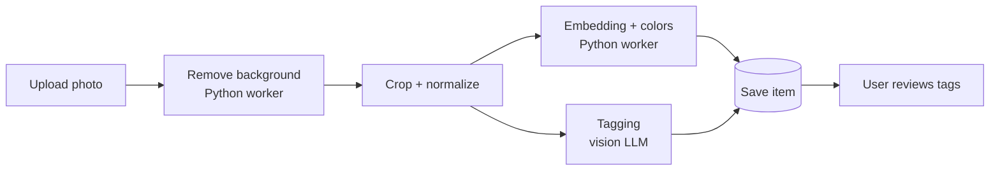
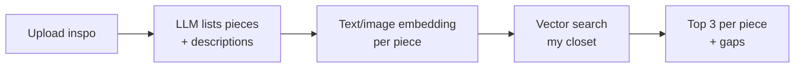
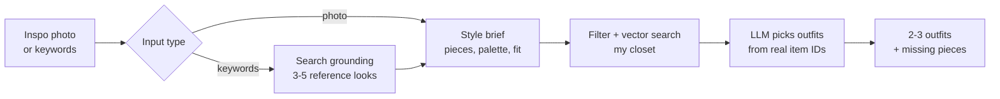
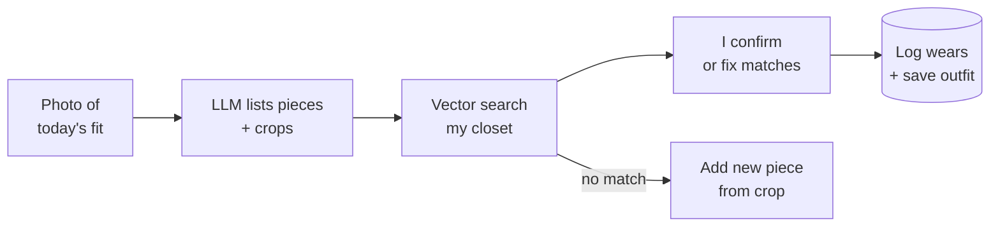
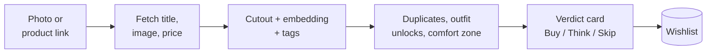
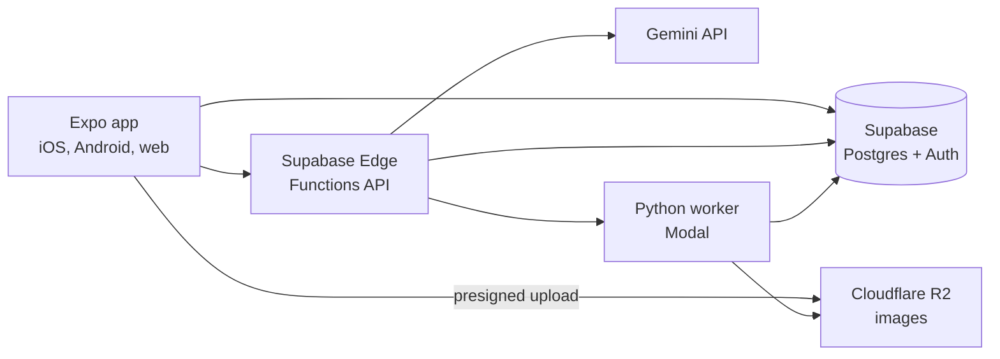

# bowr — PRD

Sep 25, 2026 · @Paul

## Overview

bowr is a personal app that turns photos of my clothes into a clean, searchable wardrobe and uses AI to answer "what do I wear?" from what I already own.

**The problem.** I own more than I remember, I re-wear the same few outfits, and when I see an inspo look I can't quickly tell whether I can recreate it. Existing apps (Whering, Acloset, Indyx) are close, but I want control over the AI, the data, and the cost, and I want to share it with a few friends.

**The pitch.** Snap a piece, it gets cut out and tagged automatically. Then ask the app to pair items, recreate an inspo photo from my closet, build an outfit for an occasion, or audit what I have and what I'm missing.

## Naming: the bowr taxonomy

bowr is named after the bowerbird, which gathers objects, sorts them by color, and arranges them into a display called a bower. Every feature name comes from something the bird actually does. Everyday nouns (pieces, outfits) stay plain, so nobody has to learn a dictionary to use the app.

| Feature | bowr name | From the bird | In the UI |
| --- | --- | --- | --- |
| Closet | Bower | The structure the bird builds and decorates | "42 pieces in your Bower" |
| Add pieces (F1) | Gather | Bowerbirds collect shells, berries, flowers and bottle caps | "Gather" button |
| Pair and match (F3) | Arrange | The bird places and re-places each object until it looks right | "Arrange around this" |
| Inspo match (F4) | Mimic | Bowerbirds are skilled vocal mimics | "Mimic this look" |
| Build me an outfit (F5) | Forage | Goes out, finds material, brings it home | "Forage: old money" |
| Style presets (F5) | Themes | Satin bowerbirds keep a strict blue color theme | "Save as Theme" |
| Audit and insights (F6) | Birdseye | The view from above | "Birdseye: 38% of your tops are black" |
| Color profile (F7) | Plumage | The bird's natural coloring | "Find your Plumage" |
| Proportion guidance (F7) | Perspective | Great bowerbirds arrange objects small to large to create a forced-perspective illusion | "Perspective tips" |
| Wishlist and verdicts (F8) | Shinies | Bowerbirds prize bright, often blue, objects | "Add to Shinies" |
| Daily fit log (F9) | Strut | The courtship display in front of the bower | "Log today's Strut" |
| Repeat a logged fit | Encore | Displays are repeated for every visitor | "Encore" |
| Friends (F10) | Flock | — | "Your Flock" |
| Polls (F10) | Ask the Flock | — | "Ask the Flock: A or B?" |

**Voice rules**

- Name features, not objects: pieces, outfits and photos keep their normal names; only the closet becomes the Bower.
- Pair a name with a plain subtitle until people know it: "Strut · log today's fit".
- One word where possible, capitalized in the UI; the wordmark is always lowercase **bowr**.
- Code, database tables and analytics events keep plain names (`fit_logged`, `wishlist_items`), so a feature can be renamed without a migration.

**Sample copy**

- Empty closet: "Your Bower is empty. Gather your first piece."
- After a fit log: "Strut saved. That's the third time this jacket's been out this month."
- Budget cap reached: "The Flock's AI is resting until the 1st. Everything else still works."
- Tagline options: "Build your bower." · "Curate like a bowerbird." · "Wear what you've gathered."

## Goals, non-goals, and users

The app succeeds if I get dressed faster using more of my closet, buy smarter, and never spend more than US$10/month on AI across all accounts.

**Goals**

- Digitize a wardrobe of 100–300 items with minimal manual tagging.
- Suggest outfits that actually use what I own, not generic advice.
- Map any inspo photo to my closest owned pieces, and name the gaps.
- Give a clear audit: what I wear, what I don't, duplicates, and missing basics.
- Let 2–10 friends sign up and keep their own private closets.

**Non-goals (for now)**

- Shopping checkout, affiliate links, or a marketplace (the wishlist only links out).
- Virtual try-on or putting clothes on a body model.
- Native apps in v1: v1 is the web app; iOS and Android builds come from the same code in phase 8 (see Mobile and web).
- Public feeds, public profiles, or following strangers; social stays friends-only and comes after the core app.
- Region-specific weather presets.

**Users**

| User | Needs |
| --- | --- |
| Me (owner/admin) | Full features, control over AI costs, invite friends |
| Invited friends | Own private closet, same features, simple onboarding |

## Core features

Ten features, ordered by build priority. F1–F3 plus the daily fit log (F9) are the MVP; everything else builds on the tagged closet.

### F1. Gather: closet upload with background removal

As a user, I upload a photo of one piece and get back a clean cutout on a neutral background, so my closet looks like a catalog.

- Upload from camera or gallery; batch upload up to 20 photos. Pieces can be shot on a hanger or laid flat.
- A short photo guide shows on first upload and stays one tap away (below); in the mobile app (phase 8), the camera also shows a framing outline for the chosen category (hanger, flat lay, shoe side view).
- Background removed automatically; original kept in storage.
- Auto-crop and center on a square canvas; shadow optional.
- Optional second photo of the care label: brand, size and fabric are read from it automatically.
- Manual fallback: retry, or tap to fix edges if the cutout is bad.

**Photo guide (shown in the app)**

| Step | Hanger | Flat lay |
| --- | --- | --- |
| Background | Hang on a plain door or wall | Lay on a plain sheet or floor; white for dark clothes, darker for light clothes |
| Prep | Button or zip it closed; front facing out | Smooth out wrinkles; arrange sleeves and legs naturally |
| Light | Daylight near a window, no flash, no harsh shadows | Same; avoid yellow indoor bulbs |
| Angle | Straight on, phone held upright and level with the item | Straight down from above, phone parallel to the floor |
| Framing | Whole piece in frame with a little space around it | Same; one item per photo |
| Extras | Shoes: side view with the pair together | Accessories: group small items by type |

**Shoes and accessories guide (shown in the app when I pick the category)**

| Item | How to shoot it | Watch out for |
| --- | --- | --- |
| Shoes | Pair side by side on the floor, side view with toes pointing left, camera at shoe height; optional second shot from above | Laces tidy; wipe the soles if they show |
| Shades | Arms open, lying on a plain surface, shot straight at the lenses from lens height | Reflections: shoot in shade or indirect light and tilt slightly; use a background that contrasts with the frame |
| Caps and hats | On a flat surface or over a fist or ball to hold the crown's shape, three-quarter front view with the brim toward the camera | Brim flat, not bent out of shape; logo facing the camera |
| Bags | Standing upright, straps arranged above or beside it, straight-on front view | Stuff it lightly so it holds its shape |
| Belts | Laid straight or loosely coiled, buckle visible | Plain background so the edges cut out cleanly |
| Watches and jewelry | On dark fabric, close-up, several small pieces grouped per photo | Glare on metal: indirect light; tap each piece to split a group photo into items |

### F2. Auto-tagging

As a user, each item is tagged for me so I never fill a long form.

- Category and subcategory: tops, bottoms, outerwear, dresses, shoes (sneakers, loafers, boots, sandals, slides), eyewear (shades, optical frames), headwear (caps, bucket hats, beanies), bags, belts, watches and jewelry. Accessories get extra tags where they matter: shoe type and sole color; frame shape, frame color and lens tint; cap style and whether it has a logo.
- Dominant colors (hex + name), pattern, material guess, formality (1–5), season, style tags (minimal, streetwear, etc.).
- User can edit any tag; edits are the source of truth.
- Optional: brand, price paid, purchase date (feeds cost-per-wear).

### F3. Arrange: pair and match

As a user, I pick one item and see what goes with it from my closet.

- "Complete this look": pick 1 item → 3–5 full outfits built around it.
- Each suggestion shows a one-line reason ("navy balances the camel coat").
- Save outfits; mark "wore this today" to log wears.
- Thumbs up/down to teach preferences.

### F4. Mimic: inspo match

As a user, I upload or paste an inspo photo and see my closest pieces for each item in it.

- Detect the pieces in the inspo (e.g. white shirt, black trousers, loafers).
- For each, show my top 3 matches with a similarity score.
- Flag gaps: "You don't own anything like the brown loafers."
- Save the recreated look as an outfit.

### F5. Forage: build me an outfit

As a user, I give the app a vibe (an inspo photo or a few keywords) and it builds outfits from my closet.

- Inputs, any mix: inspo photo(s); keywords for an aesthetic ("old money", "quiet luxury"), a place or scene ("Cubao Expo fit", "BGC brunch"), or a person's style ("Andrew Garfield fit"); occasion; weather (auto); items to include or avoid.
- Keywords: the LLM uses Google Search grounding to find 3–5 reference looks, then writes a style brief (key pieces, palette, silhouettes, fabrics, shoes).
- Photo: the same style brief is extracted straight from the image.
- Output: 2–3 outfits from owned items with a one-line reason each, the reference looks as linked thumbnails, and a "missing pieces" list.
- Save a brief as a reusable preset ("my Cubao Expo preset").
- For a named person, the app works from their public style only and stores just the reference links, not photos of them.

### F6. Birdseye: closet audit and "What can you say about my closet?"

As a user, I get the numbers plus an honest, stylist-style read of my wardrobe.

- Stats: breakdown by category, color, formality, season; most and least worn; not worn in 90+ days; near-duplicates; cost-per-wear.
- Closet insights, written by the LLM from computed stats (never guessed), e.g. "38% of your tops are black, so make the next top a color", "you own 9 blue pieces but only 1 pair of shoes that works with navy", "your closet is 80% casual with one formal outfit".
- Balance scores: palette mix (neutrals vs accents), category ratios (tops : bottoms : shoes), and versatility (how many outfits each item appears in).
- Gaps: basics that unlock the most new outfits ("a white sneaker would pair with 18 items").
- Links to the wishlist (F8), where each item I'm eyeing gets a "should I buy this?" verdict.
- With a fit profile (F7), insights also flag colors and cuts outside my best range.

### F7. Plumage and Perspective: fit profile

As a user, I can optionally add my measurements, coloring and taste, so suggestions fit my body and complexion, then browse fit inspo from the web that matches.

**Inputs (all optional, editable any time)**

- Body: height, weight, key measurements (shoulders, chest, waist, hips, inseam), usual sizes per brand, fit preference (relaxed to tailored), and areas I like to highlight or keep low-key.
- Coloring: an unfiltered daylight selfie holding a white sheet of paper (for white balance), or self-reported undertone, hair color and eye color. The selfie is used for analysis only and deleted as soon as the session ends; only the color numbers and palette are kept.
- Taste: 15–20 quick swipe ratings of outfit images, favorite brands, style icons, comfort limits (e.g. no wool in Manila heat), budget, and lifestyle mix (office, WFH, events).

**Outputs**

- Proportion guidance: rises, inseams, jacket and top lengths, and necklines that balance my measured proportions.
- Color profile: undertone, skin lightness, and contrast level (skin vs hair vs eyes), with a best-colors palette split into "near the face" and "anywhere".
- Fit inspo: web results of looks on people with similar height, build and coloring, filtered by my taste.

**Guardrails:** weight is optional and never framed as a goal; wording is about fit and proportion, never "flaws" or "slimming"; every result is a suggestion I can override. See Research notes for how much of this is backed by evidence.

**Selfie guide (shown in the app)**

1. Stand facing a window in indirect daylight; no direct sun, no lamps on.
2. Turn off beauty mode, filters, and portrait effects; use the back camera or a mirror if you can.
3. Bare face or minimal makeup; hair pulled back; no tinted glasses.
4. Wear a plain white or gray top.
5. Hold a sheet of white paper just under your chin so it's in the frame.
6. Take 3 shots; the app keeps the most consistent reading, then deletes all of them.

### F8. Shinies: wishlist and "Should I buy this?"

As a user, I add something I'm thinking of buying and get an honest verdict before I spend.

- Add by photo (a screenshot or an in-store shot) or by pasting or sharing a product link from Uniqlo, Shein, Zalora, Shopee, Lazada and similar.
- For links, the server reads the page's preview data (title, image, price); if a store blocks it, the app asks for a screenshot instead.
- Verdict card, each part computed from my closet:
  - Duplicate check: "you already own 3 similar black tees" (embedding similarity).
  - Outfit unlocks: how many new complete outfits it creates with what I own.
  - Comfort zone: "your usual", "a stretch", or "new territory", by distance from my taste vector.
  - Palette and fit: whether it sits in my color profile and proportion guidance (if F7 is set up).
  - Cost-per-wear estimate from price and how often I wear similar pieces.
- Overall call: Buy, Think about it, or Skip, with the two strongest reasons.
- Saved to a wishlist with price and link; "I bought it" moves it into the closet using the product image until I shoot my own.

### F9. Strut: daily fit log

As a user, I snap today's fit and the app records which pieces I wore, so I can repeat looks I liked.

- Take a mirror or full-body photo of today's outfit.
- The app finds each piece and matches it to my closet (vector search, confirmed by the LLM); I tap to confirm or fix.
- Logs a wear for every piece, which feeds the audit and cost-per-wear.
- Saves the look as an outfit with its photo; heart the ones I love to teach my taste.
- A piece that isn't in my closet yet: "Add it?" using a crop from the photo, reshoot later.
- Calendar of past fits, "repeat this fit" with the piece list, and "you wore this last Tuesday" nudges.
- Optional daily reminder; option to keep the pieces but discard the photo.

### F10. Flock: social with friends (later phase)

As a user, I can ask friends what they think, without making anything public. Off until the core app is solid.

- Share a single outfit, fit-log photo, or wishlist item with chosen friends; closets stay private.
- "Rate my fit" and "A or B?" polls with comments; polls close after a set time.
- "Ask before buying": send a wishlist verdict to friends for a vote.
- Friends-only feed of things shared with me; no public profiles, no strangers.
- Delete anything I shared at any time; invite-only membership.

## Key user flows

The upload pipeline does the heavy lifting once per item, so every later feature is a cheap query over stored tags and embeddings.

**Adding an item**

The user sees the cutout within a few seconds, and tags fill in shortly after; editing is optional.

**Inspo match**

**Build me an outfit**

The LLM only ever chooses from item IDs it is given, so it can't invent clothes I don't own.

**Daily fit log**

**Should I buy this?**

## AI and ML strategy

Use a cheap vision LLM only for understanding and reasoning, and run everything repetitive (cutouts, colors, similarity) in your own Python service. At this scale either LLM costs cents per month, so pick on vision quality and features, not price.

### LLM options

| Model | Input / output per 1M tokens (USD) | Vision | Notes |
| --- | --- | --- | --- |
| [DeepSeek `deepseek-flash` (V4.1 Flash)](https://api-docs.deepseek.com/quick_start/pricing/) | $0.15 / $0.60 off-peak; $0.30 / $1.20 peak | Yes | Cheapest. Peak is 09:00–12:00 and 14:00–18:00 PH time on weekdays. Up to about 1,024 tokens per image. Data is processed in China. |
| [Gemini 3.1 Flash-Lite](https://ai.google.dev/gemini-api/docs/pricing) | $0.25 / $1.50 | Yes | Recommended default. Mature vision, free tier for development, 5,000 free Google Search grounding requests/month shared across Gemini 3.x. |
| [Gemini 3.5 Flash-Lite](https://ai.google.dev/gemini-api/docs/pricing) | $0.30 / $2.50 | Yes | Newer Flash-Lite; step up if 3.1 tagging quality is weak. |
| [Gemini 3.8 Flash](https://ai.google.dev/gemini-api/docs/pricing) | $0.75 / $3.75 until Dec 31, 2026, then $1.50 / $7.50 | Yes | Use only for "build me an outfit" if Flash-Lite's styling is poor. |

**Decision:** Gemini on the paid (prepaid) tier for every call that includes a photo, split by task: Flash-Lite for extraction, **Gemini 3.8 Flash** only for the calls where styling judgment shows. Friends said it matters who sees their photos, so photos never go to DeepSeek, and the paid tier keeps Google from using content to improve its products. Built-in Google Search grounding covers "find inspiration online". Model names live in a config file, so any task can switch models without code changes.

### Model routing

| Task | Model | Why |
| --- | --- | --- |
| Tagging, label reading, fit-log piece detection, wishlist extraction, inspo piece lists | Gemini 3.1 or 3.5 Flash-Lite (winner of the test below) | Structured extraction; embeddings do the matching and a confirm step catches errors |
| Build me an outfit, style briefs from keywords ("old money", "Cubao Expo fit") | Gemini 3.8 Flash, thinking off or low | Styling judgment is the product here |
| Closet insights text, fit-profile explanations | Gemini 3.8 Flash | Few calls; writing quality matters |
| Cheaper mode (after $8 of monthly spend) | Everything on Flash-Lite | Keeps the app working under the cap |

3.8 Flash's $0.75 / $3.75 price is a promotion that doubles to $1.50 / $7.50 on Jan 1, 2027; the routing keeps even the 2027 price inside the cap (see Cost estimate).

### Model test before committing

1. Pick 20 of my own pieces (tops, bottoms, shoes, shades, caps) and 10 real requests, e.g. "old money", "rainy office day", "Cubao Expo fit".
2. Run each through 3.1 Flash-Lite, 3.5 Flash-Lite and 3.8 Flash with the same prompts.
3. Rate results blind (model names hidden): tag accuracy for extraction, 1–5 "would I wear this" for outfits.
4. Pick the cheapest model per task that scores within about 10% of the best. Total cost: a few cents on the paid tier.
5. Rerun the test whenever Google ships a new model or changes prices.

Cost traps: thinking tokens are billed as output on both providers, so disable thinking for tagging and matching. Show a one-line note during onboarding naming Google as the AI provider that processes photos.

### What to build in Python (no LLM)

| Job | Approach | Why not the LLM |
| --- | --- | --- |
| Background removal | `rembg` with the BiRefNet or `u2net_cloth_seg` model | Deterministic, free, runs on CPU in a few seconds |
| Image embeddings | FashionCLIP or Marqo-FashionSigLIP, stored in pgvector | Powers inspo match, "similar items", duplicates and the taste vector at zero per-query cost |
| Dominant colors | k-means on non-transparent pixels, mapped to named colors | Exact hex values; LLMs guess colors poorly |
| Skin color profile | Face landmarks (MediaPipe), sample cheek and forehead pixels, white-balance against the paper, convert to CIELAB for lightness and undertone | Repeatable numbers instead of a vibe; the LLM only explains them |
| Proportions | Ratios from entered measurements (shoulder-to-hip, leg-to-torso, rise vs inseam) | Plain math |
| Color preference ranking | Bradley–Terry model over pairwise drape votes | Statistically sound ranking from few votes |
| Pairing score | Rules: color harmony, formality gap, season, category completeness | Fast pre-filter so the LLM only chooses among good candidates |
| Near-duplicates | Cosine similarity above a threshold (e.g. 0.92) within a category | Pure math over stored embeddings |
| Audit stats | SQL over items and wear logs; the LLM only writes the insights text | Numbers stay exact |

Later, thumbs up/down data can train a small personal compatibility model (e.g. logistic regression over embedding pairs), replacing more LLM calls over time.

## Research notes: color and fit science

The core idea behind color analysis (skin tone changes which clothing colors look right) has experimental support, but the named "seasons" and body-type labels are practitioner systems with weak validation. So the app should measure concrete traits and learn from my own ratings, not hand out a label.

| Claim | What studies found | How the app uses it |
| --- | --- | --- |
| Skin tone shifts which colors suit you | In two experiments (96 and 75 observers), people picked cool blues for fair skin and warm orange-reds for tanned skin ([Clothing Aesthetics, 2021](https://pmc.ncbi.nlm.nih.gov/articles/PMC8597069/)) | Measure undertone and lightness; weight palette suggestions by them |
| Seasonal categories predict harmony | Warm undertones matched autumn colors and light cool skin matched winter, but generic color-harmony models agreed with viewers only 53% of the time ([Personal color analysis based on color harmony for skin tone](https://www.academia.edu/125120428/Personal_color_analysis_based_on_color_harmony_for_skin_tone)) | Show a season as a friendly summary, not a rule |
| Your color "type" decides which shade works | 431 Korean raters scored women of four skin/hair types in four reds; vivid red rated highest for almost every type, and differences between types were not significant ([Hong & Kim, 2022](https://link.springer.com/article/10.1186/s40691-021-00279-0)) | Treat chroma and lightness as seriously as hue; don't over-restrict palettes |
| Horizontal stripes make you look wider | The opposite held in lab tests: horizontally striped figures looked 4.5–10.7% narrower ([Thompson & Mikellidou, 2011](https://journals.sagepub.com/doi/10.1068/i0405)); a 2021 follow-up found horizontal stripes and dark clothes both read thinner, with the effect possibly weaker on wider bodies ([Koutsoumpis et al., 2021](https://pmc.ncbi.nlm.nih.gov/articles/PMC8438770/)) | Folk styling rules are weak priors, not hard filters |
| Body-type systems (Kibbe, fruit shapes) | I found no peer-reviewed validation in this search | Use measured ratios (shoulder-to-hip, leg-to-torso) instead of type labels |

Most of these studies used East Asian or European faces, so medium-to-deep Filipino skin tones are under-represented. That is another reason to calibrate on the user's own ratings.

**How the app runs its own taste research**

1. Virtual draping: crop the face from the daylight selfie, show it against pairs of color swatches, and let me pick the better one of each pair. Rank colors with a Bradley–Terry model, the same math used for pairwise preference ranking.
2. Taste vector: swipe ratings on outfit images become a centroid in FashionCLIP embedding space; outfit suggestions are re-ranked by closeness to it.
3. Feedback loop: thumbs up/down and wear logs update both the palette ranking and the taste vector over time.
4. Scorecard: track the share of suggestions I accept each month; if it drops, the model is drifting from my taste.

The selfie exists only for the analysis and draping session and is deleted when it ends; only the color numbers and the ranked palette are stored.

## Tech stack and architecture

An Expo (React Native) app for iOS, Android and web; Supabase for database, vectors, auth and the API (Edge Functions); Cloudflare R2 for images; and a Python service on Modal for image and ML work. All of it runs on free tiers at this size.

The app talks to Postgres directly for reads and writes protected by Row Level Security; anything that needs a secret (Gemini, R2 signing, Modal) goes through an Edge Function, so no API keys ship inside the app.

| Layer | Choice | Reason |
| --- | --- | --- |
| App | Expo (React Native) + Expo Router + NativeWind, TypeScript | One codebase for iOS, Android and web |
| API | Supabase Edge Functions (TypeScript) | Presigned R2 URLs, AI calls with the budget guard, invite redemption; keys stay server-side |
| Database | Supabase Postgres + pgvector | Relational data and embeddings in one place |
| File storage | Cloudflare R2 (bucket created with `wrangler r2 bucket create`), WebP at max 1024 px | 10 GB free and no egress fees; S3-compatible API |
| Image/ML service | Python on Modal: `@modal.fastapi_endpoint` for on-demand jobs, CPU containers that scale to zero | Python-native, per-second billing, $30/month free credits on Starter |
| LLM | Gemini Flash-Lite + 3.8 Flash, routed by task | See AI and ML strategy |
| Jobs | A `jobs` table: Edge Functions insert, the Modal worker processes and updates status | Upload returns fast; processing runs in the background |
| Builds and distribution | Phase 8: EAS Build + EAS Update; TestFlight and Play internal testing | See Mobile and web |
| Web hosting | Expo web export on Vercel (Hobby) | Free static hosting |
| Analytics | PostHog`: posthog-js on web, posthog-react-native on phones` | See Analytics |

**R2 access pattern:** the bucket stays private. After checking the Supabase session, an Edge Function issues short-lived presigned URLs (S3 API via `@aws-sdk/s3-request-presigner`) for uploads and views, and keys are namespaced as `users/{user_id}/...`. This replaces Supabase Storage policies, so every image request must go through that server check. Modal reads and writes R2 with its own scoped API token stored as a Modal secret.

### Auth: Supabase Auth vs Better Auth

**Recommendation: use Supabase Auth.** You're already on Supabase, and its auth plugs straight into Row Level Security (`auth.uid()`), so each friend only ever sees their own closet with a few lines of SQL. Images in R2 are protected by the presigned-URL check above instead.

|  | Supabase Auth | Better Auth |
| --- | --- | --- |
| Setup effort | Built in, a few clicks | Library on your own server, own tables |
| Row Level Security | Native (`auth.uid()`) | Manual: you enforce access in server code or mint Supabase JWTs |
| Google login + magic link | Yes | Yes |
| Invite-only signups | Invite codes enforced through RLS (see below) | Build it with a plugin or custom code |
| Vendor lock-in | Tied to Supabase | Portable to any Postgres |

Pick Better Auth only if you plan to leave Supabase later or need its plugins (organizations, passkeys with custom flows). For a closet shared with a few friends, it adds work without a clear benefit.

### Registration with invite codes

Anyone can create a login, but nothing in the app opens until a valid invite code is redeemed, so only people I invite get in. This keeps Google sign-in working for new users without extra plumbing.

1. I generate codes on an `/admin` page: single-use by default, 7-day expiry, an optional note ("for Mika"), and a revoke button.
2. A friend opens the sign-up page, signs in with Google or an email magic link, and lands on an "Enter your invite code" screen.
3. The server checks the code (exists, unused, not expired, not revoked) and, in one transaction, marks it redeemed and sets `invited_by` and `joined_at` on their profile.
4. Row Level Security on every table requires a redeemed invite, so an account without one can't read or write anything; unredeemed accounts are deleted after 24 hours.
5. Wrong codes are rate-limited to 5 attempts per hour per account.

**Sharing model:** invite-only, and no sharing in v1; every closet is private. Friends-only sharing arrives with F10.

### Mobile and web

**Decision: React Native with Expo, web first.** Everything is written once in Expo (Expo Router renders the web version through react-native-web). Phases 0–7 ship only the web build, which friends open in any browser, phone or laptop. Phase 8 turns on iOS and Android builds from the same code and adds the phone-only features, with no rewrite.

| Piece | Web (phases 0–7) | Mobile (phase 8) |
| --- | --- | --- |
| Framework | Expo SDK + Expo Router, TypeScript, NativeWind (Tailwind classes for React Native) | Same code |
| Photos | `expo-image-picker`, which opens the phone camera or file picker from the browser | `expo-camera` with a framing outline per category (hanger, flat lay, shoe side view) |
| Auth session | `supabase-js`, session in browser storage | Session in `expo-secure-store` |
| Share from other apps | Paste a product link | Share-intent config plugin (e.g. `expo-share-intent`): share a Uniqlo or Shein link from Safari or the store's app into the wishlist |
| Reminders | None, or email | `expo-notifications` push for the daily fit log |
| Analytics | `posthog-js` | `posthog-react-native`; same events |
| Hosting and delivery | Expo web export on Vercel; add a web manifest so friends can put it on their home screen | EAS Build and EAS Update ([free plan](https://expo.dev/pricing.md): 15 iOS + 15 Android builds a month, over-the-air updates for up to 1,000 monthly users); TestFlight ($99/year Apple Developer Program) and Play internal testing ($25 once) ([costs](https://www.choicely.com/tutorials/how-much-does-it-cost-to-publish-an-app)) |

**Rules while building web-first**, so phase 8 stays easy:

- Use React Native primitives (`View`, `Text`, `Pressable`), never raw HTML tags.
- Wrap anything platform-specific behind a small module with `.web.ts` and `.native.ts` versions (storage, camera, sharing, push).
- Open the site on an actual phone browser every week; most users will be on phones even before the apps exist.

**Why this over Next.js now, Expo later:** Next.js would give a nicer desktop site, but it means building every screen twice. Expo web is a little less polished on a laptop, which is fine for browsing a closet, and the mobile phase becomes a build step instead of a second project.

**What waits for phase 8:** the share sheet, push reminders, the camera framing outline, and the Apple and Google fees. Server logic (presigned R2 URLs, AI calls with the budget guard, invite redemption) lives in Supabase Edge Functions from day one, so it serves web and mobile the same way and no API keys ever ship to the browser or the phone.

### Cost cap: US$10/month across all accounts

Three layers, so no single failure can run up a bill. The app layer does the real work; the Google layers are the backstop.

| Layer | How | What happens at the limit |
| --- | --- | --- |
| App budget guard | Every AI call logs its cost to `ai_usage`. Before each call, the server adds an upfront estimate to the month-to-date total and refuses the call if it would pass the cap. | At $8: cheaper mode (no web search grounding, fewer outfit options) and an alert to me. At $9.50: AI features show "monthly AI budget reached, resets on the 1st"; the closet, log and wishlist still work without AI. |
| Gemini project spend cap | Set a $10 monthly cap on the project in AI Studio's Spend tab ([Google](https://blog.google/innovation-and-ai/technology/developers-tools/more-control-over-gemini-api-costs/)) | Google pauses API requests; the cap takes about 10 minutes to kick in, so the app guard stops first. |
| Prepaid balance | Buy Gemini credits in small top-ups (the minimum purchase is $10) and leave auto top-up off ([Gemini billing](https://ai.google.dev/gemini-api/docs/billing)) | When the balance hits $0 every call stops, so the bill can't exceed what was loaded. |

No per-user limits for now; the same `ai_usage` table can add them later. Modal, R2, Supabase and Vercel all stay inside free tiers at this size, so AI is the only variable cost.

### Analytics

PostHog for how the app is used, plus a small `/admin` page for money and invites. [PostHog's free plan](https://posthog.com/pricing) covers 1M events and 5K session recordings a month with no card, far more than a handful of friends will generate.

**Events to track** (by internal user ID, never email)

| Event | Properties | Answers |
| --- | --- | --- |
| `invite_redeemed` | code note | Who joined and from which invite |
| `item_added` | category, source (upload/fit-log crop/wishlist) | Is onboarding happening? |
| `fit_logged` | pieces matched, pieces corrected | Is the daily habit sticking? How accurate is matching? |
| `outfit_generated` | feature (pair/inspo/build), model, latency\_ms | Which features get used, and are they fast enough? |
| `outfit_rated` / `outfit_saved` | rating | Are suggestions any good? |
| `wishlist_checked` | verdict, store | Is "should I buy this?" used? |
| `insights_viewed`, `fit_profile_completed` | — | Uptake of the deeper features |
| `budget_mode_changed` | mode (normal/cheaper/paused) | How close we run to the cap |

**Dashboard:** weekly active users, fit logs per user per week, week-1 and week-4 retention, feature usage, and time to a user's first 20 items.

**`/admin` page (only me):** user list with last active date, closet sizes, AI spend month-to-date by user and by task (from `ai_usage`), and invite codes with their status.

**Privacy:** session recording off (screens are full of people's photos); no text inputs or images sent to PostHog; onboarding says the app tracks usage events, not photos.

## Data model

Thirteen core tables plus three for the later social phase, every row owned by a `user_id` and protected by Row Level Security.

| Table | Key columns | Purpose |
| --- | --- | --- |
| `profiles` | id, display\_name, city, invited\_by, joined\_at, is\_admin | Per-user settings and weather location |
| `items` | id, user\_id, original\_key, cutout\_key (R2 object keys), category, subcategory, colors (jsonb), pattern, material, brand, size, formality (1–5), seasons\[\], style\_tags\[\], price, purchased\_at, status (processing/ready/archived), embedding vector(512) | The closet |
| `outfits` | id, user\_id, name, source (manual/pair/inspo/generated/log), occasion, reason, rating, loved | Saved looks |
| `outfit_items` | outfit\_id, item\_id, slot (top/bottom/outerwear/shoes/eyewear/headwear/bag/accessory) | Items in an outfit |
| `fit_logs` | id, user\_id, worn\_on, photo\_key (nullable if discarded), outfit\_id | Daily fit log (F9) |
| `wear_logs` | id, user\_id, item\_id, fit\_log\_id, worn\_on | One row per piece worn; powers audit and cost-per-wear |
| `wishlist_items` | id, user\_id, source\_url, store, title, price, image\_key, embedding, verdict (buy/think/skip), verdict\_reasons (jsonb), status (wanted/bought/dropped) | Wishlist and "should I buy this?" (F8) |
| `inspos` | id, user\_id, image\_key or source\_url, keywords, style\_brief (jsonb), reference\_links\[\], matched\_outfit\_id | Photo or keyword requests and their results |
| `style_presets` | id, user\_id, name, style\_brief (jsonb) | Saved vibes like "my Cubao Expo preset" |
| `fit_profiles` | user\_id, height\_cm, weight\_kg (nullable), measurements (jsonb), sizes (jsonb), fit\_prefs (jsonb), skin\_lab (L\*, a\*, b\*), undertone, contrast\_level, palette (jsonb), taste\_vector vector(512); no selfie stored | Body, color and taste profile (F7) |
| `drape_votes` | id, user\_id, color\_a, color\_b, winner | Pairwise votes for the color ranking |
| `taste_ratings` | id, user\_id, image\_url, liked (bool) | Swipe ratings behind the taste vector |
| `shares` (later) | id, owner\_id, object\_type (outfit/fit\_log/wishlist), object\_id, recipient\_ids\[\] | What I've shared with which friends (F10) |
| `polls` (later) | id, share\_id, kind (rate/a\_or\_b/buy), options (jsonb), closes\_at | "Rate my fit" and "A or B?" |
| `poll_responses` (later) | poll\_id, user\_id, choice, comment | Friends' votes and comments |
| `invite_codes` | code, created\_by, note, max\_uses, uses, expires\_at, revoked\_at, redeemed\_by\[\] | Invite-only registration |

An `ai_usage` table (user\_id, model, tokens\_in, tokens\_out, cost\_usd) is worth adding from day one to watch spend per friend.

## Cost estimate

For me plus 5 friends, expect about US$2.60/month in AI fees through December 2026 and about US$4.90/month from January 2027, when 3.8 Flash's promo price ends, plus about $1.30 one-time to tag everyone's initial closet. Hosting stays on free tiers; the only fixed costs arrive with the mobile phase: the Apple Developer Program ($99/year) and Google Play's $25 one-time fee, and even at 2027 prices the $10 cap has about 2× headroom.

Assumptions: 6 users × 300 items at onboarding, then per user per month 20 new items, 60 outfit requests, 25 fit logs, 10 inspo matches, 10 keyword style briefs, 5 wishlist checks, 5 insight reports. Extraction uses [Gemini 3.1 Flash-Lite](https://ai.google.dev/gemini-api/docs/pricing) ($0.25 / $1.50 per 1M tokens); taste calls use Gemini 3.8 Flash ($0.75 / $3.75 through Dec 31, 2026, then $1.50 / $7.50). Token counts are estimates; check real numbers in `ai_usage` after the first week.

| Line item | Model | Volume (all 6 users) | Through Dec 2026 (USD) | From Jan 2027 (USD) |
| --- | --- | --- | --- | --- |
| Initial tagging (one-time) | Flash-Lite | 1,800 items × \~$0.0007 | $1.26 once | $1.26 once |
| Ongoing tagging | Flash-Lite | 120 items/month | $0.08 | $0.08 |
| Daily fit log | Flash-Lite | 150 logs/month × \~$0.001 | $0.15 | $0.15 |
| Inspo match | Flash-Lite | 60/month × \~$0.001 | $0.06 | $0.06 |
| Wishlist verdicts | Flash-Lite | 30/month × \~$0.001 | $0.03 | $0.03 |
| Build me an outfit / pairing | 3.8 Flash | 360/month × \~$0.005 / \~$0.011 | $1.89 | $3.78 |
| Keyword style briefs | 3.8 Flash | 60/month | $0.27 | $0.54 |
| Closet insights + fit profile | 3.8 Flash | 30/month | $0.15 | $0.30 |
| **Monthly AI total** |  |  | **\~$2.60** | **\~$4.90** |
| Web inspo search | Google Search grounding | well under 5,000 free/month | $0 | $0 |
| Supabase | [Free plan](https://supabase.com/pricing): 500 MB database, 50,000 MAU, Edge Functions included | rows + embeddings | $0 | $0 |
| Cloudflare R2 | [Free tier](https://developers.cloudflare.com/r2/pricing): 10 GB, no egress fees | \~450 MB of images | $0 | $0 |
| Modal | [Starter plan](https://modal.com/pricing): $30/month compute credit | a few hundred CPU-seconds/day | $0 | $0 |
| PostHog | [Free plan](https://posthog.com/pricing): 1M events/month | a few thousand events | $0 | $0 |
| Vercel | Hobby plan, hosts the web build | — | $0 | $0 |
| EAS Build + Update | Free plan | 15 iOS + 15 Android builds/month | $0 | $0 |
| Apple Developer Program | Required for TestFlight (phase 8) | — | $99/year | $99/year |
| Google Play Console | Required for Play internal testing (phase 8) | — | $25 once | — |

**Storage math:** a WebP original (\~150 KB) plus cutout (\~100 KB) is about 250 KB per item, so 1,800 items use roughly 450 MB, under a twentieth of R2's free 10 GB.

The Supabase free plan pauses a project after one week of inactivity, so it suits regular personal use but not a long-idle demo.

## MVP scope and roadmap

Ship a usable closet with pairing first; every later phase reuses the same tags and embeddings. Durations assume evenings and weekends.

| Phase | Scope | Est. time | Done when |
| --- | --- | --- | --- |
| 0. Foundations | Expo app shell exported to web on Vercel, Edge Functions API, Supabase Auth (Google + magic link) with invite codes, RLS, R2 bucket via wrangler, presigned uploads, Modal app skeleton, `ai_usage` budget guard, Gemini prepaid + $10 project cap, PostHog events, /admin page | 1 week | A friend can join only with a valid code, upload to R2, and a test call is blocked when the budget is set to $0 |
| 1. Closet (MVP) | F1 upload with clothing, shoe and accessory photo guides and label reading, rembg cutouts on Modal, F2 auto-tagging, closet grid with filters | 2–3 weeks | 50 of my items are in with clean cutouts |
| 2. Pairing + daily log (MVP) | Model test (Flash-Lite vs 3.8 Flash), F3 complete-this-look, F9 daily fit log with piece matching, calendar, "repeat this fit" | 2–3 weeks | I log my fit 5 days in a row and matches are right 8 of 10 times |
| 3. Audit + insights | F6 stats, "what can you say about my closet?", balance scores, gaps | 1–2 weeks | Insights name at least 3 things I agree with |
| 4. Wishlist | F8 photo or link input, verdict card, "I bought it" | 1–2 weeks | A Uniqlo link and a Shein screenshot both return a verdict |
| 5. Inspo + build me an outfit | F4 embeddings + pgvector; F5 photo or keyword input, search grounding, style briefs and presets | 2–3 weeks | "Old money" and "Cubao Expo fit" each return 2 wearable outfits in under 15 seconds |
| 6. Fit profile | F7 measurements, selfie guide and color profile (selfie deleted after), virtual draping, taste swipes, fit inspo search | 2–3 weeks | My top-ranked drape colors match what I'd pick in a mirror |
| 7. Friends | Invites and onboarding for friends on the web app | 1 week | 3 friends onboarded with their own closets |
| 8. Mobile apps | iOS and Android builds from the same code, TestFlight and Play internal testing, share-intent plugin for product links, push reminders, camera framing outlines | 2–3 weeks | Friends install from TestFlight or Play, and sharing a Uniqlo link from Safari lands in the wishlist |
| 9. Social | F10 sharing with chosen friends, "rate my fit" and "A or B?" polls, "ask before buying" | 2 weeks | A poll gets votes from 2 friends |

Later ideas: calendar of past outfits, packing lists for trips, shareable outfit links, a personal compatibility model trained on ratings.

## Risks, decisions, and success metrics

The biggest risk is onboarding friction: if photographing 200 items feels like a chore, nothing else matters.

**Risks and mitigations**

| Risk | Mitigation |
| --- | --- |
| Tedious onboarding | Batch upload, auto-tagging, the in-app photo guide, and adding pieces straight from daily fit-log photos |
| Bad cutouts on busy backgrounds or worn clothes | Try BiRefNet first; allow a retry with a different model; keep the original |
| Fit-log piece matching gets it wrong | Always a one-tap confirm step; corrections improve future matches |
| Stores block link previews (Shein, Shopee) | Fall back to a screenshot upload; never scrape beyond the page's public preview data |
| LLM suggests items I don't own | Only pass real item IDs; validate every returned ID server-side |
| Keyword searches return off-vibe references | Show the reference looks before building; let me drop any; save good briefs as presets |
| Body and face data are sensitive | Every F7 field optional; selfie deleted after analysis; fit profile never shared; weight never shown as a target |
| Fit-log photos are personal | Private R2 prefix, presigned URLs that expire in minutes, and a "keep pieces, discard photo" option |
| Color and fit advice sounds more certain than the evidence | Label outputs as suggestions, show confidence, and let my own ratings override defaults |
| AI budget runs out mid-month | Cheaper mode at $8, clear banner at the cap, non-AI features keep working; raise the cap deliberately if needed |
| Price changes (Gemini 3.x Flash promo ends Dec 31, 2026) | Default to Flash-Lite; provider-agnostic client; the budget guard reads prices from config |
| An invite code gets passed around beyond my friends | Single-use codes with a 7-day expiry, a revoke button on /admin, and every new member visible there with who invited them |
| Shades and shiny accessories cut out badly | Photo guide for reflections and contrast, BiRefNet first, manual edge fix as a fallback |
| TestFlight beta review or store setup slows down friends' installs | Set up the Apple and Google accounts a few weeks before phase 8; friends can use the web version while a build is in review; EAS Update ships JavaScript fixes without a new review |

**Decisions**

- Item photos: hanger or flat lay, with an in-app photo guide.
- No region-specific weather preset.
- No per-user AI limits for now; a hard cap of US$10/month across all accounts.
- No sharing in v1; friends-only social is a later phase.
- Friends care where photos go: photos are processed only by Gemini on the paid tier, never DeepSeek.
- Selfies are used for analysis only and deleted afterwards; only color numbers are kept.
- React Native with Expo, web first: friends use the web app until phase 8, when iOS and Android builds come from the same code.
- Models: Flash-Lite for extraction, Gemini 3.8 Flash for outfit building, style briefs and insights, confirmed by the blind model test.
- Registration is open, but the app only unlocks with a single-use invite code.
- Analytics: PostHog for usage events (no session recording), plus an `/admin` page for spend and invites.
- Shoes, eyewear, headwear, bags, belts, watches and jewelry are first-class items, each with its own photo guide.
- Server logic runs in Supabase Edge Functions, so no API keys ship inside the app.

**Open questions**

- [x] Keep fit-log photos by default, or keep only the piece list unless I choose to save the photo?
- [ ] Which stores matter most for wishlist links, so their previews get tested first?
- [ ] Should the app send a daily fit-log reminder by default, and at what time?

**Success metrics (first 3 months)**

- 80%+ of my wardrobe digitized.
- App used to choose an outfit at least 4 days a week.
- 30%+ of items worn at least once that hadn't been worn in the prior 90 days.
- Auto-tags accepted without edits for 80%+ of items.
- AI spend never passes the US$10/month cap.

## Sources

- [Gemini Developer API pricing](https://ai.google.dev/gemini-api/docs/pricing) (Google)
- [Models & Pricing](https://api-docs.deepseek.com/quick_start/pricing/) (DeepSeek API docs)
- [Supabase pricing](https://supabase.com/pricing)
- [R2 pricing](https://developers.cloudflare.com/r2/pricing) (Cloudflare docs)
- [Modal pricing](https://modal.com/pricing)
- [Clothing Aesthetics: Consistent Colour Choices to Match Fair and Tanned Skin Tones](https://pmc.ncbi.nlm.nih.gov/articles/PMC8597069/) (i-Perception, 2021)
- [Personal color analysis based on color harmony for skin tone](https://www.academia.edu/125120428/Personal_color_analysis_based_on_color_harmony_for_skin_tone)
- [How different shades of red T-shirts enhance the perceived attractiveness of Asian women in digital photographs](https://link.springer.com/article/10.1186/s40691-021-00279-0) (Fashion and Textiles, 2022)
- [Applying the Helmholtz Illusion to Fashion: Horizontal Stripes Won't Make You Look Fatter](https://journals.sagepub.com/doi/10.1068/i0405) (i-Perception, 2011)
- [Helmholtz Versus Haute Couture: How Horizontal Stripes and Dark Clothes Make You Look Thinner](https://pmc.ncbi.nlm.nih.gov/articles/PMC8438770/) (Perception, 2021)
- [Giving you more transparency and control over your Gemini API costs](https://blog.google/innovation-and-ai/technology/developers-tools/more-control-over-gemini-api-costs/) (Google, Mar 2026)
- [Gemini API billing](https://ai.google.dev/gemini-api/docs/billing) (Google)
- [PostHog pricing](https://posthog.com/pricing)
- [Expo Application Services pricing](https://expo.dev/pricing.md)
- [How Much Does It Cost to Publish an App? (2026)](https://www.choicely.com/tutorials/how-much-does-it-cost-to-publish-an-app) (Choicely)
