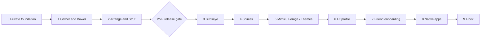

# Implementation plan

**Status:** Phases 0 and 1 are implemented on the local stack; their staging, device, paid-model and human-pilot gates remain open (unchecked tasks, recorded in each slice's evidence). Slice evidence is in [evidence/](evidence/).  
**Prepared:** 25 September 2026.  
**Baseline:** This repository currently contains specifications and local tooling configuration, with no application, migrations, worker, or test harness.

Deliver phases 0–2 as the MVP: an invited person can privately Gather, Arrange, confirm a Strut, and use Encore. Each phase below has its own task file. Later phases extend the same ownership, media, job, budget, and deletion contracts.

The breakdown contains **49 vertical slices, 184 implementation tasks and 196 acceptance cases**, plus shared release checks. These are units of planning and evidence, not an assertion that every task needs a separate pull request.

## Source documents and decision rules

Read together:

- [PRD](<../../bowr — PRD.md>): feature scope, F1–F10, roadmap, pilot outcomes, and the shared AI ceiling.
- [PRODUCT.md](../../PRODUCT.md): users, purpose, accessibility, privacy, and brand constraints.
- [DESIGN.md](../../DESIGN.md): routes, interactions, tokens, recovery states, measurement definitions, and resolved PRD ambiguities.
- [ARCHITECTURE.md](../../ARCHITECTURE.md): implementation boundaries, schemas, APIs, invariants, operational targets, and technical resolutions.

Use the PRD for scope, DESIGN for its explicit interaction/measurement refinements, and ARCHITECTURE for its explicit technical/security refinements. For example, the invite screen uses the architecture's generic unavailable-code response; it does not disclose all code states suggested in the earlier design. An unresolved conflict requires a recorded decision, not an undocumented implementation guess.

Provider prices, model availability, licenses, quotas, billing behavior, and package compatibility are **implementation verification tasks**, not newly verified facts in this plan. Do not hard-code the PRD's estimates or claim its free-tier assumptions as guarantees. External research is not needed to begin the local slices; real configuration must pass the specified gates before release.

## Phase sequence

| Phase file | Outcome | Dependencies | PRD time hypothesis |
| --- | --- | --- | --- |
| [0 — Foundations](phase-00-foundations.md) | An invited member can enter, privately upload, and receive durable results under a proven budget guard | None | 1 week |
| [1 — Bower and Gather](phase-01-bower-and-gather.md) | 50 real pieces can be added, corrected, found, and managed | Phase 0 | 2–3 weeks |
| [2 — Arrange and Strut](phase-02-arrange-and-strut.md) | Complete the outfit-to-wear loop and five-day pilot | Phase 1 | 2–3 weeks |
| [3 — Birdseye](phase-03-birdseye.md) | Inspect computed wardrobe evidence and grounded insights | Phase 2 | 1–2 weeks |
| [4 — Shinies](phase-04-shinies.md) | Evaluate a candidate and record a purchase exactly once | Phase 2; reuse phase-3 measures | 1–2 weeks |
| [5 — Mimic, Forage, Themes](phase-05-inspiration-and-themes.md) | Recreate a reference or turn a reviewed brief into owned outfits | Phase 2; phase 4 for saving gaps | 2–3 weeks |
| [6 — Fit profile](phase-06-fit-profile.md) | Optional, editable fit/color/taste preferences inform suggestions | Phase 5; integrate phases 3–4 | 2–3 weeks |
| [7 — Friend onboarding](phase-07-friend-onboarding.md) | Three friends independently establish private wardrobes | Phases 0–6 in roadmap order | 1 week |
| [8 — Native apps](phase-08-native-apps.md) | Friends use iOS/Android capture, sharing, and opt-in reminders | Phase 7; phase 4 wishlist | 2–3 weeks |
| [9 — Flock](phase-09-flock.md) | Selected recipients can view a share and answer a private poll | Phases 2 and 4; delivered after phase 8 | 2 weeks |

The PRD's original sequence totals **16–23 weeks**, including **5–7 weeks for phases 0–2**, assuming evenings/weekends. These are planning hypotheses, not a new delivery commitment. In particular, phase 0's auth, concurrency, deletion, and restore proof may exceed its original week. Re-estimate after P0.04 and the first real media benchmark; do not remove correctness gates to preserve a date. Human pilots, account provisioning, and store review add elapsed time.

The diagram is the delivery order, not a demand to couple every domain. Optional integration must not make earlier features depend on later ones: phase-4 verdicts work without a fit profile; phase-3 gaps have no dead wishlist link before phase 4; native distribution is not a prerequisite in the sharing data model. Phase 7 improves friend onboarding; admission and private multi-user operation already exist in phase 0.

## How to execute a slice

A slice is a demonstrable member or operator outcome across the necessary UI, authorization, transaction, processing, and recovery boundaries. Its internal tasks are not separate horizontal releases. Do not finish every database table first, then every endpoint, then every screen.

1. Take the next slice whose dependencies have passed. IDs such as `P1.02` identify slices; `P1.02-T1` identifies a task; `P1.02-A1` identifies acceptance evidence.
2. Read the referenced source sections. Confirm the affected schema/API, request identity, ownership rule, and feature exposure.
3. Implement the smallest end-to-end path and its fault cases. Create only the tables, components, adapters, and fixtures this slice needs.
4. Exercise the user/operator journey against the actual local stack with deterministic service adapters. Use staging only for provider/device behavior that local tests cannot prove.
5. Record evidence and release/rollback behavior before checking off tasks. A UI success message alone is insufficient for transactional or deletion outcomes.

Each phase file lists entry conditions, ordered slices, checkbox tasks, expected test outcomes, an exit gate, and rollback behavior. Tests named there are requirements to implement, not existing test filenames or runnable commands. The [test strategy](test-strategy.md) defines environments, fixtures, test layers, evidence, and common gates.

## Definition of done for every slice

- The stated demo works through a real UI or the specified owner/operator surface, including reload and acknowledged persistence.
- Its acceptance cases pass, with database/object-store/ledger assertions where applicable; a test failing for the intended reason before a bug fix is preferred for correctness regressions.
- Unauthorized users cannot reach the new data or action through direct API, RPC, media, or deep-link access.
- Empty, pending, error, retry, and unavailable states have a truthful next action. AI-dependent slices demonstrate manual or saved-result behavior at a zero allowance.
- Relevant keyboard, screen-reader, phone, 320 px reflow, and 200% text checks pass. No camera/swipe/drag-only critical path is introduced.
- New media and derived data participate in deletion, cache clearing, retention, and restore. New billable work uses the same reservation gateway.
- Events use the allowlist, no sensitive payloads leak, and analytics failure cannot fail the product action.
- Migrations are additive/compatible while old clients may exist; a feature flag or previous artifact can stop new work without deleting user data.
- Evidence identifies the code revision, fixtures, exact checks, results, known failures, and any withheld release gate. All boxes remain open until that evidence exists.

## Repository work map

These are future implementation locations from ARCHITECTURE §3; they do not exist yet.

| Location | Owned responsibility |
| --- | --- |
| `apps/app/` | Expo routes, domain features, accessible components, `.web` / `.native` adapters |
| `packages/contracts/` | Versioned validation, API types, generated Python JSON contracts |
| `packages/domain/` | Taxonomy, slots, pure eligibility and measurement rules |
| `packages/design-tokens/` | Canonical light identity and generated platform values |
| `supabase/migrations/`, `supabase/tests/` | Schema, grants, RLS, transactional RPCs and database proof |
| `supabase/functions/` | `api`, `internal`, `maintenance`, shared authorization/media/budget modules |
| `services/worker/` | Bounded image/ML/URL processing, Python contracts and fixtures |
| `config/` | Pinned models, prompts, task limits, effective-dated prices |
| `tests/e2e/` | User journeys, accessibility, browser regressions |
| `docs/runbooks/` | Deployment, recovery, budget, privacy, owner transfer |
| `docs/implementation/evidence/` | Redacted slice and phase results created during implementation |

## Requirement coverage

| Requirement | Delivering slices | Proof focus |
| --- | --- | --- |
| F1 Gather, guides, labels, cutouts, grouped accessories | P1.01, P1.03–P1.05 | Mixed batch, editable mask, explicit split, no duplicate creation |
| F2 tags, colors, accessory attributes, user authority | P1.02, P1.07 | Per-field/media version races and reviewed quality |
| F3 Arrange, full outfits, reasons, feedback | P2.01, P2.03 | Owned IDs, anchor/include/avoid, complete versus partial, distinct side effects |
| F4 Mimic, three matches, scores, gaps | P5.01 | Same-owner retrieval, labeled similarity, save owned recreation |
| F5 Forage, references, weather, Themes | P5.02–P5.05 | Review before generation, bounded search, reusable briefs, latency |
| F6 Birdseye, distributions, balance, duplicates, gaps | P3.01–P3.03 | Exact fixture totals, inspectable combinations, grounded narrative |
| F7 measurements, color, draping, taste, fit inspiration | P6.01–P6.05 | Optional sections, numerical methods, overrides, temporary image deletion |
| F8 Shinies, verdict, purchase | P4.01–P4.04 | Blocked-preview fallback, factor provenance, one purchased piece |
| F9 Strut, recognition, crop addition, calendar, Encore | P2.02, P2.04–P2.07 | Confirmation, immutable history, local dates, photo choice, five-day pilot |
| F10 selected sharing, three poll types, comments | P9.01–P9.04 | Recipient isolation, server-time closing, vote uniqueness, revocation |
| Auth, admission, RLS, private media, owner control | P0.01–P0.03, P0.06 | Attack identities, concurrency, no admin wardrobe access |
| Durable processing and shared AI budget | P0.04–P0.05; every AI slice | Lease fencing, lost dispatch, atomic reservations, uncertain billing |
| Settings, deletion, restore, safe analytics | P0.06–P0.07; lifecycle tasks in each phase | Reauthentication, scrubbed derivatives, deletion-aware restore, payload inspection |
| Web-first and native enhancements | P0.01, P7.01–P7.03, P8.01–P8.04 | Real browser use, share intents, camera, opt-in reminders |

## Decisions carried into the backlog

| Decision | Implementation consequence |
| --- | --- |
| Manual wardrobe, composer, and fit logging remain usable without AI | Build manual paths first; run the complete MVP journey at zero AI allowance |
| Outfit Save, Love, Rate, and Log are different | Distinct mutations and test assertions; only confirmation writes wear rows |
| Fit photo retention is off for every new draft | No sticky opt-in; confirmed item crops survive independently of the discarded source |
| Local wear dates and independent snapshots | Several fits/day permitted; statistics count distinct local dates; edits do not rewrite history |
| Dresses use `one_piece` | Validate one-piece or top + bottom; shoes/accessories never fill a clothing gap |
| Matching is needed before Mimic | Compute versioned 512-dimensional embeddings in phase 1 for phase-2 recognition |
| Shared budget defaults are $8 / $9.50 / $10 | Integer-micro reservations, effective prices, unknown holds, UTC reset displayed locally |
| Light-only Satin identity; Themes means style briefs | Reuse DESIGN tokens; no appearance picker or dark-mode work |
| Reminders are off; native only in phase 8 | No web/email reminder service in MVP |
| Wishlist starts with Uniqlo link and Shein screenshot | Generic safe preview plus manual/screenshot fallback; no store-specific scraping platform |
| Permanent deletion scrubs reusable details | Tombstones and neutral historical placeholders; archive remains reversible |
| Exactly one active owner | One-time bootstrap, fresh reauthentication and transfer before owner deletion with active members |

## External and empirical gates

| Gate | Resolve in | Evidence needed |
| --- | --- | --- |
| Compatible package/runtime set and native-safe shared UI | P0.01 | Locked versions, web export, deep-link proof |
| OAuth and custom SMTP | P0.02 | Real invited-address delivery and callback recovery |
| R2/Modal region, limits, HEIC decoder, model licenses | P0.03–P1.07 | Environment inventory, fixture outcomes, pinned model checksums and measured resources |
| Paid Gemini, current task models/prices/caps and billing period | P0.05; refresh before later AI releases | Dedicated-project configuration and blocked-call/cost-bound proof |
| Actual cleanup deadlines and scheduler liveness | P0.07, P2.05, P6.02 | Object absence plus independent heartbeat alert evidence |
| Blind model and recognition quality | P1.07, P2.03, P2.07 | Owned/consented dataset, denominator, blind ratings, costs, corrections |
| Bounded grounded search and weather choice | P5.02–P5.03 | Billable upper bound, current provider behavior, manual fallback |
| Native accounts, distribution, notification/share compatibility | P7.03–P8.04 | Real-device build/install and adapter checks |

Do not enable a dependent capability when its gate fails. Record the limitation and continue independent slices. A manual fallback can ship as a limited feature, but does not satisfy an unmet AI, privacy, or PRD phase exit criterion.

## Scope boundary

No shopping checkout, affiliates, public feed, virtual try-on, mandatory body profile, full offline mutations, custom vector service, freeform outfit canvas, or personal learned compatibility model. No per-user monetary quotas. Do not build phase-3+ tables or placeholder screens during foundations. Use existing seams; add abstraction only when a delivering slice requires it.

MVP release requires P2.07 plus every applicable DESIGN §14.3 and ARCHITECTURE §16 check. Later phases do not compensate for an unfinished MVP. A phase is complete when its outcome and evidence pass, not when its screen exists.
